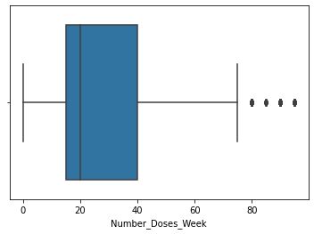

# <font color='PURPLE'>Ciência dos Dados na Prática</font>

# <font color='GREY'> Ciência de Dados no Agronegócio</font>


# Você sabia que aproximadamente **21% do PIB do Brasil** vem do Agronegócio?


# Onde a Ciência de Dados pode atuar no Agronegócio?

Recentemente, observamos o conceito emergente de **agricultura inteligente** que torna a **agricultura mais eficiente e eficaz com a ajuda de algoritmos de alta precisão.**

O Aprendizado de Máquina ajuda a quantificar e compreender processos intensivos de dados em ambientes operacionais agrícolas.

O aprendizado de máquina está em todo o ciclo de cultivo e colheita. 

Começa com o plantio de uma semente no solo - desde o preparo do solo, procriação de sementes e medição da alimentação de água - e termina quando as redes neurais fazem a colheita determinando a maturação com a ajuda da visão computacional.


##Casos Frequentes de uso de Ciência de Dados no Agro

- Previsão de Demanda dos Produtos e de Insumos para produção
- Otimização da Cadeia de Suprimentos
- Detecção e Prevenção de Pragas
- Otimização da lavoura
- Inspeção Visual
- Máquinas Autônomas
- Gerenciamento de Água
- Previsão da Qualidade da Colheita
- Detecção de Ervas Daninhas


# Um caso especial que **a Ciência de Dados** pode ajudar para o sucesso da colheita é o gerenciamento dos Pesticidas Tóxicos


O trabalho de um fazendeiro é um verdadeiro teste de resistência e determinação. 

Depois de plantadas as sementes, ele trabalha dias e noites para se certificar de que terá uma boa colheita no final da temporada. 


Uma boa colheita é garantida por **vários fatores**, como disponibilidade de água, fertilidade do solo, proteção das colheitas contra roedores, **uso oportuno de pesticidas** e outros produtos químicos úteis.


---


Embora muitos desses fatores sejam difíceis de controlar, a **quantidade e a frequência dos pesticidas são algo que o agricultor pode controlar.**


 


Os agrotóxicos também são especiais, pois protegem a lavoura com a dosagem certa. 

Mas, se você adicionar mais do que o necessário, eles podem estragar toda a colheita. 


Um alto nível de pesticida pode considerar a safra morta / inadequada para consumo entre muitos resultados. 


#1° Problema de Negócio

Precisamos **prever o resultado da temporada de colheita**, ou seja, se a cultura seria:

 **1. Saudável (viva)**

 **2. Danificada por pesticidas** ou 
 
 **3. Danificada por outros motivos.**

Os dados são baseados em safras colhidas por vários agricultores no final da temporada de colheita. 


# 2° Análise Exploratória dos Dados


1. **ID - UniqueID**
2.**Estimated_Insects_Count** - Contagem estimada de insetos por metro quadrado
3. **Crop_Type** - Categoria de cultivo (0,1)
4. **Tipo_do solo** - Categoria do solo (0,1)
5. **Pesticide_Use_Category** - Tipo de uso de pesticidas (1- 6. Nunca, 2-Usado anteriormente, 3-Usando atualmente)
7. **Number_Doses_Week** - Número de doses por semana
8. **Number_Weeks_Used** - Número de semanas usadas
9. **Number_Weeks_Quit** - Número de semanas de desistência
10. **Temporada** - Categoria Temporada (1,2,3)
11. **Crop_Damage** - Categoria de dano de cultivo (0 = vivo, 1 = dano devido a outras causas, 2 = dano devido a pesticidas)


```python
#Importação de Pacotes
import pandas as pd
import numpy as np
import seaborn as sns
from sklearn.model_selection import train_test_split
from catboost import CatBoostClassifier
import warnings
warnings.filterwarnings("ignore")

```


```python
# Conexão com os Dados
train_d=pd.read_csv('treino.csv')
```


```python
# Visualiza as 10 primeiras linhas
train_d.head(10)
```


<div>
<style scoped>
    .dataframe tbody tr th:only-of-type {
        vertical-align: middle;
    }

    .dataframe tbody tr th {
        vertical-align: top;
    }

    .dataframe thead th {
        text-align: right;
    }
</style>
<table border="1" class="dataframe">
  <thead>
    <tr style="text-align: right;">
      <th></th>
      <th>ID</th>
      <th>Estimated_Insects_Count</th>
      <th>Crop_Type</th>
      <th>Soil_Type</th>
      <th>Pesticide_Use_Category</th>
      <th>Number_Doses_Week</th>
      <th>Number_Weeks_Used</th>
      <th>Number_Weeks_Quit</th>
      <th>Season</th>
      <th>Crop_Damage</th>
    </tr>
  </thead>
  <tbody>
    <tr>
      <th>0</th>
      <td>F00000001</td>
      <td>188</td>
      <td>1</td>
      <td>0</td>
      <td>1</td>
      <td>0</td>
      <td>0.0</td>
      <td>0</td>
      <td>1</td>
      <td>0</td>
    </tr>
    <tr>
      <th>1</th>
      <td>F00000003</td>
      <td>209</td>
      <td>1</td>
      <td>0</td>
      <td>1</td>
      <td>0</td>
      <td>0.0</td>
      <td>0</td>
      <td>2</td>
      <td>1</td>
    </tr>
    <tr>
      <th>2</th>
      <td>F00000004</td>
      <td>257</td>
      <td>1</td>
      <td>0</td>
      <td>1</td>
      <td>0</td>
      <td>0.0</td>
      <td>0</td>
      <td>2</td>
      <td>1</td>
    </tr>
    <tr>
      <th>3</th>
      <td>F00000005</td>
      <td>257</td>
      <td>1</td>
      <td>1</td>
      <td>1</td>
      <td>0</td>
      <td>0.0</td>
      <td>0</td>
      <td>2</td>
      <td>1</td>
    </tr>
    <tr>
      <th>4</th>
      <td>F00000006</td>
      <td>342</td>
      <td>1</td>
      <td>0</td>
      <td>1</td>
      <td>0</td>
      <td>0.0</td>
      <td>0</td>
      <td>2</td>
      <td>1</td>
    </tr>
    <tr>
      <th>5</th>
      <td>F00000008</td>
      <td>448</td>
      <td>0</td>
      <td>1</td>
      <td>1</td>
      <td>0</td>
      <td>NaN</td>
      <td>0</td>
      <td>2</td>
      <td>1</td>
    </tr>
    <tr>
      <th>6</th>
      <td>F00000009</td>
      <td>448</td>
      <td>0</td>
      <td>1</td>
      <td>1</td>
      <td>0</td>
      <td>NaN</td>
      <td>0</td>
      <td>2</td>
      <td>1</td>
    </tr>
    <tr>
      <th>7</th>
      <td>F00000010</td>
      <td>577</td>
      <td>1</td>
      <td>0</td>
      <td>1</td>
      <td>0</td>
      <td>0.0</td>
      <td>0</td>
      <td>1</td>
      <td>2</td>
    </tr>
    <tr>
      <th>8</th>
      <td>F00000012</td>
      <td>731</td>
      <td>0</td>
      <td>0</td>
      <td>1</td>
      <td>0</td>
      <td>0.0</td>
      <td>0</td>
      <td>2</td>
      <td>0</td>
    </tr>
    <tr>
      <th>9</th>
      <td>F00000020</td>
      <td>1132</td>
      <td>1</td>
      <td>0</td>
      <td>1</td>
      <td>0</td>
      <td>0.0</td>
      <td>0</td>
      <td>1</td>
      <td>2</td>
    </tr>
  </tbody>
</table>
</div>


```python
# Informações dos atributos do Dataset
train_d.info()
```

    <class 'pandas.core.frame.DataFrame'>
    RangeIndex: 88858 entries, 0 to 88857
    Data columns (total 10 columns):
     #   Column                   Non-Null Count  Dtype  
    ---  ------                   --------------  -----  
     0   ID                       88858 non-null  object 
     1   Estimated_Insects_Count  88858 non-null  int64  
     2   Crop_Type                88858 non-null  int64  
     3   Soil_Type                88858 non-null  int64  
     4   Pesticide_Use_Category   88858 non-null  int64  
     5   Number_Doses_Week        88858 non-null  int64  
     6   Number_Weeks_Used        79858 non-null  float64
     7   Number_Weeks_Quit        88858 non-null  int64  
     8   Season                   88858 non-null  int64  
     9   Crop_Damage              88858 non-null  int64  
    dtypes: float64(1), int64(8), object(1)
    memory usage: 6.8+ MB


```python
# Explorando a Variável resposta
train_d['Crop_Damage'].value_counts()
ax = sns.countplot(x=train_d["Crop_Damage"])

```


    

    


```python
# Explorando a Variável
train_d['Season'].value_counts()
ax = sns.countplot(x=train_d["Season"])
```


    

    


```python
# Explorando a Variável
train_d['Pesticide_Use_Category'].value_counts()
ax = sns.countplot(x=train_d["Pesticide_Use_Category"])
```


    

    


```python
# Explorando a Variável
train_d['Crop_Type'].value_counts()
ax = sns.countplot(x=train_d["Crop_Type"])
```


    

    


```python
# Explorando a Variável
train_d['Soil_Type'].value_counts()
ax = sns.countplot(x=train_d["Soil_Type"])
```


    

    


```python
#Verificando valores nulos
train_d.isnull().sum()
```


    ID                            0
    Estimated_Insects_Count       0
    Crop_Type                     0
    Soil_Type                     0
    Pesticide_Use_Category        0
    Number_Doses_Week             0
    Number_Weeks_Used          9000
    Number_Weeks_Quit             0
    Season                        0
    Crop_Damage                   0
    dtype: int64


```python
#Verifica valores duplicados
train_d.duplicated().sum()
```


    0


```python
#Estatística descritiva
train_d['Estimated_Insects_Count'].describe()
ax = sns.boxplot(x=train_d["Estimated_Insects_Count"])

```


    

    


```python
#Estatística descritiva
train_d['Number_Doses_Week'].describe()
ax = sns.boxplot(x=train_d["Number_Doses_Week"])
```


    

    


```python
#Estatística descritiva
train_d['Number_Weeks_Used'].describe()
ax = sns.boxplot(x=train_d["Number_Weeks_Used"])

```


    

    


```python
#Estatística descritiva
train_d['Number_Weeks_Quit'].describe()
ax = sns.histplot(x=train_d["Number_Weeks_Quit"], bins=5)
```


    

    


# 3° Pré-Processamento dos Dados


```python
#Excluir a variável ID pois ela não é explicativa
train_d.drop('ID',axis=1,inplace=True)
train_d.head()
```


<div>
<style scoped>
    .dataframe tbody tr th:only-of-type {
        vertical-align: middle;
    }

    .dataframe tbody tr th {
        vertical-align: top;
    }

    .dataframe thead th {
        text-align: right;
    }
</style>
<table border="1" class="dataframe">
  <thead>
    <tr style="text-align: right;">
      <th></th>
      <th>Estimated_Insects_Count</th>
      <th>Crop_Type</th>
      <th>Soil_Type</th>
      <th>Pesticide_Use_Category</th>
      <th>Number_Doses_Week</th>
      <th>Number_Weeks_Used</th>
      <th>Number_Weeks_Quit</th>
      <th>Season</th>
      <th>Crop_Damage</th>
    </tr>
  </thead>
  <tbody>
    <tr>
      <th>0</th>
      <td>188</td>
      <td>1</td>
      <td>0</td>
      <td>1</td>
      <td>0</td>
      <td>0.0</td>
      <td>0</td>
      <td>1</td>
      <td>0</td>
    </tr>
    <tr>
      <th>1</th>
      <td>209</td>
      <td>1</td>
      <td>0</td>
      <td>1</td>
      <td>0</td>
      <td>0.0</td>
      <td>0</td>
      <td>2</td>
      <td>1</td>
    </tr>
    <tr>
      <th>2</th>
      <td>257</td>
      <td>1</td>
      <td>0</td>
      <td>1</td>
      <td>0</td>
      <td>0.0</td>
      <td>0</td>
      <td>2</td>
      <td>1</td>
    </tr>
    <tr>
      <th>3</th>
      <td>257</td>
      <td>1</td>
      <td>1</td>
      <td>1</td>
      <td>0</td>
      <td>0.0</td>
      <td>0</td>
      <td>2</td>
      <td>1</td>
    </tr>
    <tr>
      <th>4</th>
      <td>342</td>
      <td>1</td>
      <td>0</td>
      <td>1</td>
      <td>0</td>
      <td>0.0</td>
      <td>0</td>
      <td>2</td>
      <td>1</td>
    </tr>
  </tbody>
</table>
</div>


```python
#Exclusão dos Valores ausentes
train_d.dropna(inplace=True)
train_d.isnull().sum()
```


    Estimated_Insects_Count    0
    Crop_Type                  0
    Soil_Type                  0
    Pesticide_Use_Category     0
    Number_Doses_Week          0
    Number_Weeks_Used          0
    Number_Weeks_Quit          0
    Season                     0
    Crop_Damage                0
    dtype: int64


```python
train_d.head()
```


<div>
<style scoped>
    .dataframe tbody tr th:only-of-type {
        vertical-align: middle;
    }

    .dataframe tbody tr th {
        vertical-align: top;
    }

    .dataframe thead th {
        text-align: right;
    }
</style>
<table border="1" class="dataframe">
  <thead>
    <tr style="text-align: right;">
      <th></th>
      <th>Estimated_Insects_Count</th>
      <th>Crop_Type</th>
      <th>Soil_Type</th>
      <th>Pesticide_Use_Category</th>
      <th>Number_Doses_Week</th>
      <th>Number_Weeks_Used</th>
      <th>Number_Weeks_Quit</th>
      <th>Season</th>
      <th>Crop_Damage</th>
    </tr>
  </thead>
  <tbody>
    <tr>
      <th>0</th>
      <td>188</td>
      <td>1</td>
      <td>0</td>
      <td>1</td>
      <td>0</td>
      <td>0.0</td>
      <td>0</td>
      <td>1</td>
      <td>0</td>
    </tr>
    <tr>
      <th>1</th>
      <td>209</td>
      <td>1</td>
      <td>0</td>
      <td>1</td>
      <td>0</td>
      <td>0.0</td>
      <td>0</td>
      <td>2</td>
      <td>1</td>
    </tr>
    <tr>
      <th>2</th>
      <td>257</td>
      <td>1</td>
      <td>0</td>
      <td>1</td>
      <td>0</td>
      <td>0.0</td>
      <td>0</td>
      <td>2</td>
      <td>1</td>
    </tr>
    <tr>
      <th>3</th>
      <td>257</td>
      <td>1</td>
      <td>1</td>
      <td>1</td>
      <td>0</td>
      <td>0.0</td>
      <td>0</td>
      <td>2</td>
      <td>1</td>
    </tr>
    <tr>
      <th>4</th>
      <td>342</td>
      <td>1</td>
      <td>0</td>
      <td>1</td>
      <td>0</td>
      <td>0.0</td>
      <td>0</td>
      <td>2</td>
      <td>1</td>
    </tr>
  </tbody>
</table>
</div>


```python
# One-Hot Encoder - Criação de Variáveis Numéricas
for col in ['Crop_Type','Soil_Type','Pesticide_Use_Category','Season']:
  train_d = pd.get_dummies(train_d, columns=[col])
```


```python
train_d.head(2)
#train_d.shape
```


<div>
<style scoped>
    .dataframe tbody tr th:only-of-type {
        vertical-align: middle;
    }

    .dataframe tbody tr th {
        vertical-align: top;
    }

    .dataframe thead th {
        text-align: right;
    }
</style>
<table border="1" class="dataframe">
  <thead>
    <tr style="text-align: right;">
      <th></th>
      <th>Estimated_Insects_Count</th>
      <th>Number_Doses_Week</th>
      <th>Number_Weeks_Used</th>
      <th>Number_Weeks_Quit</th>
      <th>Crop_Damage</th>
      <th>Crop_Type_0</th>
      <th>Crop_Type_1</th>
      <th>Soil_Type_0</th>
      <th>Soil_Type_1</th>
      <th>Pesticide_Use_Category_1</th>
      <th>Pesticide_Use_Category_2</th>
      <th>Pesticide_Use_Category_3</th>
      <th>Season_1</th>
      <th>Season_2</th>
      <th>Season_3</th>
    </tr>
  </thead>
  <tbody>
    <tr>
      <th>0</th>
      <td>188</td>
      <td>0</td>
      <td>0.0</td>
      <td>0</td>
      <td>0</td>
      <td>0</td>
      <td>1</td>
      <td>1</td>
      <td>0</td>
      <td>1</td>
      <td>0</td>
      <td>0</td>
      <td>1</td>
      <td>0</td>
      <td>0</td>
    </tr>
    <tr>
      <th>1</th>
      <td>209</td>
      <td>0</td>
      <td>0.0</td>
      <td>0</td>
      <td>1</td>
      <td>0</td>
      <td>1</td>
      <td>1</td>
      <td>0</td>
      <td>1</td>
      <td>0</td>
      <td>0</td>
      <td>0</td>
      <td>1</td>
      <td>0</td>
    </tr>
  </tbody>
</table>
</div>


```python
# Split dataset
X = train_d.drop(['Crop_Damage'], axis=1)
y = train_d['Crop_Damage'].values.reshape(-1,1)

# Amostragem dos dados de treino e de teste
X_train, X_test, y_train, y_test = train_test_split(X, y, test_size=0.2, random_state=7)
```

#4° Construção das Máquinas Preditivas


```python
# Treinamento da Máquina Preditiva
Maquina_Preditiva = CatBoostClassifier(n_estimators=1000, max_depth=4, random_state=7)
Maquina_Preditiva.fit(X_train, y_train)
predicoes = Maquina_Preditiva.predict_proba(X_test)
```

    Learning rate set to 0.097814
    0:	learn: 0.9832092	total: 98ms	remaining: 1m 37s
    1:	learn: 0.8949168	total: 146ms	remaining: 1m 12s
    2:	learn: 0.8266158	total: 201ms	remaining: 1m 6s
    3:	learn: 0.7706912	total: 270ms	remaining: 1m 7s
    4:	learn: 0.7241909	total: 316ms	remaining: 1m 2s
    5:	learn: 0.6857756	total: 367ms	remaining: 1m
    6:	learn: 0.6533072	total: 423ms	remaining: 1m
    7:	learn: 0.6249385	total: 493ms	remaining: 1m 1s
    8:	learn: 0.6010892	total: 542ms	remaining: 59.6s
    9:	learn: 0.5798398	total: 590ms	remaining: 58.4s
    10:	learn: 0.5617840	total: 645ms	remaining: 58s
    11:	learn: 0.5470850	total: 707ms	remaining: 58.2s
    12:	learn: 0.5335494	total: 757ms	remaining: 57.4s
    13:	learn: 0.5221289	total: 803ms	remaining: 56.6s
    14:	learn: 0.5116100	total: 862ms	remaining: 56.6s
    15:	learn: 0.5023982	total: 929ms	remaining: 57.1s
    16:	learn: 0.4942070	total: 987ms	remaining: 57.1s
    17:	learn: 0.4877251	total: 1.03s	remaining: 56.4s
    18:	learn: 0.4815039	total: 1.1s	remaining: 56.7s
    19:	learn: 0.4765471	total: 1.22s	remaining: 59.5s
    20:	learn: 0.4716037	total: 1.39s	remaining: 1m 4s
    21:	learn: 0.4671294	total: 1.49s	remaining: 1m 6s
    22:	learn: 0.4633473	total: 1.56s	remaining: 1m 6s
    23:	learn: 0.4601271	total: 1.63s	remaining: 1m 6s
    24:	learn: 0.4578192	total: 1.69s	remaining: 1m 5s
    25:	learn: 0.4549052	total: 1.74s	remaining: 1m 5s
    26:	learn: 0.4524336	total: 1.79s	remaining: 1m 4s
    27:	learn: 0.4502470	total: 1.84s	remaining: 1m 3s
    28:	learn: 0.4482808	total: 1.91s	remaining: 1m 3s
    29:	learn: 0.4469767	total: 1.96s	remaining: 1m 3s
    30:	learn: 0.4455674	total: 2s	remaining: 1m 2s
    31:	learn: 0.4440116	total: 2.06s	remaining: 1m 2s
    32:	learn: 0.4421545	total: 2.14s	remaining: 1m 2s
    33:	learn: 0.4409949	total: 2.22s	remaining: 1m 3s
    34:	learn: 0.4401296	total: 2.34s	remaining: 1m 4s
    35:	learn: 0.4388047	total: 2.42s	remaining: 1m 4s
    36:	learn: 0.4382052	total: 2.52s	remaining: 1m 5s
    37:	learn: 0.4375598	total: 2.67s	remaining: 1m 7s
    38:	learn: 0.4366342	total: 2.81s	remaining: 1m 9s
    39:	learn: 0.4357206	total: 2.93s	remaining: 1m 10s
    40:	learn: 0.4350259	total: 3.03s	remaining: 1m 10s
    41:	learn: 0.4341996	total: 3.15s	remaining: 1m 11s
    42:	learn: 0.4336522	total: 3.24s	remaining: 1m 12s
    43:	learn: 0.4333188	total: 3.31s	remaining: 1m 11s
    44:	learn: 0.4327742	total: 3.42s	remaining: 1m 12s
    45:	learn: 0.4322459	total: 3.58s	remaining: 1m 14s
    46:	learn: 0.4317194	total: 3.72s	remaining: 1m 15s
    47:	learn: 0.4312752	total: 3.83s	remaining: 1m 16s
    48:	learn: 0.4308455	total: 3.98s	remaining: 1m 17s
    49:	learn: 0.4304575	total: 4.11s	remaining: 1m 18s
    50:	learn: 0.4300013	total: 4.24s	remaining: 1m 18s
    51:	learn: 0.4296290	total: 4.32s	remaining: 1m 18s
    52:	learn: 0.4293574	total: 4.38s	remaining: 1m 18s
    53:	learn: 0.4291234	total: 4.43s	remaining: 1m 17s
    54:	learn: 0.4287965	total: 4.52s	remaining: 1m 17s
    55:	learn: 0.4285662	total: 4.62s	remaining: 1m 17s
    56:	learn: 0.4282841	total: 4.75s	remaining: 1m 18s
    57:	learn: 0.4279412	total: 4.88s	remaining: 1m 19s
    58:	learn: 0.4276682	total: 4.94s	remaining: 1m 18s
    59:	learn: 0.4275246	total: 5.01s	remaining: 1m 18s
    60:	learn: 0.4271691	total: 5.07s	remaining: 1m 17s
    61:	learn: 0.4270358	total: 5.11s	remaining: 1m 17s
    62:	learn: 0.4268977	total: 5.16s	remaining: 1m 16s
    63:	learn: 0.4267628	total: 5.24s	remaining: 1m 16s
    64:	learn: 0.4266021	total: 5.37s	remaining: 1m 17s
    65:	learn: 0.4264020	total: 5.51s	remaining: 1m 18s
    66:	learn: 0.4262203	total: 5.63s	remaining: 1m 18s
    67:	learn: 0.4261321	total: 5.72s	remaining: 1m 18s
    68:	learn: 0.4260387	total: 5.78s	remaining: 1m 17s
    69:	learn: 0.4258988	total: 5.84s	remaining: 1m 17s
    70:	learn: 0.4257247	total: 5.9s	remaining: 1m 17s
    71:	learn: 0.4256039	total: 5.99s	remaining: 1m 17s
    72:	learn: 0.4255164	total: 6.07s	remaining: 1m 17s
    73:	learn: 0.4252867	total: 6.13s	remaining: 1m 16s
    74:	learn: 0.4252036	total: 6.18s	remaining: 1m 16s
    75:	learn: 0.4250354	total: 6.24s	remaining: 1m 15s
    76:	learn: 0.4249166	total: 6.3s	remaining: 1m 15s
    77:	learn: 0.4248308	total: 6.35s	remaining: 1m 15s
    78:	learn: 0.4246919	total: 6.4s	remaining: 1m 14s
    79:	learn: 0.4246063	total: 6.45s	remaining: 1m 14s
    80:	learn: 0.4243707	total: 6.53s	remaining: 1m 14s
    81:	learn: 0.4241756	total: 6.58s	remaining: 1m 13s
    82:	learn: 0.4241285	total: 6.62s	remaining: 1m 13s
    83:	learn: 0.4240019	total: 6.68s	remaining: 1m 12s
    84:	learn: 0.4239117	total: 6.75s	remaining: 1m 12s
    85:	learn: 0.4237952	total: 6.8s	remaining: 1m 12s
    86:	learn: 0.4236853	total: 6.85s	remaining: 1m 11s
    87:	learn: 0.4236316	total: 6.9s	remaining: 1m 11s
    88:	learn: 0.4234956	total: 6.97s	remaining: 1m 11s
    89:	learn: 0.4232525	total: 7.02s	remaining: 1m 10s
    90:	learn: 0.4230650	total: 7.07s	remaining: 1m 10s
    91:	learn: 0.4229553	total: 7.13s	remaining: 1m 10s
    92:	learn: 0.4229066	total: 7.19s	remaining: 1m 10s
    93:	learn: 0.4228376	total: 7.25s	remaining: 1m 9s
    94:	learn: 0.4227770	total: 7.32s	remaining: 1m 9s
    95:	learn: 0.4226900	total: 7.42s	remaining: 1m 9s
    96:	learn: 0.4226540	total: 7.49s	remaining: 1m 9s
    97:	learn: 0.4225520	total: 7.54s	remaining: 1m 9s
    98:	learn: 0.4224516	total: 7.59s	remaining: 1m 9s
    99:	learn: 0.4223603	total: 7.65s	remaining: 1m 8s
    100:	learn: 0.4222757	total: 7.72s	remaining: 1m 8s
    101:	learn: 0.4222063	total: 7.77s	remaining: 1m 8s
    102:	learn: 0.4221799	total: 7.88s	remaining: 1m 8s
    103:	learn: 0.4221217	total: 8.01s	remaining: 1m 9s
    104:	learn: 0.4220824	total: 8.11s	remaining: 1m 9s
    105:	learn: 0.4219500	total: 8.22s	remaining: 1m 9s
    106:	learn: 0.4218928	total: 8.3s	remaining: 1m 9s
    107:	learn: 0.4217528	total: 8.37s	remaining: 1m 9s
    108:	learn: 0.4217345	total: 8.48s	remaining: 1m 9s
    109:	learn: 0.4217006	total: 8.61s	remaining: 1m 9s
    110:	learn: 0.4215652	total: 8.72s	remaining: 1m 9s
    111:	learn: 0.4215137	total: 8.81s	remaining: 1m 9s
    112:	learn: 0.4214511	total: 8.9s	remaining: 1m 9s
    113:	learn: 0.4213597	total: 8.97s	remaining: 1m 9s
    114:	learn: 0.4212149	total: 9.02s	remaining: 1m 9s
    115:	learn: 0.4211280	total: 9.1s	remaining: 1m 9s
    116:	learn: 0.4210167	total: 9.2s	remaining: 1m 9s
    117:	learn: 0.4209726	total: 9.34s	remaining: 1m 9s
    118:	learn: 0.4209547	total: 9.46s	remaining: 1m 10s
    119:	learn: 0.4208923	total: 9.53s	remaining: 1m 9s
    120:	learn: 0.4207887	total: 9.62s	remaining: 1m 9s
    121:	learn: 0.4206662	total: 9.69s	remaining: 1m 9s
    122:	learn: 0.4206224	total: 9.75s	remaining: 1m 9s
    123:	learn: 0.4205924	total: 9.81s	remaining: 1m 9s
    124:	learn: 0.4205034	total: 9.93s	remaining: 1m 9s
    125:	learn: 0.4204154	total: 10.1s	remaining: 1m 9s
    126:	learn: 0.4203754	total: 10.1s	remaining: 1m 9s
    127:	learn: 0.4203514	total: 10.2s	remaining: 1m 9s
    128:	learn: 0.4202717	total: 10.3s	remaining: 1m 9s
    129:	learn: 0.4202269	total: 10.3s	remaining: 1m 9s
    130:	learn: 0.4201841	total: 10.5s	remaining: 1m 9s
    131:	learn: 0.4201000	total: 10.6s	remaining: 1m 9s
    132:	learn: 0.4199672	total: 10.7s	remaining: 1m 9s
    133:	learn: 0.4199095	total: 10.8s	remaining: 1m 9s
    134:	learn: 0.4197475	total: 10.9s	remaining: 1m 9s
    135:	learn: 0.4196354	total: 11s	remaining: 1m 10s
    136:	learn: 0.4195303	total: 11.1s	remaining: 1m 10s
    137:	learn: 0.4194601	total: 11.3s	remaining: 1m 10s
    138:	learn: 0.4193629	total: 11.4s	remaining: 1m 10s
    139:	learn: 0.4193326	total: 11.4s	remaining: 1m 10s
    140:	learn: 0.4192856	total: 11.5s	remaining: 1m 10s
    141:	learn: 0.4192566	total: 11.6s	remaining: 1m 9s
    142:	learn: 0.4192456	total: 11.6s	remaining: 1m 9s
    143:	learn: 0.4192157	total: 11.6s	remaining: 1m 9s
    144:	learn: 0.4191928	total: 11.7s	remaining: 1m 8s
    145:	learn: 0.4191145	total: 11.8s	remaining: 1m 8s
    146:	learn: 0.4190608	total: 11.9s	remaining: 1m 9s
    147:	learn: 0.4189984	total: 12s	remaining: 1m 9s
    148:	learn: 0.4188929	total: 12.1s	remaining: 1m 9s
    149:	learn: 0.4187356	total: 12.2s	remaining: 1m 9s
    150:	learn: 0.4187019	total: 12.4s	remaining: 1m 9s
    151:	learn: 0.4186831	total: 12.5s	remaining: 1m 9s
    152:	learn: 0.4185890	total: 12.6s	remaining: 1m 9s
    153:	learn: 0.4185201	total: 12.6s	remaining: 1m 9s
    154:	learn: 0.4184930	total: 12.7s	remaining: 1m 9s
    155:	learn: 0.4184678	total: 12.8s	remaining: 1m 9s
    156:	learn: 0.4183555	total: 12.9s	remaining: 1m 9s
    157:	learn: 0.4183179	total: 12.9s	remaining: 1m 8s
    158:	learn: 0.4182095	total: 13.1s	remaining: 1m 9s
    159:	learn: 0.4181902	total: 13.1s	remaining: 1m 9s
    160:	learn: 0.4181769	total: 13.2s	remaining: 1m 8s
    161:	learn: 0.4181616	total: 13.3s	remaining: 1m 8s
    162:	learn: 0.4181423	total: 13.3s	remaining: 1m 8s
    163:	learn: 0.4181116	total: 13.4s	remaining: 1m 8s
    164:	learn: 0.4180641	total: 13.4s	remaining: 1m 8s
    165:	learn: 0.4180456	total: 13.5s	remaining: 1m 7s
    166:	learn: 0.4179882	total: 13.6s	remaining: 1m 7s
    167:	learn: 0.4179616	total: 13.6s	remaining: 1m 7s
    168:	learn: 0.4178610	total: 13.7s	remaining: 1m 7s
    169:	learn: 0.4177243	total: 13.8s	remaining: 1m 7s
    170:	learn: 0.4177015	total: 13.9s	remaining: 1m 7s
    171:	learn: 0.4176729	total: 14s	remaining: 1m 7s
    172:	learn: 0.4176411	total: 14s	remaining: 1m 7s
    173:	learn: 0.4175867	total: 14.1s	remaining: 1m 6s
    174:	learn: 0.4175426	total: 14.2s	remaining: 1m 6s
    175:	learn: 0.4174820	total: 14.3s	remaining: 1m 6s
    176:	learn: 0.4174466	total: 14.4s	remaining: 1m 6s
    177:	learn: 0.4173537	total: 14.5s	remaining: 1m 6s
    178:	learn: 0.4173002	total: 14.6s	remaining: 1m 6s
    179:	learn: 0.4172489	total: 14.6s	remaining: 1m 6s
    180:	learn: 0.4172165	total: 14.7s	remaining: 1m 6s
    181:	learn: 0.4171912	total: 14.7s	remaining: 1m 6s
    182:	learn: 0.4171467	total: 14.9s	remaining: 1m 6s
    183:	learn: 0.4171124	total: 15s	remaining: 1m 6s
    184:	learn: 0.4170874	total: 15s	remaining: 1m 6s
    185:	learn: 0.4170072	total: 15.1s	remaining: 1m 5s
    186:	learn: 0.4169935	total: 15.1s	remaining: 1m 5s
    187:	learn: 0.4169388	total: 15.2s	remaining: 1m 5s
    188:	learn: 0.4169188	total: 15.2s	remaining: 1m 5s
    189:	learn: 0.4168924	total: 15.3s	remaining: 1m 5s
    190:	learn: 0.4167822	total: 15.3s	remaining: 1m 4s
    191:	learn: 0.4166770	total: 15.4s	remaining: 1m 4s
    192:	learn: 0.4166463	total: 15.4s	remaining: 1m 4s
    193:	learn: 0.4166001	total: 15.5s	remaining: 1m 4s
    194:	learn: 0.4165841	total: 15.5s	remaining: 1m 4s
    195:	learn: 0.4165589	total: 15.5s	remaining: 1m 3s
    196:	learn: 0.4165298	total: 15.6s	remaining: 1m 3s
    197:	learn: 0.4165228	total: 15.6s	remaining: 1m 3s
    198:	learn: 0.4165085	total: 15.7s	remaining: 1m 3s
    199:	learn: 0.4164679	total: 15.7s	remaining: 1m 2s
    200:	learn: 0.4164400	total: 15.8s	remaining: 1m 2s
    201:	learn: 0.4164230	total: 15.8s	remaining: 1m 2s
    202:	learn: 0.4164042	total: 15.9s	remaining: 1m 2s
    203:	learn: 0.4163602	total: 15.9s	remaining: 1m 2s
    204:	learn: 0.4163197	total: 15.9s	remaining: 1m 1s
    205:	learn: 0.4162805	total: 16s	remaining: 1m 1s
    206:	learn: 0.4162369	total: 16s	remaining: 1m 1s
    207:	learn: 0.4161778	total: 16.1s	remaining: 1m 1s
    208:	learn: 0.4161587	total: 16.1s	remaining: 1m 1s
    209:	learn: 0.4160703	total: 16.2s	remaining: 1m
    210:	learn: 0.4160523	total: 16.3s	remaining: 1m
    211:	learn: 0.4159560	total: 16.4s	remaining: 1m
    212:	learn: 0.4159124	total: 16.4s	remaining: 1m
    213:	learn: 0.4159031	total: 16.5s	remaining: 1m
    214:	learn: 0.4158768	total: 16.6s	remaining: 1m
    215:	learn: 0.4158423	total: 16.6s	remaining: 1m
    216:	learn: 0.4157453	total: 16.7s	remaining: 1m
    217:	learn: 0.4157321	total: 16.7s	remaining: 60s
    218:	learn: 0.4157100	total: 16.8s	remaining: 59.8s
    219:	learn: 0.4156567	total: 16.8s	remaining: 59.7s
    220:	learn: 0.4156490	total: 16.9s	remaining: 59.6s
    221:	learn: 0.4156014	total: 17s	remaining: 59.5s
    222:	learn: 0.4155528	total: 17s	remaining: 59.3s
    223:	learn: 0.4154990	total: 17.1s	remaining: 59.2s
    224:	learn: 0.4154643	total: 17.1s	remaining: 59s
    225:	learn: 0.4154164	total: 17.2s	remaining: 58.8s
    226:	learn: 0.4153737	total: 17.2s	remaining: 58.6s
    227:	learn: 0.4153159	total: 17.3s	remaining: 58.5s
    228:	learn: 0.4153078	total: 17.3s	remaining: 58.3s
    229:	learn: 0.4152761	total: 17.4s	remaining: 58.3s
    230:	learn: 0.4152164	total: 17.5s	remaining: 58.3s
    231:	learn: 0.4152090	total: 17.6s	remaining: 58.2s
    232:	learn: 0.4151876	total: 17.7s	remaining: 58.2s
    233:	learn: 0.4151277	total: 17.7s	remaining: 58.1s
    234:	learn: 0.4150706	total: 17.8s	remaining: 58.1s
    235:	learn: 0.4150219	total: 17.9s	remaining: 58.1s
    236:	learn: 0.4149859	total: 18s	remaining: 58.1s
    237:	learn: 0.4149704	total: 18.1s	remaining: 58.1s
    238:	learn: 0.4149347	total: 18.2s	remaining: 58s
    239:	learn: 0.4148881	total: 18.3s	remaining: 57.9s
    240:	learn: 0.4148758	total: 18.4s	remaining: 57.9s
    241:	learn: 0.4148002	total: 18.5s	remaining: 58s
    242:	learn: 0.4147787	total: 18.6s	remaining: 57.9s
    243:	learn: 0.4147460	total: 18.7s	remaining: 57.8s
    244:	learn: 0.4147151	total: 18.7s	remaining: 57.6s
    245:	learn: 0.4146896	total: 18.8s	remaining: 57.5s
    246:	learn: 0.4146652	total: 18.8s	remaining: 57.4s
    247:	learn: 0.4146022	total: 18.9s	remaining: 57.2s
    248:	learn: 0.4145019	total: 18.9s	remaining: 57.1s
    249:	learn: 0.4144518	total: 19s	remaining: 56.9s
    250:	learn: 0.4144483	total: 19s	remaining: 56.8s
    251:	learn: 0.4144113	total: 19.1s	remaining: 56.7s
    252:	learn: 0.4143568	total: 19.2s	remaining: 56.6s
    253:	learn: 0.4143299	total: 19.2s	remaining: 56.4s
    254:	learn: 0.4143182	total: 19.3s	remaining: 56.3s
    255:	learn: 0.4142548	total: 19.3s	remaining: 56.2s
    256:	learn: 0.4142400	total: 19.4s	remaining: 56s
    257:	learn: 0.4142237	total: 19.4s	remaining: 55.8s
    258:	learn: 0.4142094	total: 19.5s	remaining: 55.6s
    259:	learn: 0.4141884	total: 19.5s	remaining: 55.6s
    260:	learn: 0.4141763	total: 19.6s	remaining: 55.4s
    261:	learn: 0.4141691	total: 19.6s	remaining: 55.3s
    262:	learn: 0.4141511	total: 19.7s	remaining: 55.1s
    263:	learn: 0.4140875	total: 19.7s	remaining: 55s
    264:	learn: 0.4140367	total: 19.8s	remaining: 54.8s
    265:	learn: 0.4140072	total: 19.8s	remaining: 54.7s
    266:	learn: 0.4139651	total: 19.9s	remaining: 54.6s
    267:	learn: 0.4139551	total: 19.9s	remaining: 54.4s
    268:	learn: 0.4139355	total: 20s	remaining: 54.3s
    269:	learn: 0.4139025	total: 20s	remaining: 54.2s
    270:	learn: 0.4138827	total: 20.1s	remaining: 54s
    271:	learn: 0.4138445	total: 20.1s	remaining: 53.9s
    272:	learn: 0.4138283	total: 20.2s	remaining: 53.8s
    273:	learn: 0.4137779	total: 20.3s	remaining: 53.8s
    274:	learn: 0.4137629	total: 20.3s	remaining: 53.6s
    275:	learn: 0.4137118	total: 20.4s	remaining: 53.5s
    276:	learn: 0.4136991	total: 20.4s	remaining: 53.4s
    277:	learn: 0.4136354	total: 20.5s	remaining: 53.3s
    278:	learn: 0.4136132	total: 20.6s	remaining: 53.2s
    279:	learn: 0.4135549	total: 20.6s	remaining: 53s
    280:	learn: 0.4135133	total: 20.7s	remaining: 52.9s
    281:	learn: 0.4134794	total: 20.7s	remaining: 52.8s
    282:	learn: 0.4134683	total: 20.8s	remaining: 52.7s
    283:	learn: 0.4134014	total: 20.8s	remaining: 52.5s
    284:	learn: 0.4133768	total: 20.9s	remaining: 52.4s
    285:	learn: 0.4133536	total: 20.9s	remaining: 52.3s
    286:	learn: 0.4133362	total: 21s	remaining: 52.1s
    287:	learn: 0.4132846	total: 21s	remaining: 52s
    288:	learn: 0.4132612	total: 21.1s	remaining: 51.9s
    289:	learn: 0.4132413	total: 21.2s	remaining: 51.8s
    290:	learn: 0.4132314	total: 21.2s	remaining: 51.7s
    291:	learn: 0.4131947	total: 21.3s	remaining: 51.6s
    292:	learn: 0.4131835	total: 21.4s	remaining: 51.5s
    293:	learn: 0.4131643	total: 21.4s	remaining: 51.4s
    294:	learn: 0.4131541	total: 21.5s	remaining: 51.3s
    295:	learn: 0.4131402	total: 21.5s	remaining: 51.2s
    296:	learn: 0.4131261	total: 21.6s	remaining: 51s
    297:	learn: 0.4130701	total: 21.6s	remaining: 51s
    298:	learn: 0.4130365	total: 21.7s	remaining: 50.9s
    299:	learn: 0.4130267	total: 21.8s	remaining: 50.8s
    300:	learn: 0.4129924	total: 21.9s	remaining: 50.8s
    301:	learn: 0.4129676	total: 22s	remaining: 50.8s
    302:	learn: 0.4129586	total: 22s	remaining: 50.7s
    303:	learn: 0.4129341	total: 22.1s	remaining: 50.6s
    304:	learn: 0.4128818	total: 22.2s	remaining: 50.6s
    305:	learn: 0.4128528	total: 22.2s	remaining: 50.4s
    306:	learn: 0.4128304	total: 22.3s	remaining: 50.3s
    307:	learn: 0.4128226	total: 22.3s	remaining: 50.2s
    308:	learn: 0.4128087	total: 22.4s	remaining: 50.1s
    309:	learn: 0.4127878	total: 22.5s	remaining: 50s
    310:	learn: 0.4127403	total: 22.5s	remaining: 49.9s
    311:	learn: 0.4127158	total: 22.6s	remaining: 49.8s
    312:	learn: 0.4127020	total: 22.6s	remaining: 49.7s
    313:	learn: 0.4126891	total: 22.7s	remaining: 49.6s
    314:	learn: 0.4126601	total: 22.7s	remaining: 49.4s
    315:	learn: 0.4126428	total: 22.8s	remaining: 49.3s
    316:	learn: 0.4126298	total: 22.8s	remaining: 49.2s
    317:	learn: 0.4125928	total: 22.9s	remaining: 49.1s
    318:	learn: 0.4125825	total: 22.9s	remaining: 49s
    319:	learn: 0.4125601	total: 23s	remaining: 48.8s
    320:	learn: 0.4125467	total: 23s	remaining: 48.7s
    321:	learn: 0.4125418	total: 23.1s	remaining: 48.6s
    322:	learn: 0.4125311	total: 23.1s	remaining: 48.5s
    323:	learn: 0.4125152	total: 23.2s	remaining: 48.4s
    324:	learn: 0.4124971	total: 23.2s	remaining: 48.3s
    325:	learn: 0.4124760	total: 23.3s	remaining: 48.2s
    326:	learn: 0.4124644	total: 23.4s	remaining: 48.1s
    327:	learn: 0.4124445	total: 23.5s	remaining: 48.1s
    328:	learn: 0.4124294	total: 23.5s	remaining: 47.9s
    329:	learn: 0.4123917	total: 23.6s	remaining: 47.9s
    330:	learn: 0.4123869	total: 23.7s	remaining: 47.8s
    331:	learn: 0.4123664	total: 23.7s	remaining: 47.7s
    332:	learn: 0.4123556	total: 23.8s	remaining: 47.8s
    333:	learn: 0.4123394	total: 24s	remaining: 47.8s
    334:	learn: 0.4122790	total: 24.1s	remaining: 47.8s
    335:	learn: 0.4122644	total: 24.2s	remaining: 47.7s
    336:	learn: 0.4121866	total: 24.3s	remaining: 47.8s
    337:	learn: 0.4121405	total: 24.4s	remaining: 47.8s
    338:	learn: 0.4121220	total: 24.5s	remaining: 47.7s
    339:	learn: 0.4121177	total: 24.6s	remaining: 47.7s
    340:	learn: 0.4120978	total: 24.7s	remaining: 47.7s
    341:	learn: 0.4120879	total: 24.8s	remaining: 47.7s
    342:	learn: 0.4120155	total: 24.9s	remaining: 47.6s
    343:	learn: 0.4119935	total: 25s	remaining: 47.7s
    344:	learn: 0.4119497	total: 25.1s	remaining: 47.6s
    345:	learn: 0.4119334	total: 25.2s	remaining: 47.6s
    346:	learn: 0.4119181	total: 25.3s	remaining: 47.6s
    347:	learn: 0.4118949	total: 25.4s	remaining: 47.6s
    348:	learn: 0.4118638	total: 25.5s	remaining: 47.6s
    349:	learn: 0.4118526	total: 25.6s	remaining: 47.5s
    350:	learn: 0.4118459	total: 25.6s	remaining: 47.4s
    351:	learn: 0.4118398	total: 25.7s	remaining: 47.2s
    352:	learn: 0.4118068	total: 25.7s	remaining: 47.1s
    353:	learn: 0.4117818	total: 25.8s	remaining: 47s
    354:	learn: 0.4117574	total: 25.8s	remaining: 46.9s
    355:	learn: 0.4117467	total: 25.9s	remaining: 46.9s
    356:	learn: 0.4117237	total: 26s	remaining: 46.9s
    357:	learn: 0.4116996	total: 26.1s	remaining: 46.8s
    358:	learn: 0.4116685	total: 26.2s	remaining: 46.8s
    359:	learn: 0.4116609	total: 26.3s	remaining: 46.8s
    360:	learn: 0.4116353	total: 26.4s	remaining: 46.6s
    361:	learn: 0.4116258	total: 26.4s	remaining: 46.5s
    362:	learn: 0.4116050	total: 26.4s	remaining: 46.4s
    363:	learn: 0.4115880	total: 26.5s	remaining: 46.3s
    364:	learn: 0.4115665	total: 26.5s	remaining: 46.1s
    365:	learn: 0.4115135	total: 26.6s	remaining: 46s
    366:	learn: 0.4115111	total: 26.6s	remaining: 45.9s
    367:	learn: 0.4114984	total: 26.7s	remaining: 45.8s
    368:	learn: 0.4114877	total: 26.7s	remaining: 45.7s
    369:	learn: 0.4114641	total: 26.8s	remaining: 45.6s
    370:	learn: 0.4114315	total: 26.8s	remaining: 45.5s
    371:	learn: 0.4113723	total: 26.9s	remaining: 45.3s
    372:	learn: 0.4113570	total: 26.9s	remaining: 45.2s
    373:	learn: 0.4113322	total: 26.9s	remaining: 45.1s
    374:	learn: 0.4112904	total: 27s	remaining: 45s
    375:	learn: 0.4112452	total: 27.1s	remaining: 44.9s
    376:	learn: 0.4112304	total: 27.1s	remaining: 44.8s
    377:	learn: 0.4112174	total: 27.2s	remaining: 44.7s
    378:	learn: 0.4111841	total: 27.2s	remaining: 44.6s
    379:	learn: 0.4111719	total: 27.3s	remaining: 44.5s
    380:	learn: 0.4111329	total: 27.3s	remaining: 44.4s
    381:	learn: 0.4111198	total: 27.4s	remaining: 44.3s
    382:	learn: 0.4111098	total: 27.5s	remaining: 44.3s
    383:	learn: 0.4110992	total: 27.6s	remaining: 44.2s
    384:	learn: 0.4110661	total: 27.6s	remaining: 44.1s
    385:	learn: 0.4110575	total: 27.7s	remaining: 44s
    386:	learn: 0.4109942	total: 27.7s	remaining: 43.9s
    387:	learn: 0.4109729	total: 27.8s	remaining: 43.9s
    388:	learn: 0.4109574	total: 27.9s	remaining: 43.8s
    389:	learn: 0.4109383	total: 27.9s	remaining: 43.7s
    390:	learn: 0.4108907	total: 28s	remaining: 43.6s
    391:	learn: 0.4108640	total: 28s	remaining: 43.5s
    392:	learn: 0.4108477	total: 28.1s	remaining: 43.4s
    393:	learn: 0.4108340	total: 28.1s	remaining: 43.3s
    394:	learn: 0.4108095	total: 28.2s	remaining: 43.2s
    395:	learn: 0.4107882	total: 28.3s	remaining: 43.1s
    396:	learn: 0.4107646	total: 28.3s	remaining: 43s
    397:	learn: 0.4107465	total: 28.4s	remaining: 42.9s
    398:	learn: 0.4107249	total: 28.4s	remaining: 42.8s
    399:	learn: 0.4106888	total: 28.4s	remaining: 42.7s
    400:	learn: 0.4106822	total: 28.5s	remaining: 42.6s
    401:	learn: 0.4106575	total: 28.6s	remaining: 42.5s
    402:	learn: 0.4106359	total: 28.6s	remaining: 42.4s
    403:	learn: 0.4106205	total: 28.7s	remaining: 42.3s
    404:	learn: 0.4106113	total: 28.7s	remaining: 42.2s
    405:	learn: 0.4106001	total: 28.7s	remaining: 42.1s
    406:	learn: 0.4105848	total: 28.8s	remaining: 42s
    407:	learn: 0.4105707	total: 28.9s	remaining: 41.9s
    408:	learn: 0.4105587	total: 28.9s	remaining: 41.8s
    409:	learn: 0.4105495	total: 28.9s	remaining: 41.6s
    410:	learn: 0.4105323	total: 29s	remaining: 41.6s
    411:	learn: 0.4105127	total: 29.1s	remaining: 41.5s
    412:	learn: 0.4104920	total: 29.1s	remaining: 41.4s
    413:	learn: 0.4104615	total: 29.2s	remaining: 41.4s
    414:	learn: 0.4104479	total: 29.3s	remaining: 41.3s
    415:	learn: 0.4104294	total: 29.3s	remaining: 41.2s
    416:	learn: 0.4104261	total: 29.4s	remaining: 41.1s
    417:	learn: 0.4104131	total: 29.4s	remaining: 41s
    418:	learn: 0.4103812	total: 29.5s	remaining: 40.9s
    419:	learn: 0.4103567	total: 29.5s	remaining: 40.8s
    420:	learn: 0.4103183	total: 29.6s	remaining: 40.7s
    421:	learn: 0.4103063	total: 29.7s	remaining: 40.6s
    422:	learn: 0.4102756	total: 29.7s	remaining: 40.5s
    423:	learn: 0.4102504	total: 29.8s	remaining: 40.4s
    424:	learn: 0.4102332	total: 29.8s	remaining: 40.3s
    425:	learn: 0.4102179	total: 29.9s	remaining: 40.2s
    426:	learn: 0.4101955	total: 29.9s	remaining: 40.2s
    427:	learn: 0.4101807	total: 30s	remaining: 40s
    428:	learn: 0.4101711	total: 30s	remaining: 39.9s
    429:	learn: 0.4101658	total: 30.1s	remaining: 39.8s
    430:	learn: 0.4101443	total: 30.1s	remaining: 39.8s
    431:	learn: 0.4101287	total: 30.2s	remaining: 39.7s
    432:	learn: 0.4101004	total: 30.2s	remaining: 39.6s
    433:	learn: 0.4100828	total: 30.3s	remaining: 39.5s
    434:	learn: 0.4100437	total: 30.4s	remaining: 39.4s
    435:	learn: 0.4100299	total: 30.4s	remaining: 39.3s
    436:	learn: 0.4100082	total: 30.4s	remaining: 39.2s
    437:	learn: 0.4099895	total: 30.5s	remaining: 39.1s
    438:	learn: 0.4099806	total: 30.6s	remaining: 39s
    439:	learn: 0.4099755	total: 30.6s	remaining: 38.9s
    440:	learn: 0.4099620	total: 30.6s	remaining: 38.8s
    441:	learn: 0.4099390	total: 30.7s	remaining: 38.8s
    442:	learn: 0.4099228	total: 30.8s	remaining: 38.7s
    443:	learn: 0.4099147	total: 30.8s	remaining: 38.6s
    444:	learn: 0.4099055	total: 30.9s	remaining: 38.5s
    445:	learn: 0.4098896	total: 30.9s	remaining: 38.4s
    446:	learn: 0.4098610	total: 31s	remaining: 38.3s
    447:	learn: 0.4098483	total: 31s	remaining: 38.2s
    448:	learn: 0.4098269	total: 31.1s	remaining: 38.1s
    449:	learn: 0.4098187	total: 31.1s	remaining: 38s
    450:	learn: 0.4097986	total: 31.2s	remaining: 38s
    451:	learn: 0.4097699	total: 31.2s	remaining: 37.9s
    452:	learn: 0.4097620	total: 31.3s	remaining: 37.8s
    453:	learn: 0.4097513	total: 31.3s	remaining: 37.6s
    454:	learn: 0.4097455	total: 31.3s	remaining: 37.5s
    455:	learn: 0.4097359	total: 31.4s	remaining: 37.5s
    456:	learn: 0.4097076	total: 31.5s	remaining: 37.4s
    457:	learn: 0.4096906	total: 31.5s	remaining: 37.3s
    458:	learn: 0.4096392	total: 31.5s	remaining: 37.2s
    459:	learn: 0.4096263	total: 31.6s	remaining: 37.1s
    460:	learn: 0.4095905	total: 31.7s	remaining: 37s
    461:	learn: 0.4095289	total: 31.8s	remaining: 37s
    462:	learn: 0.4095038	total: 31.9s	remaining: 36.9s
    463:	learn: 0.4094840	total: 31.9s	remaining: 36.9s
    464:	learn: 0.4094751	total: 32s	remaining: 36.8s
    465:	learn: 0.4094537	total: 32s	remaining: 36.7s
    466:	learn: 0.4094485	total: 32.1s	remaining: 36.6s
    467:	learn: 0.4094289	total: 32.2s	remaining: 36.6s
    468:	learn: 0.4094042	total: 32.2s	remaining: 36.5s
    469:	learn: 0.4093880	total: 32.3s	remaining: 36.4s
    470:	learn: 0.4093774	total: 32.3s	remaining: 36.3s
    471:	learn: 0.4093680	total: 32.4s	remaining: 36.2s
    472:	learn: 0.4093545	total: 32.4s	remaining: 36.1s
    473:	learn: 0.4093468	total: 32.5s	remaining: 36s
    474:	learn: 0.4093286	total: 32.5s	remaining: 35.9s
    475:	learn: 0.4093192	total: 32.6s	remaining: 35.9s
    476:	learn: 0.4093025	total: 32.6s	remaining: 35.8s
    477:	learn: 0.4092931	total: 32.7s	remaining: 35.7s
    478:	learn: 0.4092843	total: 32.7s	remaining: 35.6s
    479:	learn: 0.4092552	total: 32.8s	remaining: 35.5s
    480:	learn: 0.4092431	total: 32.9s	remaining: 35.5s
    481:	learn: 0.4092361	total: 32.9s	remaining: 35.4s
    482:	learn: 0.4092246	total: 33s	remaining: 35.3s
    483:	learn: 0.4091901	total: 33s	remaining: 35.2s
    484:	learn: 0.4091735	total: 33.1s	remaining: 35.1s
    485:	learn: 0.4091479	total: 33.1s	remaining: 35s
    486:	learn: 0.4091329	total: 33.2s	remaining: 34.9s
    487:	learn: 0.4091250	total: 33.2s	remaining: 34.9s
    488:	learn: 0.4091059	total: 33.3s	remaining: 34.8s
    489:	learn: 0.4091010	total: 33.3s	remaining: 34.7s
    490:	learn: 0.4090833	total: 33.4s	remaining: 34.6s
    491:	learn: 0.4090622	total: 33.4s	remaining: 34.5s
    492:	learn: 0.4090479	total: 33.5s	remaining: 34.4s
    493:	learn: 0.4090121	total: 33.5s	remaining: 34.4s
    494:	learn: 0.4089918	total: 33.6s	remaining: 34.3s
    495:	learn: 0.4089585	total: 33.6s	remaining: 34.2s
    496:	learn: 0.4089149	total: 33.7s	remaining: 34.1s
    497:	learn: 0.4088854	total: 33.7s	remaining: 34s
    498:	learn: 0.4088758	total: 33.8s	remaining: 33.9s
    499:	learn: 0.4088623	total: 33.8s	remaining: 33.8s
    500:	learn: 0.4088543	total: 33.9s	remaining: 33.7s
    501:	learn: 0.4088459	total: 33.9s	remaining: 33.7s
    502:	learn: 0.4088307	total: 34s	remaining: 33.6s
    503:	learn: 0.4088095	total: 34s	remaining: 33.5s
    504:	learn: 0.4087966	total: 34.1s	remaining: 33.4s
    505:	learn: 0.4087824	total: 34.1s	remaining: 33.3s
    506:	learn: 0.4087765	total: 34.1s	remaining: 33.2s
    507:	learn: 0.4087558	total: 34.2s	remaining: 33.1s
    508:	learn: 0.4087345	total: 34.2s	remaining: 33s
    509:	learn: 0.4087304	total: 34.3s	remaining: 32.9s
    510:	learn: 0.4087003	total: 34.3s	remaining: 32.9s
    511:	learn: 0.4086925	total: 34.4s	remaining: 32.8s
    512:	learn: 0.4086675	total: 34.4s	remaining: 32.7s
    513:	learn: 0.4086641	total: 34.5s	remaining: 32.6s
    514:	learn: 0.4086519	total: 34.5s	remaining: 32.5s
    515:	learn: 0.4086406	total: 34.5s	remaining: 32.4s
    516:	learn: 0.4086212	total: 34.6s	remaining: 32.3s
    517:	learn: 0.4085949	total: 34.6s	remaining: 32.2s
    518:	learn: 0.4085868	total: 34.7s	remaining: 32.1s
    519:	learn: 0.4085710	total: 34.7s	remaining: 32.1s
    520:	learn: 0.4085470	total: 34.8s	remaining: 32s
    521:	learn: 0.4085420	total: 34.8s	remaining: 31.9s
    522:	learn: 0.4085276	total: 34.9s	remaining: 31.8s
    523:	learn: 0.4085142	total: 34.9s	remaining: 31.7s
    524:	learn: 0.4084725	total: 34.9s	remaining: 31.6s
    525:	learn: 0.4084556	total: 35s	remaining: 31.5s
    526:	learn: 0.4084434	total: 35s	remaining: 31.5s
    527:	learn: 0.4084078	total: 35.1s	remaining: 31.4s
    528:	learn: 0.4083971	total: 35.1s	remaining: 31.3s
    529:	learn: 0.4083737	total: 35.2s	remaining: 31.2s
    530:	learn: 0.4083511	total: 35.2s	remaining: 31.1s
    531:	learn: 0.4083433	total: 35.3s	remaining: 31s
    532:	learn: 0.4083352	total: 35.3s	remaining: 30.9s
    533:	learn: 0.4083231	total: 35.4s	remaining: 30.9s
    534:	learn: 0.4083130	total: 35.4s	remaining: 30.8s
    535:	learn: 0.4083013	total: 35.5s	remaining: 30.7s
    536:	learn: 0.4082937	total: 35.5s	remaining: 30.6s
    537:	learn: 0.4082671	total: 35.5s	remaining: 30.5s
    538:	learn: 0.4082437	total: 35.6s	remaining: 30.4s
    539:	learn: 0.4082306	total: 35.6s	remaining: 30.3s
    540:	learn: 0.4082165	total: 35.7s	remaining: 30.3s
    541:	learn: 0.4082042	total: 35.8s	remaining: 30.3s
    542:	learn: 0.4081966	total: 35.9s	remaining: 30.2s
    543:	learn: 0.4081663	total: 36s	remaining: 30.1s
    544:	learn: 0.4081565	total: 36s	remaining: 30.1s
    545:	learn: 0.4081460	total: 36.1s	remaining: 30s
    546:	learn: 0.4081374	total: 36.1s	remaining: 29.9s
    547:	learn: 0.4081249	total: 36.2s	remaining: 29.8s
    548:	learn: 0.4081193	total: 36.2s	remaining: 29.8s
    549:	learn: 0.4081112	total: 36.3s	remaining: 29.7s
    550:	learn: 0.4081069	total: 36.3s	remaining: 29.6s
    551:	learn: 0.4081039	total: 36.4s	remaining: 29.5s
    552:	learn: 0.4080759	total: 36.5s	remaining: 29.5s
    553:	learn: 0.4080689	total: 36.6s	remaining: 29.4s
    554:	learn: 0.4080566	total: 36.6s	remaining: 29.4s
    555:	learn: 0.4080427	total: 36.7s	remaining: 29.3s
    556:	learn: 0.4080363	total: 36.7s	remaining: 29.2s
    557:	learn: 0.4080174	total: 36.8s	remaining: 29.1s
    558:	learn: 0.4080061	total: 36.8s	remaining: 29s
    559:	learn: 0.4079902	total: 36.9s	remaining: 29s
    560:	learn: 0.4079819	total: 36.9s	remaining: 28.9s
    561:	learn: 0.4079726	total: 37s	remaining: 28.8s
    562:	learn: 0.4079549	total: 37s	remaining: 28.7s
    563:	learn: 0.4079516	total: 37.1s	remaining: 28.7s
    564:	learn: 0.4079412	total: 37.1s	remaining: 28.6s
    565:	learn: 0.4079306	total: 37.2s	remaining: 28.5s
    566:	learn: 0.4079251	total: 37.2s	remaining: 28.4s
    567:	learn: 0.4078905	total: 37.3s	remaining: 28.4s
    568:	learn: 0.4078758	total: 37.3s	remaining: 28.3s
    569:	learn: 0.4078633	total: 37.4s	remaining: 28.2s
    570:	learn: 0.4078592	total: 37.4s	remaining: 28.1s
    571:	learn: 0.4078474	total: 37.5s	remaining: 28.1s
    572:	learn: 0.4078276	total: 37.6s	remaining: 28s
    573:	learn: 0.4078113	total: 37.6s	remaining: 27.9s
    574:	learn: 0.4078068	total: 37.6s	remaining: 27.8s
    575:	learn: 0.4077969	total: 37.7s	remaining: 27.8s
    576:	learn: 0.4077665	total: 37.8s	remaining: 27.7s
    577:	learn: 0.4077588	total: 37.8s	remaining: 27.6s
    578:	learn: 0.4077455	total: 37.9s	remaining: 27.5s
    579:	learn: 0.4077396	total: 37.9s	remaining: 27.4s
    580:	learn: 0.4077302	total: 38s	remaining: 27.4s
    581:	learn: 0.4077205	total: 38s	remaining: 27.3s
    582:	learn: 0.4077069	total: 38s	remaining: 27.2s
    583:	learn: 0.4076781	total: 38.1s	remaining: 27.1s
    584:	learn: 0.4076528	total: 38.1s	remaining: 27.1s
    585:	learn: 0.4076459	total: 38.2s	remaining: 27s
    586:	learn: 0.4076361	total: 38.2s	remaining: 26.9s
    587:	learn: 0.4076350	total: 38.3s	remaining: 26.8s
    588:	learn: 0.4076225	total: 38.3s	remaining: 26.7s
    589:	learn: 0.4075642	total: 38.4s	remaining: 26.7s
    590:	learn: 0.4075123	total: 38.4s	remaining: 26.6s
    591:	learn: 0.4074815	total: 38.5s	remaining: 26.5s
    592:	learn: 0.4074668	total: 38.5s	remaining: 26.4s
    593:	learn: 0.4074416	total: 38.6s	remaining: 26.4s
    594:	learn: 0.4074276	total: 38.6s	remaining: 26.3s
    595:	learn: 0.4074208	total: 38.6s	remaining: 26.2s
    596:	learn: 0.4074124	total: 38.7s	remaining: 26.1s
    597:	learn: 0.4073996	total: 38.7s	remaining: 26s
    598:	learn: 0.4073941	total: 38.8s	remaining: 26s
    599:	learn: 0.4073878	total: 38.8s	remaining: 25.9s
    600:	learn: 0.4073618	total: 38.9s	remaining: 25.8s
    601:	learn: 0.4073525	total: 38.9s	remaining: 25.7s
    602:	learn: 0.4073413	total: 39s	remaining: 25.7s
    603:	learn: 0.4073353	total: 39s	remaining: 25.6s
    604:	learn: 0.4072985	total: 39.1s	remaining: 25.5s
    605:	learn: 0.4072675	total: 39.1s	remaining: 25.4s
    606:	learn: 0.4072600	total: 39.2s	remaining: 25.4s
    607:	learn: 0.4072499	total: 39.2s	remaining: 25.3s
    608:	learn: 0.4072327	total: 39.2s	remaining: 25.2s
    609:	learn: 0.4072193	total: 39.3s	remaining: 25.1s
    610:	learn: 0.4072050	total: 39.3s	remaining: 25s
    611:	learn: 0.4071973	total: 39.4s	remaining: 25s
    612:	learn: 0.4071857	total: 39.4s	remaining: 24.9s
    613:	learn: 0.4071566	total: 39.5s	remaining: 24.8s
    614:	learn: 0.4071386	total: 39.5s	remaining: 24.7s
    615:	learn: 0.4071283	total: 39.6s	remaining: 24.7s
    616:	learn: 0.4071247	total: 39.6s	remaining: 24.6s
    617:	learn: 0.4071189	total: 39.7s	remaining: 24.5s
    618:	learn: 0.4071073	total: 39.7s	remaining: 24.4s
    619:	learn: 0.4070986	total: 39.7s	remaining: 24.4s
    620:	learn: 0.4070858	total: 39.8s	remaining: 24.3s
    621:	learn: 0.4070788	total: 39.8s	remaining: 24.2s
    622:	learn: 0.4070716	total: 39.9s	remaining: 24.1s
    623:	learn: 0.4070312	total: 39.9s	remaining: 24.1s
    624:	learn: 0.4070266	total: 40s	remaining: 24s
    625:	learn: 0.4070205	total: 40s	remaining: 23.9s
    626:	learn: 0.4069949	total: 40.1s	remaining: 23.8s
    627:	learn: 0.4069653	total: 40.1s	remaining: 23.8s
    628:	learn: 0.4069421	total: 40.2s	remaining: 23.7s
    629:	learn: 0.4069285	total: 40.2s	remaining: 23.6s
    630:	learn: 0.4069240	total: 40.3s	remaining: 23.5s
    631:	learn: 0.4069024	total: 40.3s	remaining: 23.5s
    632:	learn: 0.4068708	total: 40.4s	remaining: 23.4s
    633:	learn: 0.4068648	total: 40.5s	remaining: 23.4s
    634:	learn: 0.4068487	total: 40.5s	remaining: 23.3s
    635:	learn: 0.4068352	total: 40.6s	remaining: 23.3s
    636:	learn: 0.4068235	total: 40.7s	remaining: 23.2s
    637:	learn: 0.4068171	total: 40.8s	remaining: 23.1s
    638:	learn: 0.4068110	total: 40.8s	remaining: 23.1s
    639:	learn: 0.4068041	total: 40.9s	remaining: 23s
    640:	learn: 0.4067911	total: 40.9s	remaining: 22.9s
    641:	learn: 0.4067826	total: 41s	remaining: 22.9s
    642:	learn: 0.4067796	total: 41s	remaining: 22.8s
    643:	learn: 0.4067744	total: 41.1s	remaining: 22.7s
    644:	learn: 0.4067558	total: 41.1s	remaining: 22.6s
    645:	learn: 0.4067484	total: 41.2s	remaining: 22.6s
    646:	learn: 0.4067400	total: 41.2s	remaining: 22.5s
    647:	learn: 0.4067218	total: 41.3s	remaining: 22.4s
    648:	learn: 0.4067119	total: 41.3s	remaining: 22.4s
    649:	learn: 0.4066940	total: 41.4s	remaining: 22.3s
    650:	learn: 0.4066694	total: 41.5s	remaining: 22.2s
    651:	learn: 0.4066609	total: 41.5s	remaining: 22.2s
    652:	learn: 0.4066575	total: 41.6s	remaining: 22.1s
    653:	learn: 0.4066421	total: 41.6s	remaining: 22s
    654:	learn: 0.4066285	total: 41.7s	remaining: 22s
    655:	learn: 0.4066220	total: 41.7s	remaining: 21.9s
    656:	learn: 0.4066125	total: 41.8s	remaining: 21.8s
    657:	learn: 0.4065961	total: 41.8s	remaining: 21.7s
    658:	learn: 0.4065793	total: 41.9s	remaining: 21.7s
    659:	learn: 0.4065662	total: 41.9s	remaining: 21.6s
    660:	learn: 0.4065518	total: 42s	remaining: 21.5s
    661:	learn: 0.4065312	total: 42s	remaining: 21.5s
    662:	learn: 0.4065150	total: 42.1s	remaining: 21.4s
    663:	learn: 0.4065095	total: 42.1s	remaining: 21.3s
    664:	learn: 0.4064991	total: 42.2s	remaining: 21.3s
    665:	learn: 0.4064960	total: 42.2s	remaining: 21.2s
    666:	learn: 0.4064847	total: 42.3s	remaining: 21.1s
    667:	learn: 0.4064772	total: 42.3s	remaining: 21s
    668:	learn: 0.4064672	total: 42.4s	remaining: 21s
    669:	learn: 0.4064557	total: 42.4s	remaining: 20.9s
    670:	learn: 0.4064477	total: 42.5s	remaining: 20.8s
    671:	learn: 0.4064399	total: 42.6s	remaining: 20.8s
    672:	learn: 0.4064273	total: 42.6s	remaining: 20.7s
    673:	learn: 0.4064175	total: 42.7s	remaining: 20.6s
    674:	learn: 0.4064034	total: 42.7s	remaining: 20.6s
    675:	learn: 0.4063953	total: 42.7s	remaining: 20.5s
    676:	learn: 0.4063708	total: 42.8s	remaining: 20.4s
    677:	learn: 0.4063676	total: 42.8s	remaining: 20.3s
    678:	learn: 0.4063591	total: 42.9s	remaining: 20.3s
    679:	learn: 0.4063429	total: 42.9s	remaining: 20.2s
    680:	learn: 0.4063325	total: 43s	remaining: 20.1s
    681:	learn: 0.4063206	total: 43s	remaining: 20.1s
    682:	learn: 0.4063051	total: 43.1s	remaining: 20s
    683:	learn: 0.4062921	total: 43.1s	remaining: 19.9s
    684:	learn: 0.4062821	total: 43.1s	remaining: 19.8s
    685:	learn: 0.4062753	total: 43.2s	remaining: 19.8s
    686:	learn: 0.4062582	total: 43.2s	remaining: 19.7s
    687:	learn: 0.4062183	total: 43.3s	remaining: 19.6s
    688:	learn: 0.4062092	total: 43.3s	remaining: 19.6s
    689:	learn: 0.4062078	total: 43.4s	remaining: 19.5s
    690:	learn: 0.4061913	total: 43.4s	remaining: 19.4s
    691:	learn: 0.4061794	total: 43.5s	remaining: 19.3s
    692:	learn: 0.4061654	total: 43.5s	remaining: 19.3s
    693:	learn: 0.4061518	total: 43.5s	remaining: 19.2s
    694:	learn: 0.4061416	total: 43.6s	remaining: 19.1s
    695:	learn: 0.4061355	total: 43.6s	remaining: 19.1s
    696:	learn: 0.4061275	total: 43.7s	remaining: 19s
    697:	learn: 0.4061259	total: 43.7s	remaining: 18.9s
    698:	learn: 0.4061127	total: 43.8s	remaining: 18.8s
    699:	learn: 0.4060962	total: 43.8s	remaining: 18.8s
    700:	learn: 0.4060795	total: 43.9s	remaining: 18.7s
    701:	learn: 0.4060689	total: 43.9s	remaining: 18.6s
    702:	learn: 0.4060645	total: 43.9s	remaining: 18.6s
    703:	learn: 0.4060585	total: 44s	remaining: 18.5s
    704:	learn: 0.4060453	total: 44s	remaining: 18.4s
    705:	learn: 0.4060066	total: 44.1s	remaining: 18.4s
    706:	learn: 0.4059763	total: 44.1s	remaining: 18.3s
    707:	learn: 0.4059620	total: 44.2s	remaining: 18.2s
    708:	learn: 0.4059542	total: 44.2s	remaining: 18.1s
    709:	learn: 0.4059457	total: 44.2s	remaining: 18.1s
    710:	learn: 0.4059428	total: 44.3s	remaining: 18s
    711:	learn: 0.4058803	total: 44.3s	remaining: 17.9s
    712:	learn: 0.4058702	total: 44.4s	remaining: 17.9s
    713:	learn: 0.4058420	total: 44.4s	remaining: 17.8s
    714:	learn: 0.4058259	total: 44.5s	remaining: 17.7s
    715:	learn: 0.4058017	total: 44.5s	remaining: 17.7s
    716:	learn: 0.4057886	total: 44.6s	remaining: 17.6s
    717:	learn: 0.4057805	total: 44.6s	remaining: 17.5s
    718:	learn: 0.4057649	total: 44.7s	remaining: 17.5s
    719:	learn: 0.4057613	total: 44.7s	remaining: 17.4s
    720:	learn: 0.4057514	total: 44.7s	remaining: 17.3s
    721:	learn: 0.4057410	total: 44.8s	remaining: 17.2s
    722:	learn: 0.4057337	total: 44.8s	remaining: 17.2s
    723:	learn: 0.4057209	total: 44.9s	remaining: 17.1s
    724:	learn: 0.4057152	total: 44.9s	remaining: 17s
    725:	learn: 0.4057031	total: 45s	remaining: 17s
    726:	learn: 0.4056965	total: 45s	remaining: 16.9s
    727:	learn: 0.4056918	total: 45.1s	remaining: 16.8s
    728:	learn: 0.4056888	total: 45.1s	remaining: 16.8s
    729:	learn: 0.4056811	total: 45.1s	remaining: 16.7s
    730:	learn: 0.4056707	total: 45.2s	remaining: 16.6s
    731:	learn: 0.4056392	total: 45.2s	remaining: 16.6s
    732:	learn: 0.4056296	total: 45.3s	remaining: 16.5s
    733:	learn: 0.4056170	total: 45.3s	remaining: 16.4s
    734:	learn: 0.4056051	total: 45.4s	remaining: 16.4s
    735:	learn: 0.4055939	total: 45.4s	remaining: 16.3s
    736:	learn: 0.4055557	total: 45.5s	remaining: 16.2s
    737:	learn: 0.4055501	total: 45.5s	remaining: 16.2s
    738:	learn: 0.4055438	total: 45.6s	remaining: 16.1s
    739:	learn: 0.4055354	total: 45.6s	remaining: 16s
    740:	learn: 0.4055268	total: 45.6s	remaining: 16s
    741:	learn: 0.4055199	total: 45.7s	remaining: 15.9s
    742:	learn: 0.4055106	total: 45.7s	remaining: 15.8s
    743:	learn: 0.4055006	total: 45.8s	remaining: 15.8s
    744:	learn: 0.4054750	total: 45.8s	remaining: 15.7s
    745:	learn: 0.4054634	total: 45.9s	remaining: 15.6s
    746:	learn: 0.4054585	total: 45.9s	remaining: 15.6s
    747:	learn: 0.4054429	total: 46s	remaining: 15.5s
    748:	learn: 0.4054335	total: 46s	remaining: 15.4s
    749:	learn: 0.4054217	total: 46.1s	remaining: 15.3s
    750:	learn: 0.4054115	total: 46.1s	remaining: 15.3s
    751:	learn: 0.4054091	total: 46.1s	remaining: 15.2s
    752:	learn: 0.4053976	total: 46.2s	remaining: 15.2s
    753:	learn: 0.4053652	total: 46.2s	remaining: 15.1s
    754:	learn: 0.4053445	total: 46.3s	remaining: 15s
    755:	learn: 0.4053360	total: 46.3s	remaining: 14.9s
    756:	learn: 0.4053310	total: 46.4s	remaining: 14.9s
    757:	learn: 0.4053229	total: 46.4s	remaining: 14.8s
    758:	learn: 0.4053091	total: 46.5s	remaining: 14.8s
    759:	learn: 0.4053002	total: 46.5s	remaining: 14.7s
    760:	learn: 0.4052893	total: 46.6s	remaining: 14.6s
    761:	learn: 0.4052793	total: 46.6s	remaining: 14.6s
    762:	learn: 0.4052752	total: 46.7s	remaining: 14.5s
    763:	learn: 0.4052562	total: 46.7s	remaining: 14.4s
    764:	learn: 0.4052275	total: 46.7s	remaining: 14.4s
    765:	learn: 0.4051989	total: 46.8s	remaining: 14.3s
    766:	learn: 0.4051939	total: 46.9s	remaining: 14.2s
    767:	learn: 0.4051900	total: 47s	remaining: 14.2s
    768:	learn: 0.4051814	total: 47s	remaining: 14.1s
    769:	learn: 0.4051721	total: 47.1s	remaining: 14.1s
    770:	learn: 0.4051614	total: 47.2s	remaining: 14s
    771:	learn: 0.4051384	total: 47.3s	remaining: 14s
    772:	learn: 0.4051307	total: 47.4s	remaining: 13.9s
    773:	learn: 0.4051242	total: 47.5s	remaining: 13.9s
    774:	learn: 0.4051195	total: 47.6s	remaining: 13.8s
    775:	learn: 0.4051135	total: 47.6s	remaining: 13.8s
    776:	learn: 0.4051072	total: 47.7s	remaining: 13.7s
    777:	learn: 0.4050995	total: 47.7s	remaining: 13.6s
    778:	learn: 0.4050763	total: 47.8s	remaining: 13.6s
    779:	learn: 0.4050695	total: 47.9s	remaining: 13.5s
    780:	learn: 0.4050224	total: 48s	remaining: 13.4s
    781:	learn: 0.4050069	total: 48s	remaining: 13.4s
    782:	learn: 0.4049932	total: 48.1s	remaining: 13.3s
    783:	learn: 0.4049868	total: 48.1s	remaining: 13.3s
    784:	learn: 0.4049775	total: 48.2s	remaining: 13.2s
    785:	learn: 0.4049620	total: 48.2s	remaining: 13.1s
    786:	learn: 0.4049392	total: 48.3s	remaining: 13.1s
    787:	learn: 0.4049235	total: 48.4s	remaining: 13s
    788:	learn: 0.4048925	total: 48.4s	remaining: 12.9s
    789:	learn: 0.4048808	total: 48.5s	remaining: 12.9s
    790:	learn: 0.4048710	total: 48.5s	remaining: 12.8s
    791:	learn: 0.4048539	total: 48.6s	remaining: 12.8s
    792:	learn: 0.4048462	total: 48.6s	remaining: 12.7s
    793:	learn: 0.4048310	total: 48.7s	remaining: 12.6s
    794:	learn: 0.4048119	total: 48.7s	remaining: 12.6s
    795:	learn: 0.4047993	total: 48.8s	remaining: 12.5s
    796:	learn: 0.4047932	total: 48.8s	remaining: 12.4s
    797:	learn: 0.4047872	total: 48.9s	remaining: 12.4s
    798:	learn: 0.4047806	total: 48.9s	remaining: 12.3s
    799:	learn: 0.4047700	total: 49s	remaining: 12.2s
    800:	learn: 0.4047653	total: 49s	remaining: 12.2s
    801:	learn: 0.4047555	total: 49.1s	remaining: 12.1s
    802:	learn: 0.4047518	total: 49.1s	remaining: 12s
    803:	learn: 0.4047489	total: 49.2s	remaining: 12s
    804:	learn: 0.4047294	total: 49.2s	remaining: 11.9s
    805:	learn: 0.4047173	total: 49.3s	remaining: 11.9s
    806:	learn: 0.4047132	total: 49.3s	remaining: 11.8s
    807:	learn: 0.4046944	total: 49.3s	remaining: 11.7s
    808:	learn: 0.4046900	total: 49.4s	remaining: 11.7s
    809:	learn: 0.4046724	total: 49.5s	remaining: 11.6s
    810:	learn: 0.4046697	total: 49.5s	remaining: 11.5s
    811:	learn: 0.4046617	total: 49.5s	remaining: 11.5s
    812:	learn: 0.4046572	total: 49.6s	remaining: 11.4s
    813:	learn: 0.4046371	total: 49.6s	remaining: 11.3s
    814:	learn: 0.4046208	total: 49.7s	remaining: 11.3s
    815:	learn: 0.4046019	total: 49.7s	remaining: 11.2s
    816:	learn: 0.4045946	total: 49.8s	remaining: 11.1s
    817:	learn: 0.4045898	total: 49.8s	remaining: 11.1s
    818:	learn: 0.4045851	total: 49.8s	remaining: 11s
    819:	learn: 0.4045769	total: 49.9s	remaining: 10.9s
    820:	learn: 0.4045619	total: 49.9s	remaining: 10.9s
    821:	learn: 0.4045500	total: 50s	remaining: 10.8s
    822:	learn: 0.4045375	total: 50s	remaining: 10.8s
    823:	learn: 0.4045253	total: 50.1s	remaining: 10.7s
    824:	learn: 0.4045088	total: 50.1s	remaining: 10.6s
    825:	learn: 0.4044938	total: 50.2s	remaining: 10.6s
    826:	learn: 0.4044883	total: 50.2s	remaining: 10.5s
    827:	learn: 0.4044796	total: 50.2s	remaining: 10.4s
    828:	learn: 0.4044606	total: 50.3s	remaining: 10.4s
    829:	learn: 0.4044495	total: 50.3s	remaining: 10.3s
    830:	learn: 0.4044388	total: 50.4s	remaining: 10.2s
    831:	learn: 0.4044175	total: 50.4s	remaining: 10.2s
    832:	learn: 0.4043913	total: 50.5s	remaining: 10.1s
    833:	learn: 0.4043865	total: 50.5s	remaining: 10.1s
    834:	learn: 0.4043771	total: 50.6s	remaining: 9.99s
    835:	learn: 0.4043620	total: 50.6s	remaining: 9.93s
    836:	learn: 0.4043503	total: 50.6s	remaining: 9.86s
    837:	learn: 0.4043372	total: 50.7s	remaining: 9.8s
    838:	learn: 0.4043266	total: 50.7s	remaining: 9.73s
    839:	learn: 0.4043154	total: 50.8s	remaining: 9.67s
    840:	learn: 0.4043023	total: 50.8s	remaining: 9.61s
    841:	learn: 0.4042937	total: 50.9s	remaining: 9.55s
    842:	learn: 0.4042773	total: 50.9s	remaining: 9.48s
    843:	learn: 0.4042711	total: 51s	remaining: 9.42s
    844:	learn: 0.4042618	total: 51s	remaining: 9.36s
    845:	learn: 0.4042438	total: 51.1s	remaining: 9.29s
    846:	learn: 0.4042347	total: 51.1s	remaining: 9.23s
    847:	learn: 0.4042218	total: 51.1s	remaining: 9.16s
    848:	learn: 0.4042073	total: 51.2s	remaining: 9.1s
    849:	learn: 0.4042026	total: 51.2s	remaining: 9.04s
    850:	learn: 0.4041948	total: 51.3s	remaining: 8.98s
    851:	learn: 0.4041767	total: 51.3s	remaining: 8.91s
    852:	learn: 0.4041699	total: 51.4s	remaining: 8.85s
    853:	learn: 0.4041600	total: 51.4s	remaining: 8.79s
    854:	learn: 0.4041488	total: 51.5s	remaining: 8.73s
    855:	learn: 0.4041454	total: 51.5s	remaining: 8.66s
    856:	learn: 0.4041409	total: 51.5s	remaining: 8.6s
    857:	learn: 0.4041318	total: 51.6s	remaining: 8.54s
    858:	learn: 0.4041245	total: 51.6s	remaining: 8.47s
    859:	learn: 0.4041038	total: 51.7s	remaining: 8.41s
    860:	learn: 0.4040961	total: 51.7s	remaining: 8.35s
    861:	learn: 0.4040820	total: 51.8s	remaining: 8.29s
    862:	learn: 0.4040648	total: 51.8s	remaining: 8.22s
    863:	learn: 0.4040422	total: 51.9s	remaining: 8.16s
    864:	learn: 0.4040000	total: 51.9s	remaining: 8.11s
    865:	learn: 0.4039892	total: 52s	remaining: 8.05s
    866:	learn: 0.4039728	total: 52.1s	remaining: 8s
    867:	learn: 0.4039679	total: 52.2s	remaining: 7.94s
    868:	learn: 0.4039509	total: 52.3s	remaining: 7.88s
    869:	learn: 0.4039373	total: 52.3s	remaining: 7.82s
    870:	learn: 0.4039211	total: 52.4s	remaining: 7.76s
    871:	learn: 0.4039147	total: 52.4s	remaining: 7.7s
    872:	learn: 0.4039122	total: 52.5s	remaining: 7.64s
    873:	learn: 0.4038994	total: 52.5s	remaining: 7.57s
    874:	learn: 0.4038869	total: 52.6s	remaining: 7.51s
    875:	learn: 0.4038689	total: 52.7s	remaining: 7.45s
    876:	learn: 0.4038524	total: 52.7s	remaining: 7.39s
    877:	learn: 0.4038316	total: 52.7s	remaining: 7.33s
    878:	learn: 0.4038224	total: 52.8s	remaining: 7.27s
    879:	learn: 0.4037895	total: 52.8s	remaining: 7.21s
    880:	learn: 0.4037834	total: 52.9s	remaining: 7.15s
    881:	learn: 0.4037700	total: 53s	remaining: 7.08s
    882:	learn: 0.4037551	total: 53s	remaining: 7.02s
    883:	learn: 0.4037485	total: 53s	remaining: 6.96s
    884:	learn: 0.4037395	total: 53.1s	remaining: 6.9s
    885:	learn: 0.4037245	total: 53.2s	remaining: 6.84s
    886:	learn: 0.4037172	total: 53.2s	remaining: 6.78s
    887:	learn: 0.4037119	total: 53.3s	remaining: 6.72s
    888:	learn: 0.4037031	total: 53.3s	remaining: 6.65s
    889:	learn: 0.4036979	total: 53.4s	remaining: 6.59s
    890:	learn: 0.4036568	total: 53.4s	remaining: 6.53s
    891:	learn: 0.4036539	total: 53.5s	remaining: 6.47s
    892:	learn: 0.4036439	total: 53.5s	remaining: 6.41s
    893:	learn: 0.4036208	total: 53.6s	remaining: 6.35s
    894:	learn: 0.4036042	total: 53.6s	remaining: 6.29s
    895:	learn: 0.4035934	total: 53.7s	remaining: 6.23s
    896:	learn: 0.4035752	total: 53.7s	remaining: 6.17s
    897:	learn: 0.4035738	total: 53.8s	remaining: 6.11s
    898:	learn: 0.4035583	total: 53.8s	remaining: 6.04s
    899:	learn: 0.4035509	total: 53.9s	remaining: 5.98s
    900:	learn: 0.4035462	total: 53.9s	remaining: 5.92s
    901:	learn: 0.4035406	total: 54s	remaining: 5.86s
    902:	learn: 0.4035189	total: 54s	remaining: 5.8s
    903:	learn: 0.4035127	total: 54.1s	remaining: 5.74s
    904:	learn: 0.4034910	total: 54.1s	remaining: 5.68s
    905:	learn: 0.4034815	total: 54.1s	remaining: 5.62s
    906:	learn: 0.4034654	total: 54.2s	remaining: 5.56s
    907:	learn: 0.4034534	total: 54.2s	remaining: 5.5s
    908:	learn: 0.4034451	total: 54.3s	remaining: 5.43s
    909:	learn: 0.4034395	total: 54.3s	remaining: 5.37s
    910:	learn: 0.4034283	total: 54.4s	remaining: 5.31s
    911:	learn: 0.4034217	total: 54.4s	remaining: 5.25s
    912:	learn: 0.4034125	total: 54.5s	remaining: 5.19s
    913:	learn: 0.4034039	total: 54.5s	remaining: 5.13s
    914:	learn: 0.4034007	total: 54.6s	remaining: 5.07s
    915:	learn: 0.4033875	total: 54.6s	remaining: 5.01s
    916:	learn: 0.4033835	total: 54.7s	remaining: 4.95s
    917:	learn: 0.4033622	total: 54.7s	remaining: 4.88s
    918:	learn: 0.4033596	total: 54.7s	remaining: 4.82s
    919:	learn: 0.4033567	total: 54.8s	remaining: 4.76s
    920:	learn: 0.4033518	total: 54.8s	remaining: 4.7s
    921:	learn: 0.4033296	total: 54.9s	remaining: 4.64s
    922:	learn: 0.4033191	total: 54.9s	remaining: 4.58s
    923:	learn: 0.4033095	total: 55s	remaining: 4.52s
    924:	learn: 0.4033026	total: 55s	remaining: 4.46s
    925:	learn: 0.4032946	total: 55.1s	remaining: 4.4s
    926:	learn: 0.4032875	total: 55.1s	remaining: 4.34s
    927:	learn: 0.4032803	total: 55.2s	remaining: 4.28s
    928:	learn: 0.4032728	total: 55.3s	remaining: 4.23s
    929:	learn: 0.4032675	total: 55.4s	remaining: 4.17s
    930:	learn: 0.4032423	total: 55.4s	remaining: 4.11s
    931:	learn: 0.4032367	total: 55.5s	remaining: 4.05s
    932:	learn: 0.4032229	total: 55.5s	remaining: 3.99s
    933:	learn: 0.4032133	total: 55.6s	remaining: 3.93s
    934:	learn: 0.4032111	total: 55.6s	remaining: 3.87s
    935:	learn: 0.4032052	total: 55.7s	remaining: 3.81s
    936:	learn: 0.4031968	total: 55.7s	remaining: 3.75s
    937:	learn: 0.4031894	total: 55.8s	remaining: 3.69s
    938:	learn: 0.4031824	total: 55.8s	remaining: 3.63s
    939:	learn: 0.4031565	total: 55.9s	remaining: 3.57s
    940:	learn: 0.4031445	total: 55.9s	remaining: 3.51s
    941:	learn: 0.4031351	total: 56s	remaining: 3.45s
    942:	learn: 0.4031317	total: 56s	remaining: 3.39s
    943:	learn: 0.4031250	total: 56.1s	remaining: 3.33s
    944:	learn: 0.4031114	total: 56.1s	remaining: 3.27s
    945:	learn: 0.4031036	total: 56.2s	remaining: 3.21s
    946:	learn: 0.4030972	total: 56.3s	remaining: 3.15s
    947:	learn: 0.4030814	total: 56.3s	remaining: 3.09s
    948:	learn: 0.4030757	total: 56.4s	remaining: 3.03s
    949:	learn: 0.4030710	total: 56.4s	remaining: 2.97s
    950:	learn: 0.4030350	total: 56.5s	remaining: 2.91s
    951:	learn: 0.4030271	total: 56.5s	remaining: 2.85s
    952:	learn: 0.4030122	total: 56.6s	remaining: 2.79s
    953:	learn: 0.4030070	total: 56.6s	remaining: 2.73s
    954:	learn: 0.4029763	total: 56.7s	remaining: 2.67s
    955:	learn: 0.4029653	total: 56.7s	remaining: 2.61s
    956:	learn: 0.4029556	total: 56.8s	remaining: 2.55s
    957:	learn: 0.4029445	total: 56.9s	remaining: 2.49s
    958:	learn: 0.4029374	total: 56.9s	remaining: 2.43s
    959:	learn: 0.4029245	total: 57s	remaining: 2.37s
    960:	learn: 0.4028980	total: 57s	remaining: 2.31s
    961:	learn: 0.4028872	total: 57.1s	remaining: 2.25s
    962:	learn: 0.4028780	total: 57.1s	remaining: 2.19s
    963:	learn: 0.4028583	total: 57.2s	remaining: 2.13s
    964:	learn: 0.4028498	total: 57.2s	remaining: 2.08s
    965:	learn: 0.4028376	total: 57.3s	remaining: 2.02s
    966:	learn: 0.4028220	total: 57.3s	remaining: 1.96s
    967:	learn: 0.4028039	total: 57.4s	remaining: 1.9s
    968:	learn: 0.4027993	total: 57.4s	remaining: 1.84s
    969:	learn: 0.4027826	total: 57.5s	remaining: 1.78s
    970:	learn: 0.4027780	total: 57.5s	remaining: 1.72s
    971:	learn: 0.4027707	total: 57.6s	remaining: 1.66s
    972:	learn: 0.4027569	total: 57.6s	remaining: 1.6s
    973:	learn: 0.4027521	total: 57.6s	remaining: 1.54s
    974:	learn: 0.4027366	total: 57.7s	remaining: 1.48s
    975:	learn: 0.4027281	total: 57.7s	remaining: 1.42s
    976:	learn: 0.4027206	total: 57.8s	remaining: 1.36s
    977:	learn: 0.4027096	total: 57.8s	remaining: 1.3s
    978:	learn: 0.4026955	total: 57.9s	remaining: 1.24s
    979:	learn: 0.4026893	total: 57.9s	remaining: 1.18s
    980:	learn: 0.4026823	total: 58s	remaining: 1.12s
    981:	learn: 0.4026720	total: 58s	remaining: 1.06s
    982:	learn: 0.4026612	total: 58s	remaining: 1s
    983:	learn: 0.4026406	total: 58.1s	remaining: 944ms
    984:	learn: 0.4026317	total: 58.1s	remaining: 885ms
    985:	learn: 0.4026225	total: 58.2s	remaining: 826ms
    986:	learn: 0.4026166	total: 58.2s	remaining: 767ms
    987:	learn: 0.4026076	total: 58.3s	remaining: 708ms
    988:	learn: 0.4025986	total: 58.3s	remaining: 648ms
    989:	learn: 0.4025927	total: 58.3s	remaining: 589ms
    990:	learn: 0.4025698	total: 58.4s	remaining: 530ms
    991:	learn: 0.4025625	total: 58.4s	remaining: 471ms
    992:	learn: 0.4025488	total: 58.5s	remaining: 412ms
    993:	learn: 0.4025387	total: 58.5s	remaining: 353ms
    994:	learn: 0.4025175	total: 58.6s	remaining: 294ms
    995:	learn: 0.4024779	total: 58.6s	remaining: 235ms
    996:	learn: 0.4024758	total: 58.7s	remaining: 177ms
    997:	learn: 0.4024474	total: 58.7s	remaining: 118ms
    998:	learn: 0.4024366	total: 58.7s	remaining: 58.8ms
    999:	learn: 0.4024223	total: 58.8s	remaining: 0us


#5° Avaliação das Máquinas Preditivas 


```python
# Score do modelo nos dados de teste
result = Maquina_Preditiva.score(X_test, y_test)
print("Acurácia nos Dados de Teste: %.3f%%" % (result * 100.0))
```

    Acurácia nos Dados de Teste: 80.103%


```python
# Determinar as Variáveis Mais Importantes
Maquina_Preditiva.feature_importances_
```


    array([21.36537105, 18.29694341, 25.21854051, 11.53187023,  1.84298933,
            1.66553058,  0.92037955,  0.57402227,  0.60262598,  9.50784327,
            6.34740699,  0.78616794,  0.56192349,  0.7783854 ])


```python
train_d.info()
```

    <class 'pandas.core.frame.DataFrame'>
    Int64Index: 79858 entries, 0 to 88857
    Data columns (total 15 columns):
     #   Column                    Non-Null Count  Dtype  
    ---  ------                    --------------  -----  
     0   Estimated_Insects_Count   79858 non-null  int64  
     1   Number_Doses_Week         79858 non-null  int64  
     2   Number_Weeks_Used         79858 non-null  float64
     3   Number_Weeks_Quit         79858 non-null  int64  
     4   Crop_Damage               79858 non-null  int64  
     5   Crop_Type_0               79858 non-null  uint8  
     6   Crop_Type_1               79858 non-null  uint8  
     7   Soil_Type_0               79858 non-null  uint8  
     8   Soil_Type_1               79858 non-null  uint8  
     9   Pesticide_Use_Category_1  79858 non-null  uint8  
     10  Pesticide_Use_Category_2  79858 non-null  uint8  
     11  Pesticide_Use_Category_3  79858 non-null  uint8  
     12  Season_1                  79858 non-null  uint8  
     13  Season_2                  79858 non-null  uint8  
     14  Season_3                  79858 non-null  uint8  
    dtypes: float64(1), int64(4), uint8(10)
    memory usage: 4.4 MB


## Valeu!

### #YouTube - Mais Aulas como essa no YouTube 
https://www.youtube.com/channel/UCd3ThZLzVDDnKSZMsbK0icg?sub_confirmation=1

### #Links - Ciência dos Dados <a href="https://linktr.ee/cienciadosdados">https://linktr.ee/cienciadosdados</a>


```python
from IPython.core.display import HTML
HTML('<iframe width="380" height="200" src="https://www.youtube.com/embed/O8SZGlSFnwo" frameborder="0" allow="accelerometer; autoplay; clipboard-write; encrypted-media; gyroscope; picture-in-picture" allowfullscreen></iframe>')
```


<iframe width="380" height="200" src="https://www.youtube.com/embed/O8SZGlSFnwo" frameborder="0" allow="accelerometer; autoplay; clipboard-write; encrypted-media; gyroscope; picture-in-picture" allowfullscreen></iframe>


```python

```
