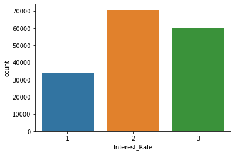
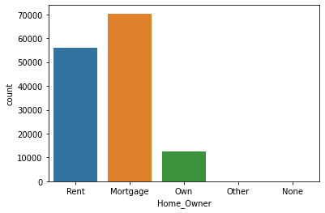
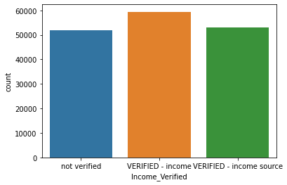
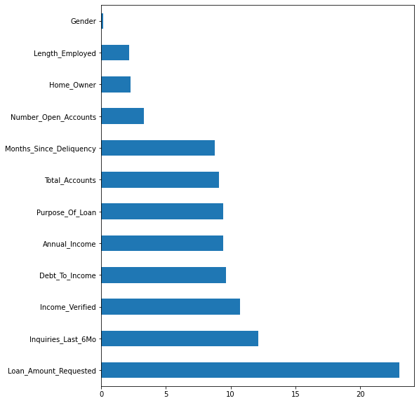

# <font color='PURPLE'>Ciência dos Dados na Prática</font>

# <font color='GREY'> Personalizando as Taxas de Acordo para cada Cliente</font>


# Bancos e Cooperativas de Crédito
Essas são 2 de uma infinidade de empresas que oferecem vários tipos de contas e fornecem empréstimos com base nos requisitos de seus clientes. Corretoras da Bolsa ofertam diversos produtos como investimentos em mercado e os mais variados fundos de investimento. 


Existem muitos bancos em todo o mundo que estão aproveitando o aprendizado de máquina e a IA em sua rotina diária e obtendo benefícios com isso. No Brasil e no Mundo as empresas estão usando o aprendizado de máquina para fornecer vários recursos aos clientes, bem como para prevenção e detecção de risco. Algumas aplicações incluem:

1. Suporte ao cliente

2. Detecção de fraude

3. Modelagem de Risco

4. Análise de marketing

5. Segmentação de clientes


# Só que tem mais...


Você já se perguntou como os credores usam vários fatores, como pontuação de crédito, renda anual, valor do empréstimo aprovado, prazo de validade, relação dívida / renda, etc., e **selecionam suas taxas de juros?**

O processo, definido como 'precificação baseada em risco', usa um algoritmo sofisticado que alavanca diferentes fatores determinantes de um solicitante de empréstimo. 

A seleção de variáveis significativas ajudará a desenvolver um algoritmo de previsão que pode estimar as taxas de juros dos empréstimos com base nas informações dos clientes. 


#1° Problema de Negócio


Ajudar as empresas de crédito a obter uma **estimativa imediata da taxa de juros fixa** com base nas informações dos clientes. Esse é o <"**deal**">

Aqui, seu objetivo é usar um conjunto de dados de treinamento para **prever a categoria de taxa de empréstimo (1/2/3)** que será atribuída a cada empréstimo em nosso conjunto de teste.


#2° Análise Exploratória dos Dados


```python
!pip install catboost
```


```python
import pandas as pd
import numpy as np
import seaborn as sns
from catboost import CatBoostClassifier
from sklearn.preprocessing import LabelEncoder
from sklearn.model_selection import train_test_split, KFold, StratifiedKFold
from sklearn.metrics import f1_score
from collections import Counter
import warnings
warnings.filterwarnings("ignore")
```


```python
# Versões dos pacotes usados neste jupyter notebook
!pip install -q -U watermark
%reload_ext watermark
%watermark -a "Ciência dos Dados" --iversions

# Versão da Linguagem Python
from platform import python_version
print('Versão da Linguagem Python Usada Neste Jupyter Notebook:', python_version())

#Alertas
import warnings
import sys
warnings.simplefilter(action='ignore', category=FutureWarning)
warnings.filterwarnings("ignore", category=FutureWarning)
if not sys.warnoptions:
    warnings.simplefilter("ignore")


```

    Author: Ciência dos Dados
    
    numpy  : 1.19.5
    IPython: 5.5.0
    seaborn: 0.11.1
    pandas : 1.1.5
    
    Versão da Linguagem Python Usada Neste Jupyter Notebook: 3.7.10


###Fonte de Dados:

https://datahack.analyticsvidhya.com/contest/janatahack-machine-learning-for-banking/ 


```python
#Importar os Dados
df_train = pd.read_csv("train_fNxu4vz.csv")
df_test = pd.read_csv("test_fjtUOL8.csv")
```


```python
df_train.head()
```


<div>
<style scoped>
    .dataframe tbody tr th:only-of-type {
        vertical-align: middle;
    }

    .dataframe tbody tr th {
        vertical-align: top;
    }

    .dataframe thead th {
        text-align: right;
    }
</style>
<table border="1" class="dataframe">
  <thead>
    <tr style="text-align: right;">
      <th></th>
      <th>Loan_ID</th>
      <th>Loan_Amount_Requested</th>
      <th>Length_Employed</th>
      <th>Home_Owner</th>
      <th>Annual_Income</th>
      <th>Income_Verified</th>
      <th>Purpose_Of_Loan</th>
      <th>Debt_To_Income</th>
      <th>Inquiries_Last_6Mo</th>
      <th>Months_Since_Deliquency</th>
      <th>Number_Open_Accounts</th>
      <th>Total_Accounts</th>
      <th>Gender</th>
      <th>Interest_Rate</th>
    </tr>
  </thead>
  <tbody>
    <tr>
      <th>0</th>
      <td>10000001</td>
      <td>7,000</td>
      <td>&lt; 1 year</td>
      <td>Rent</td>
      <td>68000.0</td>
      <td>not verified</td>
      <td>car</td>
      <td>18.37</td>
      <td>0</td>
      <td>NaN</td>
      <td>9</td>
      <td>14</td>
      <td>Female</td>
      <td>1</td>
    </tr>
    <tr>
      <th>1</th>
      <td>10000002</td>
      <td>30,000</td>
      <td>4 years</td>
      <td>Mortgage</td>
      <td>NaN</td>
      <td>VERIFIED - income</td>
      <td>debt_consolidation</td>
      <td>14.93</td>
      <td>0</td>
      <td>17.0</td>
      <td>12</td>
      <td>24</td>
      <td>Female</td>
      <td>3</td>
    </tr>
    <tr>
      <th>2</th>
      <td>10000003</td>
      <td>24,725</td>
      <td>7 years</td>
      <td>Mortgage</td>
      <td>75566.4</td>
      <td>VERIFIED - income source</td>
      <td>debt_consolidation</td>
      <td>15.88</td>
      <td>0</td>
      <td>NaN</td>
      <td>12</td>
      <td>16</td>
      <td>Male</td>
      <td>3</td>
    </tr>
    <tr>
      <th>3</th>
      <td>10000004</td>
      <td>16,000</td>
      <td>&lt; 1 year</td>
      <td>NaN</td>
      <td>56160.0</td>
      <td>VERIFIED - income source</td>
      <td>debt_consolidation</td>
      <td>14.34</td>
      <td>3</td>
      <td>NaN</td>
      <td>16</td>
      <td>22</td>
      <td>Male</td>
      <td>3</td>
    </tr>
    <tr>
      <th>4</th>
      <td>10000005</td>
      <td>17,000</td>
      <td>8 years</td>
      <td>Own</td>
      <td>96000.0</td>
      <td>VERIFIED - income source</td>
      <td>debt_consolidation</td>
      <td>22.17</td>
      <td>1</td>
      <td>NaN</td>
      <td>19</td>
      <td>30</td>
      <td>Female</td>
      <td>1</td>
    </tr>
  </tbody>
</table>
</div>


```python
df_train.shape
```


    (164309, 14)


```python
df_test.head()
```


```python
df_test.shape
```


    (109541, 13)


```python
#Descrição dos Campos
df_train.info()
```

    <class 'pandas.core.frame.DataFrame'>
    RangeIndex: 164309 entries, 0 to 164308
    Data columns (total 14 columns):
     #   Column                   Non-Null Count   Dtype  
    ---  ------                   --------------   -----  
     0   Loan_ID                  164309 non-null  int64  
     1   Loan_Amount_Requested    164309 non-null  object 
     2   Length_Employed          156938 non-null  object 
     3   Home_Owner               138960 non-null  object 
     4   Annual_Income            139207 non-null  float64
     5   Income_Verified          164309 non-null  object 
     6   Purpose_Of_Loan          164309 non-null  object 
     7   Debt_To_Income           164309 non-null  float64
     8   Inquiries_Last_6Mo       164309 non-null  int64  
     9   Months_Since_Deliquency  75930 non-null   float64
     10  Number_Open_Accounts     164309 non-null  int64  
     11  Total_Accounts           164309 non-null  int64  
     12  Gender                   164309 non-null  object 
     13  Interest_Rate            164309 non-null  int64  
    dtypes: float64(3), int64(5), object(6)
    memory usage: 17.6+ MB


### **Dicionário de Dados**


```python
#Estatística dos Campos
df_train.describe()
```


<div>
<style scoped>
    .dataframe tbody tr th:only-of-type {
        vertical-align: middle;
    }

    .dataframe tbody tr th {
        vertical-align: top;
    }

    .dataframe thead th {
        text-align: right;
    }
</style>
<table border="1" class="dataframe">
  <thead>
    <tr style="text-align: right;">
      <th></th>
      <th>Loan_ID</th>
      <th>Annual_Income</th>
      <th>Debt_To_Income</th>
      <th>Inquiries_Last_6Mo</th>
      <th>Months_Since_Deliquency</th>
      <th>Number_Open_Accounts</th>
      <th>Total_Accounts</th>
      <th>Interest_Rate</th>
    </tr>
  </thead>
  <tbody>
    <tr>
      <th>count</th>
      <td>1.643090e+05</td>
      <td>1.392070e+05</td>
      <td>164309.000000</td>
      <td>164309.000000</td>
      <td>75930.000000</td>
      <td>164309.000000</td>
      <td>164309.000000</td>
      <td>164309.000000</td>
    </tr>
    <tr>
      <th>mean</th>
      <td>1.008216e+07</td>
      <td>7.333116e+04</td>
      <td>17.207189</td>
      <td>0.781698</td>
      <td>34.229356</td>
      <td>11.193818</td>
      <td>25.067665</td>
      <td>2.158951</td>
    </tr>
    <tr>
      <th>std</th>
      <td>4.743207e+04</td>
      <td>6.037750e+04</td>
      <td>7.845083</td>
      <td>1.034747</td>
      <td>21.761180</td>
      <td>4.991813</td>
      <td>11.583067</td>
      <td>0.738364</td>
    </tr>
    <tr>
      <th>min</th>
      <td>1.000000e+07</td>
      <td>4.000000e+03</td>
      <td>0.000000</td>
      <td>0.000000</td>
      <td>0.000000</td>
      <td>0.000000</td>
      <td>2.000000</td>
      <td>1.000000</td>
    </tr>
    <tr>
      <th>25%</th>
      <td>1.004108e+07</td>
      <td>4.500000e+04</td>
      <td>11.370000</td>
      <td>0.000000</td>
      <td>16.000000</td>
      <td>8.000000</td>
      <td>17.000000</td>
      <td>2.000000</td>
    </tr>
    <tr>
      <th>50%</th>
      <td>1.008216e+07</td>
      <td>6.300000e+04</td>
      <td>16.840000</td>
      <td>0.000000</td>
      <td>31.000000</td>
      <td>10.000000</td>
      <td>23.000000</td>
      <td>2.000000</td>
    </tr>
    <tr>
      <th>75%</th>
      <td>1.012323e+07</td>
      <td>8.869750e+04</td>
      <td>22.780000</td>
      <td>1.000000</td>
      <td>50.000000</td>
      <td>14.000000</td>
      <td>32.000000</td>
      <td>3.000000</td>
    </tr>
    <tr>
      <th>max</th>
      <td>1.016431e+07</td>
      <td>7.500000e+06</td>
      <td>39.990000</td>
      <td>8.000000</td>
      <td>180.000000</td>
      <td>76.000000</td>
      <td>156.000000</td>
      <td>3.000000</td>
    </tr>
  </tbody>
</table>
</div>


```python
#Contagem de Domínios Distintos
df_train.nunique()
```


```python
#Verifica Valores Nulos
df_train.isna().sum()
```


```python
# #Estatística dos Campos
df_train['Length_Employed'].value_counts()
```


```python
#Estatística dos Campos
df_train['Interest_Rate'].value_counts()
sns.countplot(df_train['Interest_Rate'])
```


    <matplotlib.axes._subplots.AxesSubplot at 0x7f12ff393350>


    

    


```python
#Estatística dos Campos
df_train['Home_Owner'].value_counts()
sns.countplot(df_train['Home_Owner'])
```


    <matplotlib.axes._subplots.AxesSubplot at 0x7f12ff2976d0>


    

    


```python
#Estatística dos Campos
df_train['Income_Verified'].value_counts()
sns.countplot(df_train['Income_Verified'])
```


    <matplotlib.axes._subplots.AxesSubplot at 0x7f12fede3690>


    

    


```python
#Estatística dos Campos
df_train['Purpose_Of_Loan'].value_counts()

```

#3° Pré-Processamento dos Dados


```python
# Convert to numeric
df_train["Loan_Amount_Requested"] = df_train["Loan_Amount_Requested"].str.replace(",", "")
df_train["Loan_Amount_Requested"] = pd.to_numeric(df_train["Loan_Amount_Requested"])
df_test["Loan_Amount_Requested"] = df_test["Loan_Amount_Requested"].str.replace(",", "")
df_test["Loan_Amount_Requested"] = pd.to_numeric(df_test["Loan_Amount_Requested"])

```


```python
# Tratamento de Valores Missing e Nulos
df_train["Length_Employed"].fillna('NaN', inplace=True)
df_test["Length_Employed"].fillna('NaN', inplace=True)

df_train["Home_Owner"].fillna('NaN', inplace=True)
df_test["Home_Owner"].fillna('NaN', inplace=True)

df_train["Income_Verified"].fillna('NaN', inplace=True)
df_test["Income_Verified"].fillna('NaN', inplace=True)

df_train["Purpose_Of_Loan"].fillna('NaN', inplace=True)
df_test["Purpose_Of_Loan"].fillna('NaN', inplace=True)

df_train["Gender"].fillna('NaN', inplace=True)
df_test["Gender"].fillna('NaN', inplace=True)


```


```python
# Drop loan ids - Eliminando campos de Identificação (campos sem utilidade, pois somente identificam o cliente)
df_train = df_train.drop(["Loan_ID"], axis=1)
loan_ids = df_test["Loan_ID"].values
df_test = df_test.drop(["Loan_ID"], axis=1)


```

### Imputação de Valores Missing 


```python
# Imputação Pela Media -  mean
df_train["Annual_Income"].fillna(df_train["Annual_Income"].mean(), inplace=True)
df_test["Annual_Income"].fillna(df_test["Annual_Income"].mean(), inplace=True)

# Substituíndo nulos por Zero
df_train["Months_Since_Deliquency"].fillna(0, inplace=True)
df_test["Months_Since_Deliquency"].fillna(0, inplace=True)


```

### Criação de Variáveis - feature engineering


```python
# New feature
df_train["Number_Invalid_Acc"] = df_train["Total_Accounts"] - df_train["Number_Open_Accounts"]
df_test["Number_Invalid_Acc"] = df_test["Total_Accounts"] - df_test["Number_Open_Accounts"]

# New feature
df_train["Number_Years_To_Repay_Debt"] = df_train["Loan_Amount_Requested"]/df_train["Annual_Income"]
df_test["Number_Years_To_Repay_Debt"] = df_test["Loan_Amount_Requested"]/df_test["Annual_Income"]

df_train.head()
```


```python
#Pré - Amostragem - Dados de Treino e Teste
X_train, Y = df_train.drop(["Interest_Rate"], axis=1).values, df_train["Interest_Rate"].values
X_test = df_test.values

X_train.shape, Y.shape, X_test.shape
```


    ((164309, 12), (164309,), (109541, 12))


```python
Y
```


    array([1, 3, 3, ..., 1, 3, 2])


#4° Construíndo a Máquina Preditiva 


### Validação Cruzada ou Cross Validation
https://youtu.be/HSRsFP-lW0Q


```python
from IPython.core.display import HTML
HTML('<<iframe width="380" height="200" src="https://www.youtube.com/embed/FI3RlY9AaVs" frameborder="0" allow="accelerometer; autoplay; clipboard-write; encrypted-media; gyroscope; picture-in-picture" allowfullscreen></iframe>')
```


<<iframe width="380" height="200" src="https://www.youtube.com/embed/FI3RlY9AaVs" frameborder="0" allow="accelerometer; autoplay; clipboard-write; encrypted-media; gyroscope; picture-in-picture" allowfullscreen></iframe>


```python
# Validação Cruzada - Otimizando e Profissionalizando a Amostragem

kfold, scores = KFold(n_splits=5, shuffle=True, random_state=0), list()

for train, test in kfold.split(X_train):
    x_train, x_test = X_train[train], X_train[test]
    y_train, y_test = Y[train], Y[test]
    
    model = CatBoostClassifier(task_type="GPU", n_estimators=1000, max_depth=4, random_state=7, verbose=500)
    model.fit(x_train, y_train, cat_features=[1, 2, 4, 5, 11])
    
    #Avaliação no tempo de Treinamento
    preds = model.predict(x_test)
    score = f1_score(y_test, preds, average="weighted")
    scores.append(score)
    print(score)
print("Average: ", sum(scores)/len(scores))
```

    Learning rate set to 0.175594
    0:	learn: 1.0809143	total: 12.3ms	remaining: 12.2s
    500:	learn: 0.9052816	total: 4.36s	remaining: 4.34s
    999:	learn: 0.8933738	total: 8.51s	remaining: 0us
    0.5349985568689661
    Learning rate set to 0.175594
    0:	learn: 1.0808181	total: 8.88ms	remaining: 8.87s
    500:	learn: 0.9038374	total: 3.92s	remaining: 3.91s
    999:	learn: 0.8916711	total: 7.98s	remaining: 0us
    0.5346382159205323
    Learning rate set to 0.175594
    0:	learn: 1.0812158	total: 9.35ms	remaining: 9.34s
    500:	learn: 0.9049934	total: 3.95s	remaining: 3.94s
    999:	learn: 0.8927167	total: 8.09s	remaining: 0us
    0.533148672300574
    Learning rate set to 0.175594
    0:	learn: 1.0808484	total: 9.16ms	remaining: 9.15s
    500:	learn: 0.9051933	total: 4.02s	remaining: 4s
    999:	learn: 0.8925900	total: 8.25s	remaining: 0us
    0.534585938864088
    Learning rate set to 0.175594
    0:	learn: 1.0809992	total: 9.63ms	remaining: 9.62s
    500:	learn: 0.9049773	total: 4.14s	remaining: 4.13s
    999:	learn: 0.8930004	total: 8.34s	remaining: 0us
    0.5371743308945667
    Average:  0.5349091429697455


### Principais Variáveis


```python
#Feature Importances
feat_imp = pd.Series(model.feature_importances_, index=df_train.drop(["Interest_Rate"], axis=1).columns)
feat_imp.nlargest(30).plot(kind='barh', figsize=(8,10))
```


    <matplotlib.axes._subplots.AxesSubplot at 0x7f12fcc97f90>


    

    


#5° Avaliação da Máquina Preditiva


```python
#preds = model.predict(x_test)
#score = f1_score(y_test, preds, average="weighted")
#scores.append(score)
#print(score)
#print("Average: ", sum(scores)/len(scores))
```


```
# Isto está formatado como código
```

# Entre os 20 Primeiros do Mundo na Competição!
https://datahack.analyticsvidhya.com/contest/janatahack-machine-learning-for-banking/#LeaderBoard


# **Resumão**


* Nesta aula, aprendemos a **Criar Máquina Preditiva** que prevê a Melhor Categoria de Taxa de juros para o Cliente
* Mais 1 Case com **Catboost**
* **Validação Cruzada**
* **Imputação** de Valores Missing
* Criação de Variáveis - **Feature Engineering**
* Ficamos entre os 20 primeiros colocados na competição


#Fim

## Valeu!

### #Links - Ciência dos Dados <a href="https://linktr.ee/cienciadosdados">https://linktr.ee/cienciadosdados</a>

### #YouTube - Mais Aulas como essa no YouTube <a href="https://www.youtube.com/watch?v=IaIc5oHd3II&t=1569s">https://www.youtube.com/watch?v=IaIc5oHd3II&t=1569s</a>


```python
from IPython.core.display import HTML
HTML('<iframe width="380" height="202" src="https://www.youtube.com/embed/O8SZGlSFnwo" frameborder="0" allow="accelerometer; autoplay; clipboard-write; encrypted-media; gyroscope; picture-in-picture" allowfullscreen></iframe>')
```


<iframe width="380" height="202" src="https://www.youtube.com/embed/O8SZGlSFnwo" frameborder="0" allow="accelerometer; autoplay; clipboard-write; encrypted-media; gyroscope; picture-in-picture" allowfullscreen></iframe>


