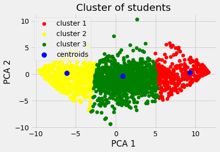

```python
import pandas as pd
import numpy as np
import seaborn as sns
import matplotlib.pyplot as plt
import warnings
%matplotlib inline
warnings.filterwarnings('ignore')
pd.options.display.max_columns = 99
```


```python
df = pd.read_csv("turkiye-student-evaluation_generic.csv")
df.head()
```


<div>
<style scoped>
    .dataframe tbody tr th:only-of-type {
        vertical-align: middle;
    }

    .dataframe tbody tr th {
        vertical-align: top;
    }

    .dataframe thead th {
        text-align: right;
    }
</style>
<table border="1" class="dataframe">
  <thead>
    <tr style="text-align: right;">
      <th></th>
      <th>instr</th>
      <th>class</th>
      <th>nb.repeat</th>
      <th>attendance</th>
      <th>difficulty</th>
      <th>Q1</th>
      <th>Q2</th>
      <th>Q3</th>
      <th>Q4</th>
      <th>Q5</th>
      <th>Q6</th>
      <th>Q7</th>
      <th>Q8</th>
      <th>Q9</th>
      <th>Q10</th>
      <th>Q11</th>
      <th>Q12</th>
      <th>Q13</th>
      <th>Q14</th>
      <th>Q15</th>
      <th>Q16</th>
      <th>Q17</th>
      <th>Q18</th>
      <th>Q19</th>
      <th>Q20</th>
      <th>Q21</th>
      <th>Q22</th>
      <th>Q23</th>
      <th>Q24</th>
      <th>Q25</th>
      <th>Q26</th>
      <th>Q27</th>
      <th>Q28</th>
    </tr>
  </thead>
  <tbody>
    <tr>
      <th>0</th>
      <td>1</td>
      <td>2</td>
      <td>1</td>
      <td>0</td>
      <td>4</td>
      <td>3</td>
      <td>3</td>
      <td>3</td>
      <td>3</td>
      <td>3</td>
      <td>3</td>
      <td>3</td>
      <td>3</td>
      <td>3</td>
      <td>3</td>
      <td>3</td>
      <td>3</td>
      <td>3</td>
      <td>3</td>
      <td>3</td>
      <td>3</td>
      <td>3</td>
      <td>3</td>
      <td>3</td>
      <td>3</td>
      <td>3</td>
      <td>3</td>
      <td>3</td>
      <td>3</td>
      <td>3</td>
      <td>3</td>
      <td>3</td>
      <td>3</td>
    </tr>
    <tr>
      <th>1</th>
      <td>1</td>
      <td>2</td>
      <td>1</td>
      <td>1</td>
      <td>3</td>
      <td>3</td>
      <td>3</td>
      <td>3</td>
      <td>3</td>
      <td>3</td>
      <td>3</td>
      <td>3</td>
      <td>3</td>
      <td>3</td>
      <td>3</td>
      <td>3</td>
      <td>3</td>
      <td>3</td>
      <td>3</td>
      <td>3</td>
      <td>3</td>
      <td>3</td>
      <td>3</td>
      <td>3</td>
      <td>3</td>
      <td>3</td>
      <td>3</td>
      <td>3</td>
      <td>3</td>
      <td>3</td>
      <td>3</td>
      <td>3</td>
      <td>3</td>
    </tr>
    <tr>
      <th>2</th>
      <td>1</td>
      <td>2</td>
      <td>1</td>
      <td>2</td>
      <td>4</td>
      <td>5</td>
      <td>5</td>
      <td>5</td>
      <td>5</td>
      <td>5</td>
      <td>5</td>
      <td>5</td>
      <td>5</td>
      <td>5</td>
      <td>5</td>
      <td>5</td>
      <td>5</td>
      <td>5</td>
      <td>5</td>
      <td>5</td>
      <td>5</td>
      <td>5</td>
      <td>5</td>
      <td>5</td>
      <td>5</td>
      <td>5</td>
      <td>5</td>
      <td>5</td>
      <td>5</td>
      <td>5</td>
      <td>5</td>
      <td>5</td>
      <td>5</td>
    </tr>
    <tr>
      <th>3</th>
      <td>1</td>
      <td>2</td>
      <td>1</td>
      <td>1</td>
      <td>3</td>
      <td>3</td>
      <td>3</td>
      <td>3</td>
      <td>3</td>
      <td>3</td>
      <td>3</td>
      <td>3</td>
      <td>3</td>
      <td>3</td>
      <td>3</td>
      <td>3</td>
      <td>3</td>
      <td>3</td>
      <td>3</td>
      <td>3</td>
      <td>3</td>
      <td>3</td>
      <td>3</td>
      <td>3</td>
      <td>3</td>
      <td>3</td>
      <td>3</td>
      <td>3</td>
      <td>3</td>
      <td>3</td>
      <td>3</td>
      <td>3</td>
      <td>3</td>
    </tr>
    <tr>
      <th>4</th>
      <td>1</td>
      <td>2</td>
      <td>1</td>
      <td>0</td>
      <td>1</td>
      <td>1</td>
      <td>1</td>
      <td>1</td>
      <td>1</td>
      <td>1</td>
      <td>1</td>
      <td>1</td>
      <td>1</td>
      <td>1</td>
      <td>1</td>
      <td>1</td>
      <td>1</td>
      <td>1</td>
      <td>1</td>
      <td>1</td>
      <td>1</td>
      <td>1</td>
      <td>1</td>
      <td>1</td>
      <td>1</td>
      <td>1</td>
      <td>1</td>
      <td>1</td>
      <td>1</td>
      <td>1</td>
      <td>1</td>
      <td>1</td>
      <td>1</td>
    </tr>
  </tbody>
</table>
</div>


```python
# statistical info
df.describe()
```


<div>
<style scoped>
    .dataframe tbody tr th:only-of-type {
        vertical-align: middle;
    }

    .dataframe tbody tr th {
        vertical-align: top;
    }

    .dataframe thead th {
        text-align: right;
    }
</style>
<table border="1" class="dataframe">
  <thead>
    <tr style="text-align: right;">
      <th></th>
      <th>instr</th>
      <th>class</th>
      <th>nb.repeat</th>
      <th>attendance</th>
      <th>difficulty</th>
      <th>Q1</th>
      <th>Q2</th>
      <th>Q3</th>
      <th>Q4</th>
      <th>Q5</th>
      <th>Q6</th>
      <th>Q7</th>
      <th>Q8</th>
      <th>Q9</th>
      <th>Q10</th>
      <th>Q11</th>
      <th>Q12</th>
      <th>Q13</th>
      <th>Q14</th>
      <th>Q15</th>
      <th>Q16</th>
      <th>Q17</th>
      <th>Q18</th>
      <th>Q19</th>
      <th>Q20</th>
      <th>Q21</th>
      <th>Q22</th>
      <th>Q23</th>
      <th>Q24</th>
      <th>Q25</th>
      <th>Q26</th>
      <th>Q27</th>
      <th>Q28</th>
    </tr>
  </thead>
  <tbody>
    <tr>
      <th>count</th>
      <td>5820.000000</td>
      <td>5820.000000</td>
      <td>5820.000000</td>
      <td>5820.000000</td>
      <td>5820.000000</td>
      <td>5820.000000</td>
      <td>5820.000000</td>
      <td>5820.000000</td>
      <td>5820.000000</td>
      <td>5820.000000</td>
      <td>5820.000000</td>
      <td>5820.000000</td>
      <td>5820.000000</td>
      <td>5820.000000</td>
      <td>5820.000000</td>
      <td>5820.000000</td>
      <td>5820.000000</td>
      <td>5820.000000</td>
      <td>5820.000000</td>
      <td>5820.000000</td>
      <td>5820.000000</td>
      <td>5820.000000</td>
      <td>5820.000000</td>
      <td>5820.000000</td>
      <td>5820.000000</td>
      <td>5820.000000</td>
      <td>5820.000000</td>
      <td>5820.00000</td>
      <td>5820.000000</td>
      <td>5820.000000</td>
      <td>5820.000000</td>
      <td>5820.000000</td>
      <td>5820.000000</td>
    </tr>
    <tr>
      <th>mean</th>
      <td>2.485567</td>
      <td>7.276289</td>
      <td>1.214089</td>
      <td>1.675601</td>
      <td>2.783505</td>
      <td>2.929897</td>
      <td>3.073883</td>
      <td>3.178694</td>
      <td>3.082474</td>
      <td>3.105842</td>
      <td>3.107388</td>
      <td>3.066323</td>
      <td>3.041924</td>
      <td>3.165979</td>
      <td>3.090722</td>
      <td>3.183849</td>
      <td>3.035567</td>
      <td>3.242784</td>
      <td>3.290893</td>
      <td>3.287285</td>
      <td>3.169588</td>
      <td>3.398454</td>
      <td>3.222509</td>
      <td>3.261684</td>
      <td>3.285395</td>
      <td>3.307388</td>
      <td>3.317526</td>
      <td>3.20189</td>
      <td>3.166838</td>
      <td>3.312543</td>
      <td>3.222165</td>
      <td>3.154811</td>
      <td>3.308076</td>
    </tr>
    <tr>
      <th>std</th>
      <td>0.718473</td>
      <td>3.688175</td>
      <td>0.532376</td>
      <td>1.474975</td>
      <td>1.348987</td>
      <td>1.341077</td>
      <td>1.285251</td>
      <td>1.253567</td>
      <td>1.284594</td>
      <td>1.278989</td>
      <td>1.280807</td>
      <td>1.279097</td>
      <td>1.283481</td>
      <td>1.268930</td>
      <td>1.275309</td>
      <td>1.295443</td>
      <td>1.305772</td>
      <td>1.264201</td>
      <td>1.255373</td>
      <td>1.253122</td>
      <td>1.288015</td>
      <td>1.267530</td>
      <td>1.279799</td>
      <td>1.268442</td>
      <td>1.276848</td>
      <td>1.269974</td>
      <td>1.268358</td>
      <td>1.27259</td>
      <td>1.275909</td>
      <td>1.257286</td>
      <td>1.270695</td>
      <td>1.291872</td>
      <td>1.278709</td>
    </tr>
    <tr>
      <th>min</th>
      <td>1.000000</td>
      <td>1.000000</td>
      <td>1.000000</td>
      <td>0.000000</td>
      <td>1.000000</td>
      <td>1.000000</td>
      <td>1.000000</td>
      <td>1.000000</td>
      <td>1.000000</td>
      <td>1.000000</td>
      <td>1.000000</td>
      <td>1.000000</td>
      <td>1.000000</td>
      <td>1.000000</td>
      <td>1.000000</td>
      <td>1.000000</td>
      <td>1.000000</td>
      <td>1.000000</td>
      <td>1.000000</td>
      <td>1.000000</td>
      <td>1.000000</td>
      <td>1.000000</td>
      <td>1.000000</td>
      <td>1.000000</td>
      <td>1.000000</td>
      <td>1.000000</td>
      <td>1.000000</td>
      <td>1.00000</td>
      <td>1.000000</td>
      <td>1.000000</td>
      <td>1.000000</td>
      <td>1.000000</td>
      <td>1.000000</td>
    </tr>
    <tr>
      <th>25%</th>
      <td>2.000000</td>
      <td>4.000000</td>
      <td>1.000000</td>
      <td>0.000000</td>
      <td>1.000000</td>
      <td>2.000000</td>
      <td>2.000000</td>
      <td>2.000000</td>
      <td>2.000000</td>
      <td>2.000000</td>
      <td>2.000000</td>
      <td>2.000000</td>
      <td>2.000000</td>
      <td>2.000000</td>
      <td>2.000000</td>
      <td>2.000000</td>
      <td>2.000000</td>
      <td>2.000000</td>
      <td>3.000000</td>
      <td>3.000000</td>
      <td>2.000000</td>
      <td>3.000000</td>
      <td>2.000000</td>
      <td>3.000000</td>
      <td>3.000000</td>
      <td>3.000000</td>
      <td>3.000000</td>
      <td>2.00000</td>
      <td>2.000000</td>
      <td>3.000000</td>
      <td>2.000000</td>
      <td>2.000000</td>
      <td>3.000000</td>
    </tr>
    <tr>
      <th>50%</th>
      <td>3.000000</td>
      <td>7.000000</td>
      <td>1.000000</td>
      <td>1.000000</td>
      <td>3.000000</td>
      <td>3.000000</td>
      <td>3.000000</td>
      <td>3.000000</td>
      <td>3.000000</td>
      <td>3.000000</td>
      <td>3.000000</td>
      <td>3.000000</td>
      <td>3.000000</td>
      <td>3.000000</td>
      <td>3.000000</td>
      <td>3.000000</td>
      <td>3.000000</td>
      <td>3.000000</td>
      <td>3.000000</td>
      <td>3.000000</td>
      <td>3.000000</td>
      <td>4.000000</td>
      <td>3.000000</td>
      <td>3.000000</td>
      <td>3.000000</td>
      <td>3.000000</td>
      <td>3.000000</td>
      <td>3.00000</td>
      <td>3.000000</td>
      <td>3.000000</td>
      <td>3.000000</td>
      <td>3.000000</td>
      <td>3.000000</td>
    </tr>
    <tr>
      <th>75%</th>
      <td>3.000000</td>
      <td>10.000000</td>
      <td>1.000000</td>
      <td>3.000000</td>
      <td>4.000000</td>
      <td>4.000000</td>
      <td>4.000000</td>
      <td>4.000000</td>
      <td>4.000000</td>
      <td>4.000000</td>
      <td>4.000000</td>
      <td>4.000000</td>
      <td>4.000000</td>
      <td>4.000000</td>
      <td>4.000000</td>
      <td>4.000000</td>
      <td>4.000000</td>
      <td>4.000000</td>
      <td>4.000000</td>
      <td>4.000000</td>
      <td>4.000000</td>
      <td>4.000000</td>
      <td>4.000000</td>
      <td>4.000000</td>
      <td>4.000000</td>
      <td>4.000000</td>
      <td>4.000000</td>
      <td>4.00000</td>
      <td>4.000000</td>
      <td>4.000000</td>
      <td>4.000000</td>
      <td>4.000000</td>
      <td>4.000000</td>
    </tr>
    <tr>
      <th>max</th>
      <td>3.000000</td>
      <td>13.000000</td>
      <td>3.000000</td>
      <td>4.000000</td>
      <td>5.000000</td>
      <td>5.000000</td>
      <td>5.000000</td>
      <td>5.000000</td>
      <td>5.000000</td>
      <td>5.000000</td>
      <td>5.000000</td>
      <td>5.000000</td>
      <td>5.000000</td>
      <td>5.000000</td>
      <td>5.000000</td>
      <td>5.000000</td>
      <td>5.000000</td>
      <td>5.000000</td>
      <td>5.000000</td>
      <td>5.000000</td>
      <td>5.000000</td>
      <td>5.000000</td>
      <td>5.000000</td>
      <td>5.000000</td>
      <td>5.000000</td>
      <td>5.000000</td>
      <td>5.000000</td>
      <td>5.00000</td>
      <td>5.000000</td>
      <td>5.000000</td>
      <td>5.000000</td>
      <td>5.000000</td>
      <td>5.000000</td>
    </tr>
  </tbody>
</table>
</div>


```python
# datatype info
df.info()
```

    <class 'pandas.core.frame.DataFrame'>
    RangeIndex: 5820 entries, 0 to 5819
    Data columns (total 33 columns):
     #   Column      Non-Null Count  Dtype
    ---  ------      --------------  -----
     0   instr       5820 non-null   int64
     1   class       5820 non-null   int64
     2   nb.repeat   5820 non-null   int64
     3   attendance  5820 non-null   int64
     4   difficulty  5820 non-null   int64
     5   Q1          5820 non-null   int64
     6   Q2          5820 non-null   int64
     7   Q3          5820 non-null   int64
     8   Q4          5820 non-null   int64
     9   Q5          5820 non-null   int64
     10  Q6          5820 non-null   int64
     11  Q7          5820 non-null   int64
     12  Q8          5820 non-null   int64
     13  Q9          5820 non-null   int64
     14  Q10         5820 non-null   int64
     15  Q11         5820 non-null   int64
     16  Q12         5820 non-null   int64
     17  Q13         5820 non-null   int64
     18  Q14         5820 non-null   int64
     19  Q15         5820 non-null   int64
     20  Q16         5820 non-null   int64
     21  Q17         5820 non-null   int64
     22  Q18         5820 non-null   int64
     23  Q19         5820 non-null   int64
     24  Q20         5820 non-null   int64
     25  Q21         5820 non-null   int64
     26  Q22         5820 non-null   int64
     27  Q23         5820 non-null   int64
     28  Q24         5820 non-null   int64
     29  Q25         5820 non-null   int64
     30  Q26         5820 non-null   int64
     31  Q27         5820 non-null   int64
     32  Q28         5820 non-null   int64
    dtypes: int64(33)
    memory usage: 1.5 MB
    


```python
# check for null values
df.isnull().sum()
```


    instr         0
    class         0
    nb.repeat     0
    attendance    0
    difficulty    0
    Q1            0
    Q2            0
    Q3            0
    Q4            0
    Q5            0
    Q6            0
    Q7            0
    Q8            0
    Q9            0
    Q10           0
    Q11           0
    Q12           0
    Q13           0
    Q14           0
    Q15           0
    Q16           0
    Q17           0
    Q18           0
    Q19           0
    Q20           0
    Q21           0
    Q22           0
    Q23           0
    Q24           0
    Q25           0
    Q26           0
    Q27           0
    Q28           0
    dtype: int64


```python
# set new style for the graph
plt.style.use("fivethirtyeight")
```


```python
sns.countplot(df['instr'])
```


    <AxesSubplot:xlabel='instr', ylabel='count'>


    

    


```python
sns.countplot(df['class'])
```


    <AxesSubplot:xlabel='class', ylabel='count'>


    

    


```python
# find mean of questions
x_questions = df.iloc[:, 5:33]
q_mean = x_questions.mean(axis=0)
total_mean = q_mean.mean()
```


```python
q_mean = q_mean.to_frame('mean')
q_mean.reset_index(level=0, inplace=True)
q_mean.head()
```


<div>
<style scoped>
    .dataframe tbody tr th:only-of-type {
        vertical-align: middle;
    }

    .dataframe tbody tr th {
        vertical-align: top;
    }

    .dataframe thead th {
        text-align: right;
    }
</style>
<table border="1" class="dataframe">
  <thead>
    <tr style="text-align: right;">
      <th></th>
      <th>index</th>
      <th>mean</th>
    </tr>
  </thead>
  <tbody>
    <tr>
      <th>0</th>
      <td>Q1</td>
      <td>2.929897</td>
    </tr>
    <tr>
      <th>1</th>
      <td>Q2</td>
      <td>3.073883</td>
    </tr>
    <tr>
      <th>2</th>
      <td>Q3</td>
      <td>3.178694</td>
    </tr>
    <tr>
      <th>3</th>
      <td>Q4</td>
      <td>3.082474</td>
    </tr>
    <tr>
      <th>4</th>
      <td>Q5</td>
      <td>3.105842</td>
    </tr>
  </tbody>
</table>
</div>


```python
total_mean
```


    3.1861561119293076


```python
plt.figure(figsize=(14,7))
sns.barplot(x='index', y='mean', data=q_mean)
```


    <AxesSubplot:xlabel='index', ylabel='mean'>


    

    


```python
corr = df.corr()
plt.figure(figsize=(18,18))
sns.heatmap(corr, annot=True, cmap='coolwarm')
```


    <AxesSubplot:>


    

    


# Principal component analysis


```python
X = df.iloc[:, 5:33]
```


```python
from sklearn.decomposition import PCA
pca = PCA(n_components=2, random_state=42)
X_pca = pca.fit_transform(X)
```


```python
X_pca
```


    array([[ 0.98901533,  0.52279815],
           [ 0.98901533,  0.52279815],
           [-9.59128851,  0.6408021 ],
           ...,
           [-9.59128851,  0.6408021 ],
           [11.56931918,  0.40479421],
           [11.56931918,  0.40479421]])


```python
# how much info we retained from the dataset
pca.explained_variance_ratio_.cumsum()[1]
```


    0.8671381678891028


# Model Training


```python
# Kmeans clustering
from sklearn.cluster import KMeans
distortions = []
cluster_range = range(1,6)

# elbow method
for i in cluster_range:
    model = KMeans(n_clusters=i, init='k-means++', n_jobs=-1, random_state=42)
    model.fit(X_pca)
    distortions.append(model.inertia_)
```


```python
plt.plot(cluster_range, distortions, marker='o')
plt.xlabel("Number of clusters")
plt.ylabel('Distortions')
plt.show()
```


    

    


```python
# use best cluster
model = KMeans(n_clusters=3, init='k-means++', n_jobs=-1, random_state=42)
model.fit(X_pca)
y = model.predict(X_pca)
```


```python
plt.scatter(X_pca[y==0, 0], X_pca[y==0, 1], s=50, c='red', label='cluster 1')
plt.scatter(X_pca[y==1, 0], X_pca[y==1, 1], s=50, c='yellow', label='cluster 2')
plt.scatter(X_pca[y==2, 0], X_pca[y==2, 1], s=50, c='green', label='cluster 3')
plt.scatter(model.cluster_centers_[:,0], model.cluster_centers_[:, 1], s=100, c='blue', label='centroids')
plt.title('Cluster of students')
plt.xlabel('PCA 1')
plt.ylabel('PCA 2')
plt.legend()
plt.show()
```


    

    


```python
from collections import Counter
Counter(y)
```


    Counter({2: 2358, 1: 2222, 0: 1240})


```python
model = KMeans(n_clusters=3, init='k-means++', n_jobs=-1, random_state=42)
model.fit(X)
y = model.predict(X)
```


```python
Counter(y)
```


    Counter({0: 2358, 2: 2223, 1: 1239})


```python
# dendogram
import scipy.cluster.hierarchy as hier
dendogram = hier.dendrogram(hier.linkage(X_pca, method='ward'))
plt.title('Dendogram')
plt.xlabel("Questions")
plt.ylabel("Distance")
plt.show()
```


    

    


```python
from sklearn.cluster import AgglomerativeClustering
model = AgglomerativeClustering(n_clusters=2, affinity='euclidean', linkage='ward')
y = model.fit_predict(X_pca)
```


```python
plt.scatter(X_pca[y==0, 0], X_pca[y==0, 1], s=50, c='red', label='cluster 1')
plt.scatter(X_pca[y==1, 0], X_pca[y==1, 1], s=50, c='yellow', label='cluster 2')
plt.title('Cluster of students')
plt.xlabel('PCA 1')
plt.ylabel('PCA 2')
plt.legend()
plt.show()
```


    

    


```python
Counter(y)
```


    Counter({0: 3502, 1: 2318})


