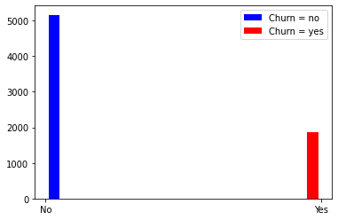

# Previsão de perda de cliente utilizando Tensorflow
##### Link para download do csv [telco cuestomer churn](https://www.kaggle.com/blastchar/telco-customer-churn)

```python
import pandas as pd
import numpy as np
import matplotlib.pyplot as plt
from sklearn.preprocessing import MinMaxScaler, LabelEncoder
from sklearn.model_selection import train_test_split
from sklearn.metrics import confusion_matrix, classification_report
import tensorflow as tf
from tensorflow import keras
from tensorflow.keras.models import Sequential
from tensorflow.keras.layers import Activation, Dense
from tensorflow.keras.optimizers import Adam
from tensorflow.keras.metrics import categorical_crossentropy
```


```python
df = pd.read_csv('WA_Fn-UseC_-Telco-Customer-Churn.csv')
```


```python
df_val = df.iloc[:10]
df_val
```


<div>
<style scoped>
    .dataframe tbody tr th:only-of-type {
        vertical-align: middle;
    }

    .dataframe tbody tr th {
        vertical-align: top;
    }

    .dataframe thead th {
        text-align: right;
    }
</style>
<table border="1" class="dataframe">
  <thead>
    <tr style="text-align: right;">
      <th></th>
      <th>customerID</th>
      <th>gender</th>
      <th>SeniorCitizen</th>
      <th>Partner</th>
      <th>Dependents</th>
      <th>tenure</th>
      <th>PhoneService</th>
      <th>MultipleLines</th>
      <th>InternetService</th>
      <th>OnlineSecurity</th>
      <th>...</th>
      <th>DeviceProtection</th>
      <th>TechSupport</th>
      <th>StreamingTV</th>
      <th>StreamingMovies</th>
      <th>Contract</th>
      <th>PaperlessBilling</th>
      <th>PaymentMethod</th>
      <th>MonthlyCharges</th>
      <th>TotalCharges</th>
      <th>Churn</th>
    </tr>
  </thead>
  <tbody>
    <tr>
      <th>0</th>
      <td>7590-VHVEG</td>
      <td>Female</td>
      <td>0</td>
      <td>Yes</td>
      <td>No</td>
      <td>1</td>
      <td>No</td>
      <td>No phone service</td>
      <td>DSL</td>
      <td>No</td>
      <td>...</td>
      <td>No</td>
      <td>No</td>
      <td>No</td>
      <td>No</td>
      <td>Month-to-month</td>
      <td>Yes</td>
      <td>Electronic check</td>
      <td>29.85</td>
      <td>29.85</td>
      <td>No</td>
    </tr>
    <tr>
      <th>1</th>
      <td>5575-GNVDE</td>
      <td>Male</td>
      <td>0</td>
      <td>No</td>
      <td>No</td>
      <td>34</td>
      <td>Yes</td>
      <td>No</td>
      <td>DSL</td>
      <td>Yes</td>
      <td>...</td>
      <td>Yes</td>
      <td>No</td>
      <td>No</td>
      <td>No</td>
      <td>One year</td>
      <td>No</td>
      <td>Mailed check</td>
      <td>56.95</td>
      <td>1889.5</td>
      <td>No</td>
    </tr>
    <tr>
      <th>2</th>
      <td>3668-QPYBK</td>
      <td>Male</td>
      <td>0</td>
      <td>No</td>
      <td>No</td>
      <td>2</td>
      <td>Yes</td>
      <td>No</td>
      <td>DSL</td>
      <td>Yes</td>
      <td>...</td>
      <td>No</td>
      <td>No</td>
      <td>No</td>
      <td>No</td>
      <td>Month-to-month</td>
      <td>Yes</td>
      <td>Mailed check</td>
      <td>53.85</td>
      <td>108.15</td>
      <td>Yes</td>
    </tr>
    <tr>
      <th>3</th>
      <td>7795-CFOCW</td>
      <td>Male</td>
      <td>0</td>
      <td>No</td>
      <td>No</td>
      <td>45</td>
      <td>No</td>
      <td>No phone service</td>
      <td>DSL</td>
      <td>Yes</td>
      <td>...</td>
      <td>Yes</td>
      <td>Yes</td>
      <td>No</td>
      <td>No</td>
      <td>One year</td>
      <td>No</td>
      <td>Bank transfer (automatic)</td>
      <td>42.30</td>
      <td>1840.75</td>
      <td>No</td>
    </tr>
    <tr>
      <th>4</th>
      <td>9237-HQITU</td>
      <td>Female</td>
      <td>0</td>
      <td>No</td>
      <td>No</td>
      <td>2</td>
      <td>Yes</td>
      <td>No</td>
      <td>Fiber optic</td>
      <td>No</td>
      <td>...</td>
      <td>No</td>
      <td>No</td>
      <td>No</td>
      <td>No</td>
      <td>Month-to-month</td>
      <td>Yes</td>
      <td>Electronic check</td>
      <td>70.70</td>
      <td>151.65</td>
      <td>Yes</td>
    </tr>
    <tr>
      <th>5</th>
      <td>9305-CDSKC</td>
      <td>Female</td>
      <td>0</td>
      <td>No</td>
      <td>No</td>
      <td>8</td>
      <td>Yes</td>
      <td>Yes</td>
      <td>Fiber optic</td>
      <td>No</td>
      <td>...</td>
      <td>Yes</td>
      <td>No</td>
      <td>Yes</td>
      <td>Yes</td>
      <td>Month-to-month</td>
      <td>Yes</td>
      <td>Electronic check</td>
      <td>99.65</td>
      <td>820.5</td>
      <td>Yes</td>
    </tr>
    <tr>
      <th>6</th>
      <td>1452-KIOVK</td>
      <td>Male</td>
      <td>0</td>
      <td>No</td>
      <td>Yes</td>
      <td>22</td>
      <td>Yes</td>
      <td>Yes</td>
      <td>Fiber optic</td>
      <td>No</td>
      <td>...</td>
      <td>No</td>
      <td>No</td>
      <td>Yes</td>
      <td>No</td>
      <td>Month-to-month</td>
      <td>Yes</td>
      <td>Credit card (automatic)</td>
      <td>89.10</td>
      <td>1949.4</td>
      <td>No</td>
    </tr>
    <tr>
      <th>7</th>
      <td>6713-OKOMC</td>
      <td>Female</td>
      <td>0</td>
      <td>No</td>
      <td>No</td>
      <td>10</td>
      <td>No</td>
      <td>No phone service</td>
      <td>DSL</td>
      <td>Yes</td>
      <td>...</td>
      <td>No</td>
      <td>No</td>
      <td>No</td>
      <td>No</td>
      <td>Month-to-month</td>
      <td>No</td>
      <td>Mailed check</td>
      <td>29.75</td>
      <td>301.9</td>
      <td>No</td>
    </tr>
    <tr>
      <th>8</th>
      <td>7892-POOKP</td>
      <td>Female</td>
      <td>0</td>
      <td>Yes</td>
      <td>No</td>
      <td>28</td>
      <td>Yes</td>
      <td>Yes</td>
      <td>Fiber optic</td>
      <td>No</td>
      <td>...</td>
      <td>Yes</td>
      <td>Yes</td>
      <td>Yes</td>
      <td>Yes</td>
      <td>Month-to-month</td>
      <td>Yes</td>
      <td>Electronic check</td>
      <td>104.80</td>
      <td>3046.05</td>
      <td>Yes</td>
    </tr>
    <tr>
      <th>9</th>
      <td>6388-TABGU</td>
      <td>Male</td>
      <td>0</td>
      <td>No</td>
      <td>Yes</td>
      <td>62</td>
      <td>Yes</td>
      <td>No</td>
      <td>DSL</td>
      <td>Yes</td>
      <td>...</td>
      <td>No</td>
      <td>No</td>
      <td>No</td>
      <td>No</td>
      <td>One year</td>
      <td>No</td>
      <td>Bank transfer (automatic)</td>
      <td>56.15</td>
      <td>3487.95</td>
      <td>No</td>
    </tr>
  </tbody>
</table>
<p>10 rows × 21 columns</p>
</div>


```python
df.drop('customerID',1, inplace=True)
```


```python
df.dtypes
```


    gender               object
    SeniorCitizen         int64
    Partner              object
    Dependents           object
    tenure                int64
    PhoneService         object
    MultipleLines        object
    InternetService      object
    OnlineSecurity       object
    OnlineBackup         object
    DeviceProtection     object
    TechSupport          object
    StreamingTV          object
    StreamingMovies      object
    Contract             object
    PaperlessBilling     object
    PaymentMethod        object
    MonthlyCharges      float64
    TotalCharges         object
    Churn                object
    dtype: object


```python
df.TotalCharges = pd.to_numeric(df.TotalCharges, errors='coerce')
```


```python
df.TotalCharges.isna()
```


    0       False
    1       False
    2       False
    3       False
    4       False
            ...  
    7038    False
    7039    False
    7040    False
    7041    False
    7042    False
    Name: TotalCharges, Length: 7043, dtype: bool


```python
df[df.TotalCharges.isna()]
```


<div>
<style scoped>
    .dataframe tbody tr th:only-of-type {
        vertical-align: middle;
    }

    .dataframe tbody tr th {
        vertical-align: top;
    }

    .dataframe thead th {
        text-align: right;
    }
</style>
<table border="1" class="dataframe">
  <thead>
    <tr style="text-align: right;">
      <th></th>
      <th>gender</th>
      <th>SeniorCitizen</th>
      <th>Partner</th>
      <th>Dependents</th>
      <th>tenure</th>
      <th>PhoneService</th>
      <th>MultipleLines</th>
      <th>InternetService</th>
      <th>OnlineSecurity</th>
      <th>OnlineBackup</th>
      <th>DeviceProtection</th>
      <th>TechSupport</th>
      <th>StreamingTV</th>
      <th>StreamingMovies</th>
      <th>Contract</th>
      <th>PaperlessBilling</th>
      <th>PaymentMethod</th>
      <th>MonthlyCharges</th>
      <th>TotalCharges</th>
      <th>Churn</th>
    </tr>
  </thead>
  <tbody>
    <tr>
      <th>488</th>
      <td>Female</td>
      <td>0</td>
      <td>Yes</td>
      <td>Yes</td>
      <td>0</td>
      <td>No</td>
      <td>No phone service</td>
      <td>DSL</td>
      <td>Yes</td>
      <td>No</td>
      <td>Yes</td>
      <td>Yes</td>
      <td>Yes</td>
      <td>No</td>
      <td>Two year</td>
      <td>Yes</td>
      <td>Bank transfer (automatic)</td>
      <td>52.55</td>
      <td>NaN</td>
      <td>No</td>
    </tr>
    <tr>
      <th>753</th>
      <td>Male</td>
      <td>0</td>
      <td>No</td>
      <td>Yes</td>
      <td>0</td>
      <td>Yes</td>
      <td>No</td>
      <td>No</td>
      <td>No internet service</td>
      <td>No internet service</td>
      <td>No internet service</td>
      <td>No internet service</td>
      <td>No internet service</td>
      <td>No internet service</td>
      <td>Two year</td>
      <td>No</td>
      <td>Mailed check</td>
      <td>20.25</td>
      <td>NaN</td>
      <td>No</td>
    </tr>
    <tr>
      <th>936</th>
      <td>Female</td>
      <td>0</td>
      <td>Yes</td>
      <td>Yes</td>
      <td>0</td>
      <td>Yes</td>
      <td>No</td>
      <td>DSL</td>
      <td>Yes</td>
      <td>Yes</td>
      <td>Yes</td>
      <td>No</td>
      <td>Yes</td>
      <td>Yes</td>
      <td>Two year</td>
      <td>No</td>
      <td>Mailed check</td>
      <td>80.85</td>
      <td>NaN</td>
      <td>No</td>
    </tr>
    <tr>
      <th>1082</th>
      <td>Male</td>
      <td>0</td>
      <td>Yes</td>
      <td>Yes</td>
      <td>0</td>
      <td>Yes</td>
      <td>Yes</td>
      <td>No</td>
      <td>No internet service</td>
      <td>No internet service</td>
      <td>No internet service</td>
      <td>No internet service</td>
      <td>No internet service</td>
      <td>No internet service</td>
      <td>Two year</td>
      <td>No</td>
      <td>Mailed check</td>
      <td>25.75</td>
      <td>NaN</td>
      <td>No</td>
    </tr>
    <tr>
      <th>1340</th>
      <td>Female</td>
      <td>0</td>
      <td>Yes</td>
      <td>Yes</td>
      <td>0</td>
      <td>No</td>
      <td>No phone service</td>
      <td>DSL</td>
      <td>Yes</td>
      <td>Yes</td>
      <td>Yes</td>
      <td>Yes</td>
      <td>Yes</td>
      <td>No</td>
      <td>Two year</td>
      <td>No</td>
      <td>Credit card (automatic)</td>
      <td>56.05</td>
      <td>NaN</td>
      <td>No</td>
    </tr>
    <tr>
      <th>3331</th>
      <td>Male</td>
      <td>0</td>
      <td>Yes</td>
      <td>Yes</td>
      <td>0</td>
      <td>Yes</td>
      <td>No</td>
      <td>No</td>
      <td>No internet service</td>
      <td>No internet service</td>
      <td>No internet service</td>
      <td>No internet service</td>
      <td>No internet service</td>
      <td>No internet service</td>
      <td>Two year</td>
      <td>No</td>
      <td>Mailed check</td>
      <td>19.85</td>
      <td>NaN</td>
      <td>No</td>
    </tr>
    <tr>
      <th>3826</th>
      <td>Male</td>
      <td>0</td>
      <td>Yes</td>
      <td>Yes</td>
      <td>0</td>
      <td>Yes</td>
      <td>Yes</td>
      <td>No</td>
      <td>No internet service</td>
      <td>No internet service</td>
      <td>No internet service</td>
      <td>No internet service</td>
      <td>No internet service</td>
      <td>No internet service</td>
      <td>Two year</td>
      <td>No</td>
      <td>Mailed check</td>
      <td>25.35</td>
      <td>NaN</td>
      <td>No</td>
    </tr>
    <tr>
      <th>4380</th>
      <td>Female</td>
      <td>0</td>
      <td>Yes</td>
      <td>Yes</td>
      <td>0</td>
      <td>Yes</td>
      <td>No</td>
      <td>No</td>
      <td>No internet service</td>
      <td>No internet service</td>
      <td>No internet service</td>
      <td>No internet service</td>
      <td>No internet service</td>
      <td>No internet service</td>
      <td>Two year</td>
      <td>No</td>
      <td>Mailed check</td>
      <td>20.00</td>
      <td>NaN</td>
      <td>No</td>
    </tr>
    <tr>
      <th>5218</th>
      <td>Male</td>
      <td>0</td>
      <td>Yes</td>
      <td>Yes</td>
      <td>0</td>
      <td>Yes</td>
      <td>No</td>
      <td>No</td>
      <td>No internet service</td>
      <td>No internet service</td>
      <td>No internet service</td>
      <td>No internet service</td>
      <td>No internet service</td>
      <td>No internet service</td>
      <td>One year</td>
      <td>Yes</td>
      <td>Mailed check</td>
      <td>19.70</td>
      <td>NaN</td>
      <td>No</td>
    </tr>
    <tr>
      <th>6670</th>
      <td>Female</td>
      <td>0</td>
      <td>Yes</td>
      <td>Yes</td>
      <td>0</td>
      <td>Yes</td>
      <td>Yes</td>
      <td>DSL</td>
      <td>No</td>
      <td>Yes</td>
      <td>Yes</td>
      <td>Yes</td>
      <td>Yes</td>
      <td>No</td>
      <td>Two year</td>
      <td>No</td>
      <td>Mailed check</td>
      <td>73.35</td>
      <td>NaN</td>
      <td>No</td>
    </tr>
    <tr>
      <th>6754</th>
      <td>Male</td>
      <td>0</td>
      <td>No</td>
      <td>Yes</td>
      <td>0</td>
      <td>Yes</td>
      <td>Yes</td>
      <td>DSL</td>
      <td>Yes</td>
      <td>Yes</td>
      <td>No</td>
      <td>Yes</td>
      <td>No</td>
      <td>No</td>
      <td>Two year</td>
      <td>Yes</td>
      <td>Bank transfer (automatic)</td>
      <td>61.90</td>
      <td>NaN</td>
      <td>No</td>
    </tr>
  </tbody>
</table>
</div>


```python
df.dropna(subset=['TotalCharges'], inplace=True)
```


```python
df
```


<div>
<style scoped>
    .dataframe tbody tr th:only-of-type {
        vertical-align: middle;
    }

    .dataframe tbody tr th {
        vertical-align: top;
    }

    .dataframe thead th {
        text-align: right;
    }
</style>
<table border="1" class="dataframe">
  <thead>
    <tr style="text-align: right;">
      <th></th>
      <th>gender</th>
      <th>SeniorCitizen</th>
      <th>Partner</th>
      <th>Dependents</th>
      <th>tenure</th>
      <th>PhoneService</th>
      <th>MultipleLines</th>
      <th>InternetService</th>
      <th>OnlineSecurity</th>
      <th>OnlineBackup</th>
      <th>DeviceProtection</th>
      <th>TechSupport</th>
      <th>StreamingTV</th>
      <th>StreamingMovies</th>
      <th>Contract</th>
      <th>PaperlessBilling</th>
      <th>PaymentMethod</th>
      <th>MonthlyCharges</th>
      <th>TotalCharges</th>
      <th>Churn</th>
    </tr>
  </thead>
  <tbody>
    <tr>
      <th>0</th>
      <td>Female</td>
      <td>0</td>
      <td>Yes</td>
      <td>No</td>
      <td>1</td>
      <td>No</td>
      <td>No phone service</td>
      <td>DSL</td>
      <td>No</td>
      <td>Yes</td>
      <td>No</td>
      <td>No</td>
      <td>No</td>
      <td>No</td>
      <td>Month-to-month</td>
      <td>Yes</td>
      <td>Electronic check</td>
      <td>29.85</td>
      <td>29.85</td>
      <td>No</td>
    </tr>
    <tr>
      <th>1</th>
      <td>Male</td>
      <td>0</td>
      <td>No</td>
      <td>No</td>
      <td>34</td>
      <td>Yes</td>
      <td>No</td>
      <td>DSL</td>
      <td>Yes</td>
      <td>No</td>
      <td>Yes</td>
      <td>No</td>
      <td>No</td>
      <td>No</td>
      <td>One year</td>
      <td>No</td>
      <td>Mailed check</td>
      <td>56.95</td>
      <td>1889.50</td>
      <td>No</td>
    </tr>
    <tr>
      <th>2</th>
      <td>Male</td>
      <td>0</td>
      <td>No</td>
      <td>No</td>
      <td>2</td>
      <td>Yes</td>
      <td>No</td>
      <td>DSL</td>
      <td>Yes</td>
      <td>Yes</td>
      <td>No</td>
      <td>No</td>
      <td>No</td>
      <td>No</td>
      <td>Month-to-month</td>
      <td>Yes</td>
      <td>Mailed check</td>
      <td>53.85</td>
      <td>108.15</td>
      <td>Yes</td>
    </tr>
    <tr>
      <th>3</th>
      <td>Male</td>
      <td>0</td>
      <td>No</td>
      <td>No</td>
      <td>45</td>
      <td>No</td>
      <td>No phone service</td>
      <td>DSL</td>
      <td>Yes</td>
      <td>No</td>
      <td>Yes</td>
      <td>Yes</td>
      <td>No</td>
      <td>No</td>
      <td>One year</td>
      <td>No</td>
      <td>Bank transfer (automatic)</td>
      <td>42.30</td>
      <td>1840.75</td>
      <td>No</td>
    </tr>
    <tr>
      <th>4</th>
      <td>Female</td>
      <td>0</td>
      <td>No</td>
      <td>No</td>
      <td>2</td>
      <td>Yes</td>
      <td>No</td>
      <td>Fiber optic</td>
      <td>No</td>
      <td>No</td>
      <td>No</td>
      <td>No</td>
      <td>No</td>
      <td>No</td>
      <td>Month-to-month</td>
      <td>Yes</td>
      <td>Electronic check</td>
      <td>70.70</td>
      <td>151.65</td>
      <td>Yes</td>
    </tr>
    <tr>
      <th>...</th>
      <td>...</td>
      <td>...</td>
      <td>...</td>
      <td>...</td>
      <td>...</td>
      <td>...</td>
      <td>...</td>
      <td>...</td>
      <td>...</td>
      <td>...</td>
      <td>...</td>
      <td>...</td>
      <td>...</td>
      <td>...</td>
      <td>...</td>
      <td>...</td>
      <td>...</td>
      <td>...</td>
      <td>...</td>
      <td>...</td>
    </tr>
    <tr>
      <th>7038</th>
      <td>Male</td>
      <td>0</td>
      <td>Yes</td>
      <td>Yes</td>
      <td>24</td>
      <td>Yes</td>
      <td>Yes</td>
      <td>DSL</td>
      <td>Yes</td>
      <td>No</td>
      <td>Yes</td>
      <td>Yes</td>
      <td>Yes</td>
      <td>Yes</td>
      <td>One year</td>
      <td>Yes</td>
      <td>Mailed check</td>
      <td>84.80</td>
      <td>1990.50</td>
      <td>No</td>
    </tr>
    <tr>
      <th>7039</th>
      <td>Female</td>
      <td>0</td>
      <td>Yes</td>
      <td>Yes</td>
      <td>72</td>
      <td>Yes</td>
      <td>Yes</td>
      <td>Fiber optic</td>
      <td>No</td>
      <td>Yes</td>
      <td>Yes</td>
      <td>No</td>
      <td>Yes</td>
      <td>Yes</td>
      <td>One year</td>
      <td>Yes</td>
      <td>Credit card (automatic)</td>
      <td>103.20</td>
      <td>7362.90</td>
      <td>No</td>
    </tr>
    <tr>
      <th>7040</th>
      <td>Female</td>
      <td>0</td>
      <td>Yes</td>
      <td>Yes</td>
      <td>11</td>
      <td>No</td>
      <td>No phone service</td>
      <td>DSL</td>
      <td>Yes</td>
      <td>No</td>
      <td>No</td>
      <td>No</td>
      <td>No</td>
      <td>No</td>
      <td>Month-to-month</td>
      <td>Yes</td>
      <td>Electronic check</td>
      <td>29.60</td>
      <td>346.45</td>
      <td>No</td>
    </tr>
    <tr>
      <th>7041</th>
      <td>Male</td>
      <td>1</td>
      <td>Yes</td>
      <td>No</td>
      <td>4</td>
      <td>Yes</td>
      <td>Yes</td>
      <td>Fiber optic</td>
      <td>No</td>
      <td>No</td>
      <td>No</td>
      <td>No</td>
      <td>No</td>
      <td>No</td>
      <td>Month-to-month</td>
      <td>Yes</td>
      <td>Mailed check</td>
      <td>74.40</td>
      <td>306.60</td>
      <td>Yes</td>
    </tr>
    <tr>
      <th>7042</th>
      <td>Male</td>
      <td>0</td>
      <td>No</td>
      <td>No</td>
      <td>66</td>
      <td>Yes</td>
      <td>No</td>
      <td>Fiber optic</td>
      <td>Yes</td>
      <td>No</td>
      <td>Yes</td>
      <td>Yes</td>
      <td>Yes</td>
      <td>Yes</td>
      <td>Two year</td>
      <td>Yes</td>
      <td>Bank transfer (automatic)</td>
      <td>105.65</td>
      <td>6844.50</td>
      <td>No</td>
    </tr>
  </tbody>
</table>
<p>7032 rows × 20 columns</p>
</div>


```python
dfno = df[df.Churn=='No'].tenure
dfyes = df[df.Churn=='Yes'].tenure

plt.hist([dfno, dfyes], color=['blue', 'red'], label=['Churn = no', 'Churn = yes'])
plt.legend()
```


    <matplotlib.legend.Legend at 0x7f479c736880>


    

    


```python
dfno = df[df.Churn=='No'].Dependents
dfyes = df[df.Churn=='Yes'].Dependents

plt.hist([dfno, dfyes], color=['blue', 'red'], label=['Churn = no', 'Churn = yes'])
plt.legend()
```


    <matplotlib.legend.Legend at 0x7f479c736f40>


    

    


```python
dfno = df[df.Churn=='No'].MonthlyCharges
dfyes = df[df.Churn=='Yes'].MonthlyCharges

plt.hist([dfno, dfyes], color=['blue', 'red'], label=['Churn = no', 'Churn = yes'])
plt.legend()
```


    <matplotlib.legend.Legend at 0x7f470f5a8af0>


    

    


```python
dfno = df[df.Churn=='No'].Churn
dfyes = df[df.Churn=='Yes'].Churn

total = dfno.count() + dfyes.count()
percent = round((dfyes.count() / total) * 100, 2)

print(f'No: {dfno.count()}', f'Yes: {dfyes.count()}', f' % No : {percent}')

plt.hist([dfno, dfyes], color=['blue', 'red'], label=['Churn = no', 'Churn = yes'])
plt.legend()
```

    No: 5163 Yes: 1869  % No : 26.58


    <matplotlib.legend.Legend at 0x7f470f310100>


    

    


```python
for i in df:
    if df[i].dtypes=='object':
        print(f'{i} : {df[i].unique()}')
```

    gender : ['Female' 'Male']
    Partner : ['Yes' 'No']
    Dependents : ['No' 'Yes']
    PhoneService : ['No' 'Yes']
    MultipleLines : ['No phone service' 'No' 'Yes']
    InternetService : ['DSL' 'Fiber optic' 'No']
    OnlineSecurity : ['No' 'Yes' 'No internet service']
    OnlineBackup : ['Yes' 'No' 'No internet service']
    DeviceProtection : ['No' 'Yes' 'No internet service']
    TechSupport : ['No' 'Yes' 'No internet service']
    StreamingTV : ['No' 'Yes' 'No internet service']
    StreamingMovies : ['No' 'Yes' 'No internet service']
    Contract : ['Month-to-month' 'One year' 'Two year']
    PaperlessBilling : ['Yes' 'No']
    PaymentMethod : ['Electronic check' 'Mailed check' 'Bank transfer (automatic)'
     'Credit card (automatic)']
    Churn : ['No' 'Yes']


```python
df.replace('No internet service', 'No', inplace=True)
df.replace('No phone service', 'No', inplace=True)
```


```python
df
```


<div>
<style scoped>
    .dataframe tbody tr th:only-of-type {
        vertical-align: middle;
    }

    .dataframe tbody tr th {
        vertical-align: top;
    }

    .dataframe thead th {
        text-align: right;
    }
</style>
<table border="1" class="dataframe">
  <thead>
    <tr style="text-align: right;">
      <th></th>
      <th>gender</th>
      <th>SeniorCitizen</th>
      <th>Partner</th>
      <th>Dependents</th>
      <th>tenure</th>
      <th>PhoneService</th>
      <th>MultipleLines</th>
      <th>InternetService</th>
      <th>OnlineSecurity</th>
      <th>OnlineBackup</th>
      <th>DeviceProtection</th>
      <th>TechSupport</th>
      <th>StreamingTV</th>
      <th>StreamingMovies</th>
      <th>Contract</th>
      <th>PaperlessBilling</th>
      <th>PaymentMethod</th>
      <th>MonthlyCharges</th>
      <th>TotalCharges</th>
      <th>Churn</th>
    </tr>
  </thead>
  <tbody>
    <tr>
      <th>0</th>
      <td>Female</td>
      <td>0</td>
      <td>Yes</td>
      <td>No</td>
      <td>1</td>
      <td>No</td>
      <td>No</td>
      <td>DSL</td>
      <td>No</td>
      <td>Yes</td>
      <td>No</td>
      <td>No</td>
      <td>No</td>
      <td>No</td>
      <td>Month-to-month</td>
      <td>Yes</td>
      <td>Electronic check</td>
      <td>29.85</td>
      <td>29.85</td>
      <td>No</td>
    </tr>
    <tr>
      <th>1</th>
      <td>Male</td>
      <td>0</td>
      <td>No</td>
      <td>No</td>
      <td>34</td>
      <td>Yes</td>
      <td>No</td>
      <td>DSL</td>
      <td>Yes</td>
      <td>No</td>
      <td>Yes</td>
      <td>No</td>
      <td>No</td>
      <td>No</td>
      <td>One year</td>
      <td>No</td>
      <td>Mailed check</td>
      <td>56.95</td>
      <td>1889.50</td>
      <td>No</td>
    </tr>
    <tr>
      <th>2</th>
      <td>Male</td>
      <td>0</td>
      <td>No</td>
      <td>No</td>
      <td>2</td>
      <td>Yes</td>
      <td>No</td>
      <td>DSL</td>
      <td>Yes</td>
      <td>Yes</td>
      <td>No</td>
      <td>No</td>
      <td>No</td>
      <td>No</td>
      <td>Month-to-month</td>
      <td>Yes</td>
      <td>Mailed check</td>
      <td>53.85</td>
      <td>108.15</td>
      <td>Yes</td>
    </tr>
    <tr>
      <th>3</th>
      <td>Male</td>
      <td>0</td>
      <td>No</td>
      <td>No</td>
      <td>45</td>
      <td>No</td>
      <td>No</td>
      <td>DSL</td>
      <td>Yes</td>
      <td>No</td>
      <td>Yes</td>
      <td>Yes</td>
      <td>No</td>
      <td>No</td>
      <td>One year</td>
      <td>No</td>
      <td>Bank transfer (automatic)</td>
      <td>42.30</td>
      <td>1840.75</td>
      <td>No</td>
    </tr>
    <tr>
      <th>4</th>
      <td>Female</td>
      <td>0</td>
      <td>No</td>
      <td>No</td>
      <td>2</td>
      <td>Yes</td>
      <td>No</td>
      <td>Fiber optic</td>
      <td>No</td>
      <td>No</td>
      <td>No</td>
      <td>No</td>
      <td>No</td>
      <td>No</td>
      <td>Month-to-month</td>
      <td>Yes</td>
      <td>Electronic check</td>
      <td>70.70</td>
      <td>151.65</td>
      <td>Yes</td>
    </tr>
    <tr>
      <th>...</th>
      <td>...</td>
      <td>...</td>
      <td>...</td>
      <td>...</td>
      <td>...</td>
      <td>...</td>
      <td>...</td>
      <td>...</td>
      <td>...</td>
      <td>...</td>
      <td>...</td>
      <td>...</td>
      <td>...</td>
      <td>...</td>
      <td>...</td>
      <td>...</td>
      <td>...</td>
      <td>...</td>
      <td>...</td>
      <td>...</td>
    </tr>
    <tr>
      <th>7038</th>
      <td>Male</td>
      <td>0</td>
      <td>Yes</td>
      <td>Yes</td>
      <td>24</td>
      <td>Yes</td>
      <td>Yes</td>
      <td>DSL</td>
      <td>Yes</td>
      <td>No</td>
      <td>Yes</td>
      <td>Yes</td>
      <td>Yes</td>
      <td>Yes</td>
      <td>One year</td>
      <td>Yes</td>
      <td>Mailed check</td>
      <td>84.80</td>
      <td>1990.50</td>
      <td>No</td>
    </tr>
    <tr>
      <th>7039</th>
      <td>Female</td>
      <td>0</td>
      <td>Yes</td>
      <td>Yes</td>
      <td>72</td>
      <td>Yes</td>
      <td>Yes</td>
      <td>Fiber optic</td>
      <td>No</td>
      <td>Yes</td>
      <td>Yes</td>
      <td>No</td>
      <td>Yes</td>
      <td>Yes</td>
      <td>One year</td>
      <td>Yes</td>
      <td>Credit card (automatic)</td>
      <td>103.20</td>
      <td>7362.90</td>
      <td>No</td>
    </tr>
    <tr>
      <th>7040</th>
      <td>Female</td>
      <td>0</td>
      <td>Yes</td>
      <td>Yes</td>
      <td>11</td>
      <td>No</td>
      <td>No</td>
      <td>DSL</td>
      <td>Yes</td>
      <td>No</td>
      <td>No</td>
      <td>No</td>
      <td>No</td>
      <td>No</td>
      <td>Month-to-month</td>
      <td>Yes</td>
      <td>Electronic check</td>
      <td>29.60</td>
      <td>346.45</td>
      <td>No</td>
    </tr>
    <tr>
      <th>7041</th>
      <td>Male</td>
      <td>1</td>
      <td>Yes</td>
      <td>No</td>
      <td>4</td>
      <td>Yes</td>
      <td>Yes</td>
      <td>Fiber optic</td>
      <td>No</td>
      <td>No</td>
      <td>No</td>
      <td>No</td>
      <td>No</td>
      <td>No</td>
      <td>Month-to-month</td>
      <td>Yes</td>
      <td>Mailed check</td>
      <td>74.40</td>
      <td>306.60</td>
      <td>Yes</td>
    </tr>
    <tr>
      <th>7042</th>
      <td>Male</td>
      <td>0</td>
      <td>No</td>
      <td>No</td>
      <td>66</td>
      <td>Yes</td>
      <td>No</td>
      <td>Fiber optic</td>
      <td>Yes</td>
      <td>No</td>
      <td>Yes</td>
      <td>Yes</td>
      <td>Yes</td>
      <td>Yes</td>
      <td>Two year</td>
      <td>Yes</td>
      <td>Bank transfer (automatic)</td>
      <td>105.65</td>
      <td>6844.50</td>
      <td>No</td>
    </tr>
  </tbody>
</table>
<p>7032 rows × 20 columns</p>
</div>


```python
dfnum = pd.get_dummies(data=df, columns=['gender','InternetService','Partner','Dependents','PhoneService','MultipleLines','InternetService','OnlineSecurity','OnlineBackup','DeviceProtection','TechSupport','StreamingTV','StreamingMovies','Contract','PaperlessBilling','PaymentMethod'])
dfnum.columns
```


    Index(['SeniorCitizen', 'tenure', 'MonthlyCharges', 'TotalCharges', 'Churn',
           'gender_Female', 'gender_Male', 'InternetService_DSL',
           'InternetService_Fiber optic', 'InternetService_No', 'Partner_No',
           'Partner_Yes', 'Dependents_No', 'Dependents_Yes', 'PhoneService_No',
           'PhoneService_Yes', 'MultipleLines_No', 'MultipleLines_Yes',
           'InternetService_DSL', 'InternetService_Fiber optic',
           'InternetService_No', 'OnlineSecurity_No', 'OnlineSecurity_Yes',
           'OnlineBackup_No', 'OnlineBackup_Yes', 'DeviceProtection_No',
           'DeviceProtection_Yes', 'TechSupport_No', 'TechSupport_Yes',
           'StreamingTV_No', 'StreamingTV_Yes', 'StreamingMovies_No',
           'StreamingMovies_Yes', 'Contract_Month-to-month', 'Contract_One year',
           'Contract_Two year', 'PaperlessBilling_No', 'PaperlessBilling_Yes',
           'PaymentMethod_Bank transfer (automatic)',
           'PaymentMethod_Credit card (automatic)',
           'PaymentMethod_Electronic check', 'PaymentMethod_Mailed check'],
          dtype='object')


```python
dfnum.sample(5)
```


<div>
<style scoped>
    .dataframe tbody tr th:only-of-type {
        vertical-align: middle;
    }

    .dataframe tbody tr th {
        vertical-align: top;
    }

    .dataframe thead th {
        text-align: right;
    }
</style>
<table border="1" class="dataframe">
  <thead>
    <tr style="text-align: right;">
      <th></th>
      <th>SeniorCitizen</th>
      <th>tenure</th>
      <th>MonthlyCharges</th>
      <th>TotalCharges</th>
      <th>Churn</th>
      <th>gender_Female</th>
      <th>gender_Male</th>
      <th>InternetService_DSL</th>
      <th>InternetService_Fiber optic</th>
      <th>InternetService_No</th>
      <th>...</th>
      <th>StreamingMovies_Yes</th>
      <th>Contract_Month-to-month</th>
      <th>Contract_One year</th>
      <th>Contract_Two year</th>
      <th>PaperlessBilling_No</th>
      <th>PaperlessBilling_Yes</th>
      <th>PaymentMethod_Bank transfer (automatic)</th>
      <th>PaymentMethod_Credit card (automatic)</th>
      <th>PaymentMethod_Electronic check</th>
      <th>PaymentMethod_Mailed check</th>
    </tr>
  </thead>
  <tbody>
    <tr>
      <th>1803</th>
      <td>0</td>
      <td>36</td>
      <td>53.10</td>
      <td>1901.25</td>
      <td>No</td>
      <td>1</td>
      <td>0</td>
      <td>1</td>
      <td>0</td>
      <td>0</td>
      <td>...</td>
      <td>1</td>
      <td>0</td>
      <td>0</td>
      <td>1</td>
      <td>0</td>
      <td>1</td>
      <td>0</td>
      <td>0</td>
      <td>0</td>
      <td>1</td>
    </tr>
    <tr>
      <th>937</th>
      <td>0</td>
      <td>6</td>
      <td>79.05</td>
      <td>434.50</td>
      <td>Yes</td>
      <td>1</td>
      <td>0</td>
      <td>0</td>
      <td>1</td>
      <td>0</td>
      <td>...</td>
      <td>0</td>
      <td>1</td>
      <td>0</td>
      <td>0</td>
      <td>0</td>
      <td>1</td>
      <td>0</td>
      <td>0</td>
      <td>1</td>
      <td>0</td>
    </tr>
    <tr>
      <th>3478</th>
      <td>0</td>
      <td>23</td>
      <td>78.55</td>
      <td>1843.05</td>
      <td>No</td>
      <td>1</td>
      <td>0</td>
      <td>1</td>
      <td>0</td>
      <td>0</td>
      <td>...</td>
      <td>1</td>
      <td>0</td>
      <td>1</td>
      <td>0</td>
      <td>0</td>
      <td>1</td>
      <td>0</td>
      <td>0</td>
      <td>1</td>
      <td>0</td>
    </tr>
    <tr>
      <th>6476</th>
      <td>0</td>
      <td>53</td>
      <td>64.15</td>
      <td>3491.55</td>
      <td>No</td>
      <td>0</td>
      <td>1</td>
      <td>1</td>
      <td>0</td>
      <td>0</td>
      <td>...</td>
      <td>0</td>
      <td>0</td>
      <td>1</td>
      <td>0</td>
      <td>1</td>
      <td>0</td>
      <td>1</td>
      <td>0</td>
      <td>0</td>
      <td>0</td>
    </tr>
    <tr>
      <th>4282</th>
      <td>0</td>
      <td>52</td>
      <td>101.25</td>
      <td>5301.10</td>
      <td>No</td>
      <td>1</td>
      <td>0</td>
      <td>0</td>
      <td>1</td>
      <td>0</td>
      <td>...</td>
      <td>1</td>
      <td>0</td>
      <td>1</td>
      <td>0</td>
      <td>1</td>
      <td>0</td>
      <td>1</td>
      <td>0</td>
      <td>0</td>
      <td>0</td>
    </tr>
  </tbody>
</table>
<p>5 rows × 42 columns</p>
</div>


```python
le = LabelEncoder()
dfnum['Churn'] = le.fit_transform(dfnum['Churn'])
dfnum.Churn.sample(15)
```


    780     0
    4819    1
    3401    0
    3812    0
    1632    1
    1708    1
    6265    0
    6514    0
    4467    0
    4530    0
    3211    0
    4606    0
    3818    0
    692     0
    6738    0
    Name: Churn, dtype: int64


```python
scaler = MinMaxScaler()
dfnum[['tenure','MonthlyCharges','TotalCharges']] = scaler.fit_transform(dfnum[['tenure', 'MonthlyCharges', 'TotalCharges']])
dfnum.sample(5)
```


<div>
<style scoped>
    .dataframe tbody tr th:only-of-type {
        vertical-align: middle;
    }

    .dataframe tbody tr th {
        vertical-align: top;
    }

    .dataframe thead th {
        text-align: right;
    }
</style>
<table border="1" class="dataframe">
  <thead>
    <tr style="text-align: right;">
      <th></th>
      <th>SeniorCitizen</th>
      <th>tenure</th>
      <th>MonthlyCharges</th>
      <th>TotalCharges</th>
      <th>Churn</th>
      <th>gender_Female</th>
      <th>gender_Male</th>
      <th>InternetService_DSL</th>
      <th>InternetService_Fiber optic</th>
      <th>InternetService_No</th>
      <th>...</th>
      <th>StreamingMovies_Yes</th>
      <th>Contract_Month-to-month</th>
      <th>Contract_One year</th>
      <th>Contract_Two year</th>
      <th>PaperlessBilling_No</th>
      <th>PaperlessBilling_Yes</th>
      <th>PaymentMethod_Bank transfer (automatic)</th>
      <th>PaymentMethod_Credit card (automatic)</th>
      <th>PaymentMethod_Electronic check</th>
      <th>PaymentMethod_Mailed check</th>
    </tr>
  </thead>
  <tbody>
    <tr>
      <th>2414</th>
      <td>0</td>
      <td>0.338028</td>
      <td>0.019403</td>
      <td>0.056439</td>
      <td>0</td>
      <td>1</td>
      <td>0</td>
      <td>0</td>
      <td>0</td>
      <td>1</td>
      <td>...</td>
      <td>0</td>
      <td>0</td>
      <td>1</td>
      <td>0</td>
      <td>0</td>
      <td>1</td>
      <td>1</td>
      <td>0</td>
      <td>0</td>
      <td>0</td>
    </tr>
    <tr>
      <th>3303</th>
      <td>0</td>
      <td>0.042254</td>
      <td>0.594030</td>
      <td>0.033089</td>
      <td>1</td>
      <td>1</td>
      <td>0</td>
      <td>0</td>
      <td>1</td>
      <td>0</td>
      <td>...</td>
      <td>0</td>
      <td>1</td>
      <td>0</td>
      <td>0</td>
      <td>1</td>
      <td>0</td>
      <td>1</td>
      <td>0</td>
      <td>0</td>
      <td>0</td>
    </tr>
    <tr>
      <th>3632</th>
      <td>0</td>
      <td>0.323944</td>
      <td>0.610945</td>
      <td>0.220390</td>
      <td>0</td>
      <td>1</td>
      <td>0</td>
      <td>0</td>
      <td>1</td>
      <td>0</td>
      <td>...</td>
      <td>0</td>
      <td>1</td>
      <td>0</td>
      <td>0</td>
      <td>0</td>
      <td>1</td>
      <td>0</td>
      <td>0</td>
      <td>0</td>
      <td>1</td>
    </tr>
    <tr>
      <th>6168</th>
      <td>0</td>
      <td>0.000000</td>
      <td>0.606965</td>
      <td>0.006976</td>
      <td>1</td>
      <td>0</td>
      <td>1</td>
      <td>0</td>
      <td>1</td>
      <td>0</td>
      <td>...</td>
      <td>1</td>
      <td>1</td>
      <td>0</td>
      <td>0</td>
      <td>0</td>
      <td>1</td>
      <td>0</td>
      <td>0</td>
      <td>1</td>
      <td>0</td>
    </tr>
    <tr>
      <th>2690</th>
      <td>1</td>
      <td>0.098592</td>
      <td>0.618905</td>
      <td>0.065157</td>
      <td>1</td>
      <td>0</td>
      <td>1</td>
      <td>0</td>
      <td>1</td>
      <td>0</td>
      <td>...</td>
      <td>0</td>
      <td>1</td>
      <td>0</td>
      <td>0</td>
      <td>0</td>
      <td>1</td>
      <td>0</td>
      <td>1</td>
      <td>0</td>
      <td>0</td>
    </tr>
  </tbody>
</table>
<p>5 rows × 42 columns</p>
</div>


```python
features = dfnum.drop(['Churn'], 1)
label = dfnum['Churn']
```


```python
val = features.head(10)
val
```


<div>
<style scoped>
    .dataframe tbody tr th:only-of-type {
        vertical-align: middle;
    }

    .dataframe tbody tr th {
        vertical-align: top;
    }

    .dataframe thead th {
        text-align: right;
    }
</style>
<table border="1" class="dataframe">
  <thead>
    <tr style="text-align: right;">
      <th></th>
      <th>SeniorCitizen</th>
      <th>tenure</th>
      <th>MonthlyCharges</th>
      <th>TotalCharges</th>
      <th>gender_Female</th>
      <th>gender_Male</th>
      <th>InternetService_DSL</th>
      <th>InternetService_Fiber optic</th>
      <th>InternetService_No</th>
      <th>Partner_No</th>
      <th>...</th>
      <th>StreamingMovies_Yes</th>
      <th>Contract_Month-to-month</th>
      <th>Contract_One year</th>
      <th>Contract_Two year</th>
      <th>PaperlessBilling_No</th>
      <th>PaperlessBilling_Yes</th>
      <th>PaymentMethod_Bank transfer (automatic)</th>
      <th>PaymentMethod_Credit card (automatic)</th>
      <th>PaymentMethod_Electronic check</th>
      <th>PaymentMethod_Mailed check</th>
    </tr>
  </thead>
  <tbody>
    <tr>
      <th>0</th>
      <td>0</td>
      <td>0.000000</td>
      <td>0.115423</td>
      <td>0.001275</td>
      <td>1</td>
      <td>0</td>
      <td>1</td>
      <td>0</td>
      <td>0</td>
      <td>0</td>
      <td>...</td>
      <td>0</td>
      <td>1</td>
      <td>0</td>
      <td>0</td>
      <td>0</td>
      <td>1</td>
      <td>0</td>
      <td>0</td>
      <td>1</td>
      <td>0</td>
    </tr>
    <tr>
      <th>1</th>
      <td>0</td>
      <td>0.464789</td>
      <td>0.385075</td>
      <td>0.215867</td>
      <td>0</td>
      <td>1</td>
      <td>1</td>
      <td>0</td>
      <td>0</td>
      <td>1</td>
      <td>...</td>
      <td>0</td>
      <td>0</td>
      <td>1</td>
      <td>0</td>
      <td>1</td>
      <td>0</td>
      <td>0</td>
      <td>0</td>
      <td>0</td>
      <td>1</td>
    </tr>
    <tr>
      <th>2</th>
      <td>0</td>
      <td>0.014085</td>
      <td>0.354229</td>
      <td>0.010310</td>
      <td>0</td>
      <td>1</td>
      <td>1</td>
      <td>0</td>
      <td>0</td>
      <td>1</td>
      <td>...</td>
      <td>0</td>
      <td>1</td>
      <td>0</td>
      <td>0</td>
      <td>0</td>
      <td>1</td>
      <td>0</td>
      <td>0</td>
      <td>0</td>
      <td>1</td>
    </tr>
    <tr>
      <th>3</th>
      <td>0</td>
      <td>0.619718</td>
      <td>0.239303</td>
      <td>0.210241</td>
      <td>0</td>
      <td>1</td>
      <td>1</td>
      <td>0</td>
      <td>0</td>
      <td>1</td>
      <td>...</td>
      <td>0</td>
      <td>0</td>
      <td>1</td>
      <td>0</td>
      <td>1</td>
      <td>0</td>
      <td>1</td>
      <td>0</td>
      <td>0</td>
      <td>0</td>
    </tr>
    <tr>
      <th>4</th>
      <td>0</td>
      <td>0.014085</td>
      <td>0.521891</td>
      <td>0.015330</td>
      <td>1</td>
      <td>0</td>
      <td>0</td>
      <td>1</td>
      <td>0</td>
      <td>1</td>
      <td>...</td>
      <td>0</td>
      <td>1</td>
      <td>0</td>
      <td>0</td>
      <td>0</td>
      <td>1</td>
      <td>0</td>
      <td>0</td>
      <td>1</td>
      <td>0</td>
    </tr>
    <tr>
      <th>5</th>
      <td>0</td>
      <td>0.098592</td>
      <td>0.809950</td>
      <td>0.092511</td>
      <td>1</td>
      <td>0</td>
      <td>0</td>
      <td>1</td>
      <td>0</td>
      <td>1</td>
      <td>...</td>
      <td>1</td>
      <td>1</td>
      <td>0</td>
      <td>0</td>
      <td>0</td>
      <td>1</td>
      <td>0</td>
      <td>0</td>
      <td>1</td>
      <td>0</td>
    </tr>
    <tr>
      <th>6</th>
      <td>0</td>
      <td>0.295775</td>
      <td>0.704975</td>
      <td>0.222779</td>
      <td>0</td>
      <td>1</td>
      <td>0</td>
      <td>1</td>
      <td>0</td>
      <td>1</td>
      <td>...</td>
      <td>0</td>
      <td>1</td>
      <td>0</td>
      <td>0</td>
      <td>0</td>
      <td>1</td>
      <td>0</td>
      <td>1</td>
      <td>0</td>
      <td>0</td>
    </tr>
    <tr>
      <th>7</th>
      <td>0</td>
      <td>0.126761</td>
      <td>0.114428</td>
      <td>0.032668</td>
      <td>1</td>
      <td>0</td>
      <td>1</td>
      <td>0</td>
      <td>0</td>
      <td>1</td>
      <td>...</td>
      <td>0</td>
      <td>1</td>
      <td>0</td>
      <td>0</td>
      <td>1</td>
      <td>0</td>
      <td>0</td>
      <td>0</td>
      <td>0</td>
      <td>1</td>
    </tr>
    <tr>
      <th>8</th>
      <td>0</td>
      <td>0.380282</td>
      <td>0.861194</td>
      <td>0.349325</td>
      <td>1</td>
      <td>0</td>
      <td>0</td>
      <td>1</td>
      <td>0</td>
      <td>0</td>
      <td>...</td>
      <td>1</td>
      <td>1</td>
      <td>0</td>
      <td>0</td>
      <td>0</td>
      <td>1</td>
      <td>0</td>
      <td>0</td>
      <td>1</td>
      <td>0</td>
    </tr>
    <tr>
      <th>9</th>
      <td>0</td>
      <td>0.859155</td>
      <td>0.377114</td>
      <td>0.400317</td>
      <td>0</td>
      <td>1</td>
      <td>1</td>
      <td>0</td>
      <td>0</td>
      <td>1</td>
      <td>...</td>
      <td>0</td>
      <td>0</td>
      <td>1</td>
      <td>0</td>
      <td>1</td>
      <td>0</td>
      <td>1</td>
      <td>0</td>
      <td>0</td>
      <td>0</td>
    </tr>
  </tbody>
</table>
<p>10 rows × 41 columns</p>
</div>


```python
features = features.iloc[10:]
label = label.iloc[10:]
```


```python
x_train, x_test, y_train, y_test = train_test_split(features, label, test_size=20, random_state=42)
```


```python
model = Sequential([
    Dense(20, input_shape=(41,), activation='relu'),
    Dense(52, activation='relu'),
    Dense(1, activation='sigmoid')
])

model.compile(optimizer='adam',
             loss='binary_crossentropy',
             metrics=['accuracy'])
```


```python
model.fit(x_train, y_train, epochs=100)
```

    Epoch 1/100
    219/219 [==============================] - 1s 1ms/step - loss: 0.5573 - accuracy: 0.7043
    Epoch 2/100
    219/219 [==============================] - 0s 1ms/step - loss: 0.4298 - accuracy: 0.7955
    Epoch 3/100
    219/219 [==============================] - 0s 1ms/step - loss: 0.4136 - accuracy: 0.8069
    Epoch 4/100
    219/219 [==============================] - 0s 1ms/step - loss: 0.4189 - accuracy: 0.8067
    Epoch 5/100
    219/219 [==============================] - 0s 1ms/step - loss: 0.4075 - accuracy: 0.8116
    Epoch 6/100
    219/219 [==============================] - 0s 1ms/step - loss: 0.4247 - accuracy: 0.8013
    Epoch 7/100
    219/219 [==============================] - 0s 1ms/step - loss: 0.4085 - accuracy: 0.8093
    Epoch 8/100
    219/219 [==============================] - 0s 1ms/step - loss: 0.4006 - accuracy: 0.8147
    Epoch 9/100
    219/219 [==============================] - 0s 1ms/step - loss: 0.4095 - accuracy: 0.8104
    Epoch 10/100
    219/219 [==============================] - 0s 1ms/step - loss: 0.4164 - accuracy: 0.8046
    Epoch 11/100
    219/219 [==============================] - 0s 1ms/step - loss: 0.4002 - accuracy: 0.8172
    Epoch 12/100
    219/219 [==============================] - 0s 1ms/step - loss: 0.4026 - accuracy: 0.8095
    Epoch 13/100
    219/219 [==============================] - 0s 1ms/step - loss: 0.4004 - accuracy: 0.8130
    Epoch 14/100
    219/219 [==============================] - 0s 1ms/step - loss: 0.4069 - accuracy: 0.8095
    Epoch 15/100
    219/219 [==============================] - 0s 1ms/step - loss: 0.4121 - accuracy: 0.8089
    Epoch 16/100
    219/219 [==============================] - 0s 1ms/step - loss: 0.4045 - accuracy: 0.8076
    Epoch 17/100
    219/219 [==============================] - 0s 1ms/step - loss: 0.4088 - accuracy: 0.8035
    Epoch 18/100
    219/219 [==============================] - 0s 1ms/step - loss: 0.4060 - accuracy: 0.8092
    Epoch 19/100
    219/219 [==============================] - 0s 1ms/step - loss: 0.3944 - accuracy: 0.8159
    Epoch 20/100
    219/219 [==============================] - 0s 1ms/step - loss: 0.4074 - accuracy: 0.8110
    Epoch 21/100
    219/219 [==============================] - 0s 1ms/step - loss: 0.4060 - accuracy: 0.8155
    Epoch 22/100
    219/219 [==============================] - 0s 1ms/step - loss: 0.3922 - accuracy: 0.8152
    Epoch 23/100
    219/219 [==============================] - 0s 1ms/step - loss: 0.3939 - accuracy: 0.8215
    Epoch 24/100
    219/219 [==============================] - 0s 1ms/step - loss: 0.3873 - accuracy: 0.8154
    Epoch 25/100
    219/219 [==============================] - 0s 1ms/step - loss: 0.3845 - accuracy: 0.8187
    Epoch 26/100
    219/219 [==============================] - 0s 1ms/step - loss: 0.4043 - accuracy: 0.8112
    Epoch 27/100
    219/219 [==============================] - 0s 2ms/step - loss: 0.3868 - accuracy: 0.8133
    Epoch 28/100
    219/219 [==============================] - 0s 1ms/step - loss: 0.4027 - accuracy: 0.8099
    Epoch 29/100
    219/219 [==============================] - 0s 2ms/step - loss: 0.3886 - accuracy: 0.8175
    Epoch 30/100
    219/219 [==============================] - 0s 1ms/step - loss: 0.4036 - accuracy: 0.8063
    Epoch 31/100
    219/219 [==============================] - 0s 1ms/step - loss: 0.3956 - accuracy: 0.8127
    Epoch 32/100
    219/219 [==============================] - 0s 1ms/step - loss: 0.3897 - accuracy: 0.8196
    Epoch 33/100
    219/219 [==============================] - 0s 1ms/step - loss: 0.4019 - accuracy: 0.8071
    Epoch 34/100
    219/219 [==============================] - 0s 1ms/step - loss: 0.3990 - accuracy: 0.8041
    Epoch 35/100
    219/219 [==============================] - 0s 1ms/step - loss: 0.3874 - accuracy: 0.8160
    Epoch 36/100
    219/219 [==============================] - 0s 1ms/step - loss: 0.3859 - accuracy: 0.8177
    Epoch 37/100
    219/219 [==============================] - 0s 1ms/step - loss: 0.3895 - accuracy: 0.8126
    Epoch 38/100
    219/219 [==============================] - 0s 1ms/step - loss: 0.3872 - accuracy: 0.8182
    Epoch 39/100
    219/219 [==============================] - 0s 1ms/step - loss: 0.3855 - accuracy: 0.8182
    Epoch 40/100
    219/219 [==============================] - 0s 1ms/step - loss: 0.3775 - accuracy: 0.8259
    Epoch 41/100
    219/219 [==============================] - 0s 1ms/step - loss: 0.3852 - accuracy: 0.8132
    Epoch 42/100
    219/219 [==============================] - 0s 1ms/step - loss: 0.3933 - accuracy: 0.8104
    Epoch 43/100
    219/219 [==============================] - 0s 1ms/step - loss: 0.3885 - accuracy: 0.8192
    Epoch 44/100
    219/219 [==============================] - 0s 1ms/step - loss: 0.3806 - accuracy: 0.8228
    Epoch 45/100
    219/219 [==============================] - 0s 1ms/step - loss: 0.3781 - accuracy: 0.8227
    Epoch 46/100
    219/219 [==============================] - 0s 1ms/step - loss: 0.3771 - accuracy: 0.8245
    Epoch 47/100
    219/219 [==============================] - 0s 1ms/step - loss: 0.3672 - accuracy: 0.8292
    Epoch 48/100
    219/219 [==============================] - 0s 1ms/step - loss: 0.3777 - accuracy: 0.8205
    Epoch 49/100
    219/219 [==============================] - 0s 1ms/step - loss: 0.3737 - accuracy: 0.8266
    Epoch 50/100
    219/219 [==============================] - 0s 1ms/step - loss: 0.3775 - accuracy: 0.8229
    Epoch 51/100
    219/219 [==============================] - 0s 1ms/step - loss: 0.3869 - accuracy: 0.8177
    Epoch 52/100
    219/219 [==============================] - 0s 1ms/step - loss: 0.3687 - accuracy: 0.8279
    Epoch 53/100
    219/219 [==============================] - 0s 1ms/step - loss: 0.3730 - accuracy: 0.8271
    Epoch 54/100
    219/219 [==============================] - 0s 1ms/step - loss: 0.3710 - accuracy: 0.8339
    Epoch 55/100
    219/219 [==============================] - 0s 1ms/step - loss: 0.3664 - accuracy: 0.8276
    Epoch 56/100
    219/219 [==============================] - 0s 1ms/step - loss: 0.3778 - accuracy: 0.8230
    Epoch 57/100
    219/219 [==============================] - 0s 1ms/step - loss: 0.3681 - accuracy: 0.8240
    Epoch 58/100
    219/219 [==============================] - 0s 1ms/step - loss: 0.3699 - accuracy: 0.8219
    Epoch 59/100
    219/219 [==============================] - 0s 1ms/step - loss: 0.3759 - accuracy: 0.8182
    Epoch 60/100
    219/219 [==============================] - 0s 1ms/step - loss: 0.3734 - accuracy: 0.8226
    Epoch 61/100
    219/219 [==============================] - 0s 1ms/step - loss: 0.3801 - accuracy: 0.8186
    Epoch 62/100
    219/219 [==============================] - 0s 1ms/step - loss: 0.3757 - accuracy: 0.8249
    Epoch 63/100
    219/219 [==============================] - 0s 1ms/step - loss: 0.3779 - accuracy: 0.8204
    Epoch 64/100
    219/219 [==============================] - 0s 1ms/step - loss: 0.3722 - accuracy: 0.8247
    Epoch 65/100
    219/219 [==============================] - 0s 1ms/step - loss: 0.3649 - accuracy: 0.8267
    Epoch 66/100
    219/219 [==============================] - 0s 1ms/step - loss: 0.3809 - accuracy: 0.8199
    Epoch 67/100
    219/219 [==============================] - 0s 1ms/step - loss: 0.3697 - accuracy: 0.8248
    Epoch 68/100
    219/219 [==============================] - 0s 1ms/step - loss: 0.3713 - accuracy: 0.8260
    Epoch 69/100
    219/219 [==============================] - 0s 1ms/step - loss: 0.3556 - accuracy: 0.8285
    Epoch 70/100
    219/219 [==============================] - 0s 1ms/step - loss: 0.3606 - accuracy: 0.8253
    Epoch 71/100
    219/219 [==============================] - 0s 1ms/step - loss: 0.3620 - accuracy: 0.8307
    Epoch 72/100
    219/219 [==============================] - 0s 1ms/step - loss: 0.3675 - accuracy: 0.8274
    Epoch 73/100
    219/219 [==============================] - 0s 1ms/step - loss: 0.3550 - accuracy: 0.8340
    Epoch 74/100
    219/219 [==============================] - 0s 1ms/step - loss: 0.3645 - accuracy: 0.8322
    Epoch 75/100
    219/219 [==============================] - 0s 1ms/step - loss: 0.3575 - accuracy: 0.8274
    Epoch 76/100
    219/219 [==============================] - 0s 1ms/step - loss: 0.3619 - accuracy: 0.8280
    Epoch 77/100
    219/219 [==============================] - 0s 1ms/step - loss: 0.3647 - accuracy: 0.8274
    Epoch 78/100
    219/219 [==============================] - 0s 1ms/step - loss: 0.3630 - accuracy: 0.8240
    Epoch 79/100
    219/219 [==============================] - 0s 1ms/step - loss: 0.3548 - accuracy: 0.8366
    Epoch 80/100
    219/219 [==============================] - 0s 1ms/step - loss: 0.3596 - accuracy: 0.8304
    Epoch 81/100
    219/219 [==============================] - 0s 1ms/step - loss: 0.3540 - accuracy: 0.8316
    Epoch 82/100
    219/219 [==============================] - 0s 1ms/step - loss: 0.3613 - accuracy: 0.8292
    Epoch 83/100
    219/219 [==============================] - 0s 1ms/step - loss: 0.3509 - accuracy: 0.8373
    Epoch 84/100
    219/219 [==============================] - 0s 1ms/step - loss: 0.3532 - accuracy: 0.8342
    Epoch 85/100
    219/219 [==============================] - 0s 1ms/step - loss: 0.3500 - accuracy: 0.8322
    Epoch 86/100
    219/219 [==============================] - 0s 1ms/step - loss: 0.3588 - accuracy: 0.8350
    Epoch 87/100
    219/219 [==============================] - 0s 1ms/step - loss: 0.3463 - accuracy: 0.8352
    Epoch 88/100
    219/219 [==============================] - 0s 1ms/step - loss: 0.3489 - accuracy: 0.8385
    Epoch 89/100
    219/219 [==============================] - 0s 1ms/step - loss: 0.3505 - accuracy: 0.8353
    Epoch 90/100
    219/219 [==============================] - 0s 1ms/step - loss: 0.3425 - accuracy: 0.8355
    Epoch 91/100
    219/219 [==============================] - 0s 1ms/step - loss: 0.3530 - accuracy: 0.8331
    Epoch 92/100
    219/219 [==============================] - 0s 1ms/step - loss: 0.3525 - accuracy: 0.8343
    Epoch 93/100
    219/219 [==============================] - 0s 1ms/step - loss: 0.3451 - accuracy: 0.8392
    Epoch 94/100
    219/219 [==============================] - 0s 1ms/step - loss: 0.3474 - accuracy: 0.8359
    Epoch 95/100
    219/219 [==============================] - 0s 1ms/step - loss: 0.3553 - accuracy: 0.8303
    Epoch 96/100
    219/219 [==============================] - 0s 1ms/step - loss: 0.3523 - accuracy: 0.8328
    Epoch 97/100
    219/219 [==============================] - 0s 1ms/step - loss: 0.3483 - accuracy: 0.8348
    Epoch 98/100
    219/219 [==============================] - 0s 1ms/step - loss: 0.3407 - accuracy: 0.8420
    Epoch 99/100
    219/219 [==============================] - 0s 1ms/step - loss: 0.3488 - accuracy: 0.8320
    Epoch 100/100
    219/219 [==============================] - 0s 1ms/step - loss: 0.3488 - accuracy: 0.8384


    <tensorflow.python.keras.callbacks.History at 0x7f470d4bb0a0>


```python
pred_val = model.predict(val)
print(pred_val)
```

    [[0.4886498 ]
     [0.01561677]
     [0.4698162 ]
     [0.01061279]
     [0.7479832 ]
     [0.9702516 ]
     [0.28525698]
     [0.05150113]
     [0.6155678 ]
     [0.02913597]]


```python
y_pred = []
for i in pred_val:
    if i > 0.5:
        y_pred.append(1)
    else:
        y_pred.append(0)
        
cliente = df_val['customerID']
real = df_val['Churn']
pred = list(pred_val.flatten())

df = pd.DataFrame({'cliente':cliente, 'previsao': pred, 'real':real, 'churn':y_pred})

print(df)
```

          cliente  previsao real  churn
    0  7590-VHVEG  0.488650   No      0
    1  5575-GNVDE  0.015617   No      0
    2  3668-QPYBK  0.469816  Yes      0
    3  7795-CFOCW  0.010613   No      0
    4  9237-HQITU  0.747983  Yes      1
    5  9305-CDSKC  0.970252  Yes      1
    6  1452-KIOVK  0.285257   No      0
    7  6713-OKOMC  0.051501   No      0
    8  7892-POOKP  0.615568  Yes      1
    9  6388-TABGU  0.029136   No      0


```python
import seaborn as sns

df = pd.DataFrame(df, columns=['real','churn'])
confusion_matrix = pd.crosstab(df['real'], df['churn'], rownames=['real'], colnames=['chrun'])

sns.heatmap(confusion_matrix, annot=True)
```


    <AxesSubplot:xlabel='chrun', ylabel='real'>


    

    

