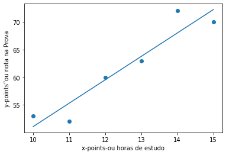

# <font color='blue'>"Dicas e Truques" de Ciência de Dados</font>
# <font color='Green'> Sua 1° Máquina Preditiva com Regressão Linear</font>


#Aprendizado de Máquina e Inteligência Artificial 
Essas são algumas palavras no mundo atual que **chamam a atenção** de quase todos. Alguns querem se beneficiar dessas tecnologias e outros querem fazer carreira nelas. Esse Vídeo é principalmente **para aqueles que desejam fazer** carreira nessas áreas ou apenas interessados ​​em conhecer o funcionamento dessa parada muito massa.


#... mas muitos travam por 
Achar palavras como **Estatística, Probabilidade e Regressão** intimidantes... É completamente compreensível se sentir assim, especialmente se você **vem de uma formação não técnica**. Mas existe uma solução para isso: Entender que não é esse bixo de 7 cabeças.... 


### Portanto, comece pequeno. Babysteps...


#**Regressão linear simples**
)

#O que é? Quando usamos LR?

Vamos criar um modelo simples de aprendizado de máquina usando regressão linear. Mas antes de passar para a parte de codificação, vamos examinar os **fundamentos** e a **lógica** por trás dessa parada.

A regressão é usada como algoritmo de **aprendizado de máquina supervisionado**, que é o algoritmo mais usado no momento. A análise de regressão é um método onde estabelecemos uma relação entre uma **variável dependente** (y) e uma **variável independente** (x); portanto, permitindo-nos prever e prever os resultados. 


### Você se lembra....

Você se lembra de resolver equações como **y = mx + c** em seus tempos de escola? Se sim, então parabéns. **Você já conhece a Regressão Linear Simples**. Do contrário, não é nada difícil aprender.


Vamos considerar um exemplo popular. O **número de horas investidas no estudo** e as **notas obtidas no exame**. Aqui, as notas obtidas dependem do número de horas que um aluno investe no estudo, portanto, as **notas obtidas são a variável dependente y e o número de horas é a variável independente x**. 

* O objetivo é desenvolver uma Máquina Preditiva que nos ajude a **prever as notas obtidas** para um novo número de horas. 

* Vamos fazer isso usando Regressão Linear.


Essa é a equação da linha de regressão que melhor se ajusta aos dados. 

Aqui,

**y** é a variável dependente, neste caso, **notas obtidas.**

**x** é a variável independente, neste caso, **número de horas**.

**m** é a inclinação(Slope) da linha de regressão e o coeficiente da variável independente.

**b** é a interceptação da linha de regressão.

A lógica é calcular a inclinação **(m)** e interceptar **(b)** com os dados disponíveis e então

 **poderemos calcular o valor de y para qualquer valor de x.**

#Como fazer essa parada em Python?

Precisamos importar alguns **pacotes** como **NumPy** para trabalhar com matrizes, **Sklearn** para realizar regressão linear e **Matplotlib** para traçar a linha de regressão e os gráficos. 

Lembre-se de que **é quase impossível** ter conhecimento de cada pacote e biblioteca em Python, especialmente para iniciantes.


Portanto, é aconselhável **limitar-se a pesquisar o pacote adequado quando necessário para uma tarefa (nada de decoreba)**. É mais fácil lembrar o uso de pacotes com experiência prática envolvida, ao invés de apenas ler teoricamente a documentação disponível sobre eles.


# Hands On


```python
#importação de Pacotes
import numpy as np                                  # Matrizes
import matplotlib.pyplot as plt                     # Gráficos
from sklearn.linear_model import LinearRegression   # Máquina Preditiva
```

Considerando que este é seu primeiro modelo de aprendizado de máquina, eliminaremos algumas complicações tomando uma amostra muito pequena, em vez de usar dados de um grande banco de dados. Isso também ajudará a ver claramente o resultado nos gráficos e a apreciar o conceito de maneira muito mais didática e eficaz.


```python
#Criar os dados da Variável independente (explicativa)
xpoints = np.array([10, 11, 12, 13, 14, 15]).reshape(-1,1)

```

##### **Obs**: a função **reshape(-1,1)** é para remodelar os xpoints **para ter 1 coluna e muitas linhas**. O preditor (x) **precisa ser uma matriz de matrizes e a resposta (y) pode ser uma matriz simples.**


```python
#Criar os dados da Variável Dependente ( Variável a ser predita)
ypoints = np.array([53, 52, 60, 63, 72, 70])
```

A Máquina Preditiva é criada com o algoritmo **LinearRegression**. Esse algoritmo pode receber Hiper-parâmetros opcionais. Eles não são necessários para este exemplo, portanto, vamos ignorá-los.

Como o nome sugere, o método **.fit()** é para treinar e estimar os parâmetros do modelo, o que significa que ele calcula o valor otimizado de **m e b** usando os dados fornecidos.


```python
#Criando a Máquina Preditiva - Escolher o Algoritmo
maquina_preditiva = LinearRegression()

```


```python
# Treinando a Máquina Preditiva - Passando os dados 
maquina_preditiva.fit(xpoints, ypoints)
```


    LinearRegression()


### **Após o Treinamento a gente faz as Previsões com a função "Predict"**

O método .predict () é usado para obter a resposta prevista usando o modelo e leva o preditor xpoints como argumento.


```python
#Novas Previsões => y_pred
y_pred = maquina_preditiva.predict(xpoints)
```

Agora, imprima y_pred e observe que os valores estão bem próximos de ypoints . Se as respostas previstas e reais tiverem valores próximos, isso significa que o modelo é preciso. Em um caso ideal, os valores de resposta previstos e reais se sobreporiam.


```python
#Análise Gráfica dos Resultados com Matplotlib
plt.scatter(xpoints, ypoints)
plt.plot(xpoints, y_pred)
plt.xlabel('x-points-ou horas de estudo')
plt.ylabel('y-points”ou nota na Prova')
plt.show()
```


    

    


##### Traçamos os gráficos usando a **função ".scatter()"** que leva xpoints e ypoints como argumentos. 


```python
#Obtem o coeficiente da variável x (ou a inclinação, também chamada de slope....tudo a mesma coisa...), que nesse caso é o "m" da equação
print(maquina_preditiva.coef_)

```

    [4.22857143]


```python
#Obtem o valor do intercept ou o valor "b" da equação
print(maquina_preditiva.intercept_)
```

    8.809523809523803


# Cara, agora vc já construiu sua 1° Máquina Preditiva


Agora faça novas previsões com sua máquina. Tente prever a nota do cara  "y_new" para **um novo valor de horas de estudo** (novo valor da variável 'x' ...) x_new = 16. 


##A equação da linha de regressão é **y = 4,23x + 8,80**. 

Então, de acordo com a equação, quando **x = 16**,

**y = 4,23 * (16) + 8,80 = 76,48** 


####**Fazendo novas previsões com sua 1° Máquina Preditiva**


```python
# Você vai estimar a nota do aluno com base no seu tempo de estudo de 16 horas
# Obs: Antes, vc precisa entregar os dados no formato de Matriz (array)
x_new = np.array([16]).reshape(-1,1)
```


```python
# Prevendo a nota com sua Máquina
y_new = maquina_preditiva.predict(x_new)
print('A nota estimada é de ==>', y_new)
```

    A nota estimada é de ==> [76.46666667]


## Como podemos avaliar nossa Máquina Preditiva?


Podemos usar o método **.score()** que usa as amostras x e y como seus 2 argumentos para encontrar **R2** ou o coeficiente de determinação (Uma das várias Métricas de avaliação das Máquinas). 

O melhor valor para **R2** é 1,0 e ele pode assumir valores negativos também, pois o modelo pode ser pior. Um valor mais próximo de R2 igual a 1,0 indica a **eficiência** da nossa Máquina Preditiva.


```python
maquina_preditiva.score(xpoints, ypoints)
```


    0.8957470010905126


###**O valor de R2 é 0,89. Portanto, a previsão do modelo é confiável.**

#**Resumão**

Essa Foi sua 1° Máquina Preditiva com o Algoritmo **Regressão Liner Simples.**

Quando estiver confortável com isso, você pode ir um passo à frente e pode usar um conjunto de dados maior. 

Por exemplo, um dataset da [UCI](https://archive.ics.uci.edu/ml/index.php) por Exemplo.  Nesse caso, você precisará trabalhar com os pacotes Pandas e NumPy. A seguir, você pode tentar um modelo de **regressão linear múltipla** ou **logística**. 


#Simbóra!

#Fim


### #YouTube - Mais Aulas como essa no YouTube 
https://www.youtube.com/channel/UCd3ThZLzVDDnKSZMsbK0icg?sub_confirmation=1

### #Links - Ciência dos Dados <a href="https://linktr.ee/cienciadosdados">https://linktr.ee/cienciadosdados</a>


```python
from IPython.core.display import HTML
HTML('<iframe width="680" height="400" src="https://www.youtube.com/embed/O8SZGlSFnwo" frameborder="0" allow="accelerometer; autoplay; clipboard-write; encrypted-media; gyroscope; picture-in-picture" allowfullscreen></iframe>')
```

    /home/nico/.local/lib/python3.8/site-packages/IPython/core/display.py:717: UserWarning: Consider using IPython.display.IFrame instead
      warnings.warn("Consider using IPython.display.IFrame instead")


<iframe width="680" height="400" src="https://www.youtube.com/embed/O8SZGlSFnwo" frameborder="0" allow="accelerometer; autoplay; clipboard-write; encrypted-media; gyroscope; picture-in-picture" allowfullscreen></iframe>


####Links fontes: 

https://www.analyticsvidhya.com/blog/2021/02/build-your-first-linear-regression-machine-learning-model/
