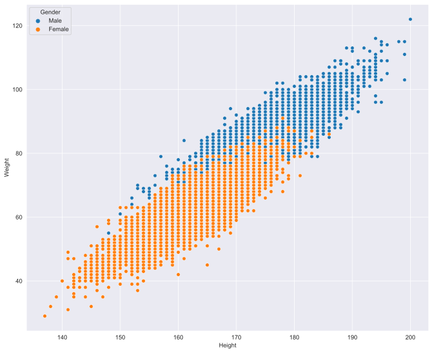
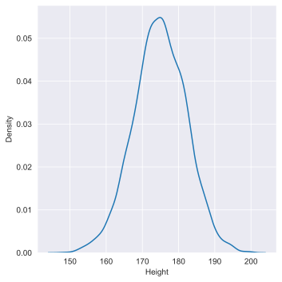
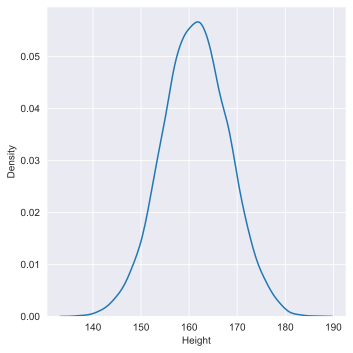
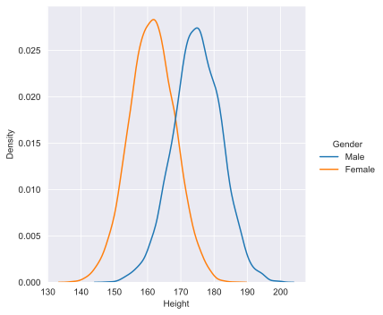
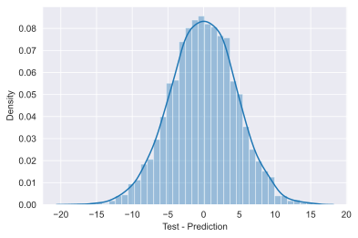

```python
import pandas as pd
import numpy as np
import matplotlib.pyplot as plt
import seaborn as sns
from sklearn.model_selection import train_test_split
from sklearn.linear_model import LinearRegression
sns.set_style('darkgrid')
```


```python
df = pd.read_csv('./heights_weights_genders.csv')

df['Weight'] = df['Weight'] / 2.2046
df['Weight'] = df['Weight'].astype(int)

df['Height'] = df['Height'] * 2.54
df['Height'] = df['Height'].astype(int)

df.head()
```


<div>
<style scoped>
    .dataframe tbody tr th:only-of-type {
        vertical-align: middle;
    }

    .dataframe tbody tr th {
        vertical-align: top;
    }

    .dataframe thead th {
        text-align: right;
    }
</style>
<table border="1" class="dataframe">
  <thead>
    <tr style="text-align: right;">
      <th></th>
      <th>Gender</th>
      <th>Height</th>
      <th>Weight</th>
    </tr>
  </thead>
  <tbody>
    <tr>
      <th>0</th>
      <td>Male</td>
      <td>187</td>
      <td>109</td>
    </tr>
    <tr>
      <th>1</th>
      <td>Male</td>
      <td>174</td>
      <td>73</td>
    </tr>
    <tr>
      <th>2</th>
      <td>Male</td>
      <td>188</td>
      <td>96</td>
    </tr>
    <tr>
      <th>3</th>
      <td>Male</td>
      <td>182</td>
      <td>99</td>
    </tr>
    <tr>
      <th>4</th>
      <td>Male</td>
      <td>177</td>
      <td>93</td>
    </tr>
  </tbody>
</table>
</div>


```python
df.describe()
```


<div>
<style scoped>
    .dataframe tbody tr th:only-of-type {
        vertical-align: middle;
    }

    .dataframe tbody tr th {
        vertical-align: top;
    }

    .dataframe thead th {
        text-align: right;
    }
</style>
<table border="1" class="dataframe">
  <thead>
    <tr style="text-align: right;">
      <th></th>
      <th>Height</th>
      <th>Weight</th>
    </tr>
  </thead>
  <tbody>
    <tr>
      <th>count</th>
      <td>10000.000000</td>
      <td>10000.0000</td>
    </tr>
    <tr>
      <th>mean</th>
      <td>168.073300</td>
      <td>72.7347</td>
    </tr>
    <tr>
      <th>std</th>
      <td>9.775269</td>
      <td>14.5725</td>
    </tr>
    <tr>
      <th>min</th>
      <td>137.000000</td>
      <td>29.0000</td>
    </tr>
    <tr>
      <th>25%</th>
      <td>161.000000</td>
      <td>61.0000</td>
    </tr>
    <tr>
      <th>50%</th>
      <td>168.000000</td>
      <td>73.0000</td>
    </tr>
    <tr>
      <th>75%</th>
      <td>175.000000</td>
      <td>84.0000</td>
    </tr>
    <tr>
      <th>max</th>
      <td>200.000000</td>
      <td>122.0000</td>
    </tr>
  </tbody>
</table>
</div>


```python
fig, ax = plt.subplots(figsize=(12, 10))
sns.scatterplot(data=df, y='Weight', x='Height', hue='Gender', ax=ax)
```


    <AxesSubplot:xlabel='Height', ylabel='Weight'>


    

    


```python
dfMale = df[df['Gender'] == 'Male']
# fig, ax = plt.subplots(figsize=(12, 10))
sns.displot(data=dfMale, x='Height', kind='kde')
```


    <seaborn.axisgrid.FacetGrid at 0x196dd8e9700>


    

    


```python
dfFemale = df[df['Gender'] == 'Female']
# fig, ax = plt.subplots(figsize=(12, 10))
sns.displot(data=dfFemale, x='Height', kind='kde')
```


    <seaborn.axisgrid.FacetGrid at 0x196dd808eb0>


    

    


```python
sns.displot(data=df, x='Height', kind='kde', hue='Gender')
```


    <seaborn.axisgrid.FacetGrid at 0x196dd8f2400>


    

    


```python
df['Gender'] = df['Gender'].replace('Male', 0) 
df['Gender'] = df['Gender'].replace('Female', 1)
df.head(200)
```


<div>
<style scoped>
    .dataframe tbody tr th:only-of-type {
        vertical-align: middle;
    }

    .dataframe tbody tr th {
        vertical-align: top;
    }

    .dataframe thead th {
        text-align: right;
    }
</style>
<table border="1" class="dataframe">
  <thead>
    <tr style="text-align: right;">
      <th></th>
      <th>Gender</th>
      <th>Height</th>
      <th>Weight</th>
    </tr>
  </thead>
  <tbody>
    <tr>
      <th>0</th>
      <td>0</td>
      <td>187</td>
      <td>109</td>
    </tr>
    <tr>
      <th>1</th>
      <td>0</td>
      <td>174</td>
      <td>73</td>
    </tr>
    <tr>
      <th>2</th>
      <td>0</td>
      <td>188</td>
      <td>96</td>
    </tr>
    <tr>
      <th>3</th>
      <td>0</td>
      <td>182</td>
      <td>99</td>
    </tr>
    <tr>
      <th>4</th>
      <td>0</td>
      <td>177</td>
      <td>93</td>
    </tr>
    <tr>
      <th>...</th>
      <td>...</td>
      <td>...</td>
      <td>...</td>
    </tr>
    <tr>
      <th>195</th>
      <td>0</td>
      <td>183</td>
      <td>94</td>
    </tr>
    <tr>
      <th>196</th>
      <td>0</td>
      <td>170</td>
      <td>82</td>
    </tr>
    <tr>
      <th>197</th>
      <td>0</td>
      <td>192</td>
      <td>105</td>
    </tr>
    <tr>
      <th>198</th>
      <td>0</td>
      <td>168</td>
      <td>77</td>
    </tr>
    <tr>
      <th>199</th>
      <td>0</td>
      <td>180</td>
      <td>85</td>
    </tr>
  </tbody>
</table>
<p>200 rows × 3 columns</p>
</div>


```python
X = df[['Gender', 'Height']]
Y = df[['Weight']]
```


```python
from sklearn.preprocessing import StandardScaler

scaler = StandardScaler().fit(X)
X = scaler.transform(X)
```


```python
X_train, X_test, y_train, y_test = train_test_split(X, Y)
```


```python
model = LinearRegression()
model.fit(X_train, y_train)
```


    LinearRegression()


```python
predictions = model.predict(X_test)
```


```python
sns.distplot(y_test - predictions, axlabel="Test - Prediction")
```
    


    <AxesSubplot:xlabel='Test - Prediction', ylabel='Density'>


    

    


```python
from sklearn.preprocessing import StandardScaler

myvals = np.array([0,176]).reshape(1, -1)

scaler = StandardScaler().fit(myvals)
myvals = scaler.transform(myvals)
print(myvals)
```

    [[0. 0.]]
    


```python
# 94 -> 94 Kg (Weight)
# 182 -> 182 cm (Height) 

print(model.predict(myvals)) 

# The more close to 0, the more is a Male
# The more close to 1, the more is a Female
```

    [[72.73333562]]
    
